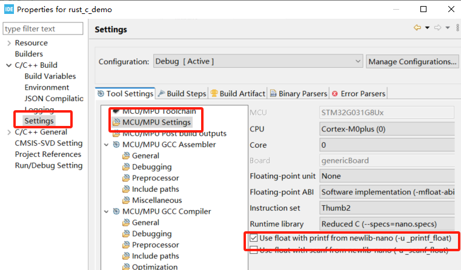
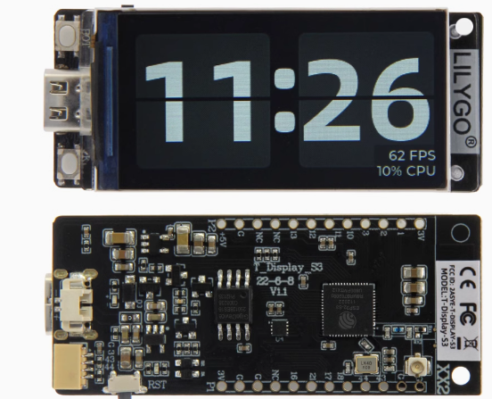
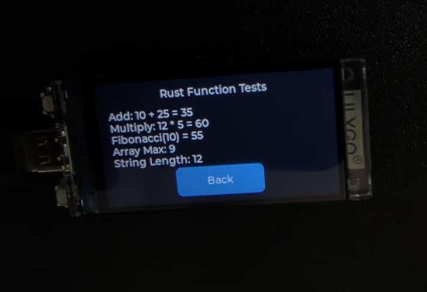
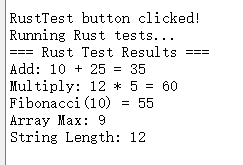

# 嵌入式工程师的单片机Rust上手指南

--语言只是工具，重要的是思想


--4/27/2025 草稿

- [嵌入式工程师的单片机Rust上手指南](#嵌入式工程师的单片机rust上手指南)
  - [前言：单片机开发的挑战与Rust的价值](#前言单片机开发的挑战与rust的价值)
  - [环境搭建：现代工具链的优势](#环境搭建现代工具链的优势)
    - [C语言开发方式](#c语言开发方式)
    - [Rust环境配置](#rust环境配置)
    - [烧录和调试](#烧录和调试)
  - [类型系统：编译期安全与零成本抽象](#类型系统编译期安全与零成本抽象)
    - [C语言的类型安全问题](#c语言的类型安全问题)
    - [Rust的类型状态模式](#rust的类型状态模式)
    - [PhantomData与零成本抽象](#phantomdata与零成本抽象)
      - [PhantomData的作用](#phantomdata的作用)
      - [编译期状态编码实现](#编译期状态编码实现)
    - [PhantomData生命周期标记](#phantomdata生命周期标记)
      - [生命周期与嵌入式系统](#生命周期与嵌入式系统)
  - [Embedded-HAL :跨平台生态](#embedded-hal-跨平台生态)
    - [与传统C/C++嵌入式库的区别](#与传统cc嵌入式库的区别)
    - [Trait是什么](#trait是什么)
    - [Embedded-HAL生态系统](#embedded-hal生态系统)
    - [优雅的错误处理](#优雅的错误处理)
  - [嵌入式异步编程：全新嵌入式编程范式](#嵌入式异步编程全新嵌入式编程范式)
    - [裸机轮询模型](#裸机轮询模型)
    - [RTOS任务模型](#rtos任务模型)
    - [嵌入式异步编程](#嵌入式异步编程)
      - [什么是异步编程](#什么是异步编程)
      - [Future工作原理与async/await](#future工作原理与asyncawait)
    - [单片机中异步运行时与执行器](#单片机中异步运行时与执行器)
    - [异步与DMA](#异步与dma)
    - [多优先级任务调度](#多优先级任务调度)
    - [任务间通信](#任务间通信)
    - [任务间共享外设](#任务间共享外设)
    - [小结](#小结)
  - [基础示例：SSD1306 OLED显示](#基础示例ssd1306-oled显示)
    - [使用cargo-embassy创建工程](#使用cargo-embassy创建工程)
    - [从头开始创建工程](#从头开始创建工程)
    - [添加屏幕显示](#添加屏幕显示)
    - [小结](#小结-1)
  - [Rust嵌入stm32的C工程](#rust嵌入stm32的c工程)
    - [STM32CubeIDE中嵌入](#stm32cubeide中嵌入)
    - [小结](#小结-2)
  - [嵌入式中的Vec等容器使用](#嵌入式中的vec等容器使用)
    - [heapless](#heapless)
    - [使用全局的allocator](#使用全局的allocator)
  - [ESP32中的Rust开发](#esp32中的rust开发)
    - [ESP32Rust环境配置](#esp32rust环境配置)
    - [生成项目](#生成项目)
    - [开发](#开发)
    - [混合Rust与C](#混合rust与c)
      - [Rust作为component ESP-IDF 方法](#rust作为component-esp-idf-方法)
      - [利用platformio构建](#利用platformio构建)


## 前言：单片机开发的挑战与Rust的价值

单片机领域一直是C语言的天下，这个局面已经持续了几十年。C语言贴近硬件、语法简洁、执行高效，自然成了嵌入式开发的首选。不过，随着单片机应用越来越复杂，大家对代码质量和开发效率的要求也在水涨船高。

近几年，Rust在Web后端、系统工具、操作系统、Web3等多个领域都展露头角，嵌入式开发也不例外。Rust设计之初就考虑了系统编程的需求，在单片机这种资源受限的环境中，它的"零成本抽象"原则显得尤为重要 —— 你可以写出高级、安全、易读的代码，而不必担心运行时开销。Rust还带来了不少现代语言的优势：编译时的内存安全检查消除了大部分缓冲区溢出和空指针解引用的风险；所有权系统让并发编程更加安全可控；丰富的类型系统和trait机制支持高度抽象和代码复用，同时不引入运行时开销；包管理系统让依赖处理和代码复用变得简单。这些特性正好应对了单片机开发面临的很多挑战。

Rust曾因陡峭的学习曲线而被开发者诟病，但情况正在改变。随着网上教程和资料越来越丰富，加上各种开发工具的成熟，入门Rust已经容易了不少。特别是对C语言工程师来说，两者有不少共通点 —— Rust和C一样，都能直接操作硬件寄存器和内存，保留了对底层的精确控制，但同时提供了更安全、更现代的编程体验。很多在C中需要提心吊胆的内存问题，在Rust中都能在编译时被揪出来，省去了大量调试时间。在单片机编程中，这种编译期检查特别有价值，因为单片机的调试往往比PC应用要困难得多。

这篇指南就是写给那些想尝试Rust做单片机开发的C程序员的。我们会用实际例子对比两种语言的异同，讲清楚怎么用Rust的特性来应对单片机开发的各种挑战，如何提高开发效率，以及怎么在不牺牲性能的前提下写出更可靠的嵌入式程序。

现在网上关于Rust的教程已经非常丰富，但大多数都是从零开始或者面向其他背景的开发者。作为一个C语言单片机工程师，我希望能从我们的视角出发，把现有的优秀资源整合起来，帮助大家更快地掌握Rust单片机开发。我会引用和参考很多优秀的教程，但重点会放在如何把C语言的经验和思维模式迁移到Rust上，让大家少走弯路，本文更像是一个目录或者科普带大家走进Rust单片机开发。

强烈建议先完成阅读，本文也将大量参考这些优秀资源
[The Rust Programming Language](https://doc.rust-lang.org/book/)
[Rust语言圣经(Rust Course)](https://course.rs/about-book.html)
[Asynchronous Programming in Rust](https://rust-lang.github.io/async-book/)
[The Embedded Rust Book](https://docs.rust-embedded.org/book/)
[Embassy Book](https://embassy.dev/book/)
[The Rust on ESP Book](https://docs.esp-rs.org/book/overview/index.html)


## 环境搭建：现代工具链的优势

嵌入式中C工具链根据不同目标平台需要不同的工具链，这是单片机开发者最常遇到的第一个挑战。ARM平台需要安装ARM-GCC或ARMCC，8051需要Keil C51或者SDCC，ESP32使用xtensa-esp32-gcc/riscv-32... 还有很多Risc-V架构的单片机。不同平台工具链之间互不兼容，每换一个芯片平台，开发者往往需要重新配置整个环境。即使是同一CPU架构，不同厂商和不同系列的单片机，也可能需要不同的SDK和工具链配置。
### C语言开发方式
从原理上来讲我们可以直接通过gcc配合烧录调试工具直接进行开发，但是C语言需要编写makefile或者cmake且调试上也会很麻烦

在C语言ARM单片机开发中，很多开发者使用的是像Keil5或者IAR这样的IDE：
比如Keil需要先在官网[下载](https://www.keil.com/download/product/)并激活后配置对应soc的[工具包](https://www.keil.arm.com/devices/)

 


很多厂商也给出了自己的集成开发环境比如TI的[CCS](https://www.ti.com/tool/CCSTUDIO)，能用于编译调试TI的单片机，DSP，蓝牙SOC等处理器芯片


ST公司为自家SOC提供的[CubeIDE](https://www.st.com/en/development-tools/stm32cubeide.html)

NXP公司提供的NXP MCUXpresso


也有很多厂商通过eclipse或者VScode自定义自家SOC的开发环境。

每个芯片厂商往往有自己的IDE和工具链，例如STM32CubeIDE、NXP MCUXpresso、ESP-IDF等。这导致开发者在切换平台时需要重新学习一套工具，项目移植困难，学习成本高。

相比之下，Rust嵌入式开发生态提供了一套更加现代化、统一的工具链体验

### Rust环境配置

首先我们来安装[Rust工具链](https://www.rust-lang.org/tools/install)

对于windows用户只需一行
```bash
curl --proto '=https' --tlsv1.2 -sSf https://sh.rustup.rs | sh
```

[Rust 生态系统](https://google.github.io/comprehensive-rust/cargo/rust-ecosystem.html)由许多工具组成，主要包括：

* rustc：Rust 编译器，可将 .rs 文件转换为二进制文件和其他中间格式。

* cargo：Rust 依赖项管理器和构建工具。Cargo 知道如何下载托管在 https://crates.io 上的依赖项,并在构建项目时将它们传递给 rustc。Cargo 还附带一个内置的测试运行程序，用于执行单元测试。

* rustup：Rust 工具链安装和更新工具。当 Rust 发布新版本时，此工具用于安装并更新 rustc 和 cargo。 此外，rustup 还可以下载标准库的文档。可以同时安装多个版本的 Rust，rustup 会根据需要让你在这些版本之间切换。

利用rustup工具可以快速配置不同嵌入式平台支持：
   ```bash
   rustup target add thumbv6m-none-eabi  # 添加ARM Cortex-M0支持
   rustup target add thumbv7m-none-eabi  # 添加ARM Cortex-M3支持
   rustup target add riscv32imac-unknown-none-elf  # 添加RISC-V32imac支持
   ```
在这之后就完成编译rust的基础配置环境了。然后就是针对嵌入式环境的烧录和调试。

### 烧录和调试

除了通过命令行或IDE使用传统的openocd ，调试器等。也可以用Rust生态中的强力工具[probe-rs](https://probe.rs/)
probe-rs实现了针对不同SOC厂商和不同调试协议的适配


利用probe-rs可以快速实现编译后代码的烧录和调试。
在```.cargo/config.toml```中添加对应的编译目标平台例如stm32g031
```
[target.'cfg(all(target_arch = "arm", target_os = "none"))']
# replace STM32G031G8Ux with your chip as listed in `probe-rs chip list`
runner = "probe-rs run --chip STM32G031G8Ux"
```
即可通过```cargo run```命令将代码烧录并运行在目标平台
```
 cargo run --release --target thumbv6m-none-eabi
```
probe-rs还支持与VSCode/CLion等IDE的集成，可以实现代码的断点调试。具体可以参考[probe-rs-vscode](https://probe.rs/docs/tools/debugger/#building-and-testing-the-debug-extension-in-vs-code)

在单片机编程中也经常有"printf调试"，probe-rs中利用调试器的[RTT](https://github.com/probe-rs/rtt-target)和[defmt](https://github.com/knurling-rs/defmt) 实现很小的延迟和无阻塞的方式将日志记录打印到电脑，代码中利用defmt中的```debug！``` ```error！``` ``` info！```等宏直接实现不同日志的打印


```rust
defmt::info!("This is an info message: {}", 42);
defmt::warn!("This is a warning message: {}", true);
defmt::debug!("This is a debug message: {}", "hello");
defmt::error!("This is an error message: {}", 3.14);
defmt::println!("This is a println message: {}", 42);
defmt::assert!(1 + 1 == 2, "Assertion failed: 1 + 1 != 2");
```

整体代码示例：

```rust
#![no_main]
#![no_std]

use defmt::info;
use defmt_rtt as _; // 使用 RTT 作为传输层
use panic_probe as _; // 使用探针作为 panic handler

#[cortex_m_rt::entry]
fn main() -> ! {
    info!("This is an info message: {}", 42);
    defmt::debug!("This is a debug message: {}", "hello");
    defmt::warn!("This is a warning message: {}", true);
    defmt::error!("This is an error message: {}", 3.14);
    defmt::trace!("This is a trace message: {}", [1, 2, 3]);

    defmt::assert!(1 + 1 == 2, "Assertion failed: 1 + 1 != 2");
    defmt::assert_eq!(1 + 1, 2, "Assertion failed: 1 + 1 != 2");
    defmt::assert_ne!(1 + 1, 3, "Assertion failed: 1 + 1 == 3");

    let mut buffer = [0u8; 32];
    defmt::write!(&mut buffer, "Hello, {}!", "world");

    let args = defmt::format_args!("Hello, {}!", "world");
    defmt::println!("This is a println message: {}", 42);

    defmt::log!(defmt::Level::Info, "This is a log message: {}", 42);

    loop {}
}
```

具体实现和原理可以参考[defmt-book](https://defmt.ferrous-systems.com/)。

这里使用的时候是无感的，单片机工程执行cargo run 之后调用probe-rs。
probe-rs内置了[SEGGER 的 RTT](https://www.segger.com/products/debug-probes/j-link/technology/about-real-time-transfer/)，通过RTT将日志发送给电脑。

至此通过Rust工具的生态能非常简单的完成基础配置，且无需特定的IDE便能轻松实现编译和调试


## 类型系统：编译期安全与零成本抽象

Rust的类型系统为嵌入式开发提供了强大的编译期安全保障，同时保持了零运行时开销的特性，这对资源受限的单片机开发尤为重要。

### C语言的类型安全问题

嵌入式系统中直接操作底层寄存器，如果使用不当容易导致硬件损坏，系统不稳定或安全漏洞。传统C语言依赖运行时检查、技术文档和项目管理规范来避免这些问题。比如引脚配置错误、引脚配置冲突等等。
举个stm32的GPIO配置的例子

```c
void HAL_GPIO_WritePin(GPIO_TypeDef *GPIOx, uint16_t GPIO_Pin, GPIO_PinState PinState)
{
  /* 检查参数 */
  assert_param(IS_GPIO_PIN(GPIO_Pin));
  assert_param(IS_GPIO_PIN_ACTION(PinState));

  if (PinState != GPIO_PIN_RESET)
  {
    GPIOx->BSRR = GPIO_Pin;
  }
  else
  {
    GPIOx->BSRR = (uint32_t)GPIO_Pin << 16u;
  }
}
```

在上面的C语言代码中，我们可以看到几个典型的安全隐患：

1. **运行时参数检查**：函数使用`assert_param`在运行时检查参数有效性，这增加了程序体积和执行时间，且在优化编译或禁用断言时完全失效。且assert_param默认是关闭的，需要手动打开宏


2. **缺乏类型安全**：函数接受任何`GPIO_TypeDef`指针，编译器无法检查传递的GPIO外设是否已正确初始化或是否合法。

3. **状态不明确**：没有类型系统保证GPIO引脚已被正确配置为输出模式。即使引脚被配置为输入、模拟或其他功能，此函数仍然可以编译并执行，可能导致硬件行为异常。
例如我将一个初始化为input的gpio设置低电平

```c
  GPIO_InitStruct.Pin = KEY_Pin;
  GPIO_InitStruct.Mode = GPIO_MODE_INPUT;
  GPIO_InitStruct.Pull = GPIO_NOPULL;
  HAL_GPIO_Init(KEY_GPIO_Port, &GPIO_InitStruct);//配置为输入模式
  HAL_GPIO_WritePin(KEY_GPIO_Port, KEY_Pin, GPIO_PIN_RESET);//设置为低电平
```

这段代码在编译和运行时都不会报错，但这种操作在逻辑上是不合理的，可能会导致未定义行为或硬件问题。
C代码必须依赖运行时检查和开发者谨慎性，而不是利用编译器进行静态保证。

### Rust的类型状态模式

Rust允许我们在类型系统层面编码状态，使状态转换错误变成编译错误，而非运行时崩溃。这里我们看一个Rust中的GPIO实现的伪代码：

```rust

pub struct Input<MODE> { _mode: PhantomData<MODE> }
pub struct Output<MODE> { _mode: PhantomData<MODE> }
pub struct Floating; pub struct PullUp; pub struct PullDown; pub struct PushPull; pub struct OpenDrain;

pub struct Pin<const P: char, const N: u8, MODE> { _mode: PhantomData<MODE> }

impl<const P: char, const N: u8, MODE> Pin<P, N, Input<MODE>> {
    pub fn is_high(&self) -> bool { !self.is_low() }
    pub fn is_low(&self) -> bool { ...具体操作... }
    pub fn into_push_pull_output(self) -> Pin<P, N, Output<PushPull>> { ...具体操作... Pin { _mode: PhantomData } }
    pub fn into_open_drain_output(self) -> Pin<P, N, Output<OpenDrain>> { ...具体操作... Pin { _mode: PhantomData } }
}

impl<const P: char, const N: u8, MODE> Pin<P, N, Output<MODE>> {
    pub fn set_high(&mut self) { ...具体操作... }
    pub fn set_low(&mut self) { ...具体操作... }
    pub fn toggle(&mut self) { ...具体操作... }
    pub fn into_floating_input(self) -> Pin<P, N, Input<Floating>> { ...具体操作... }
}

// 使用例子
fn gpio_example() {
    ...前置配置...
    let mut output_pin = input_pin.into_push_pull_output();
    // 设置输出状态
    output_pin.set_high();
    output_pin.set_low();
    output_pin.toggle();
    
    // 编译错误示例：
    output_pin.is_high();  // ❌ 编译报错：Output型引脚没有is_high方法
    input_pin.set_high();  // ❌ 编译报错：input_pin已被消耗（moved）
    // 将引脚转换回输入模式
    let input_pin = output_pin.into_floating_input();
    let state = input_pin.is_high(); // ✓ 正确：Input型引脚可以读取状态
}
```

与之前展示的C语言实现相比，这个实际的Rust库实现展示了几个关键的优势：

1. **类型状态编码**：引脚的状态（输入/输出）直接编码在类型参数中，编译器可以静态验证操作的合法性。比如输出引脚没有`is_high()`方法，输入引脚没有`set_high()`方法。

2. **状态转换安全**：引脚状态的转换通过消耗旧状态并返回新状态的方法实现（如`into_push_pull_output()`），确保了状态转换的完整性和不可逆性，防止使用旧状态引用。

3. **所有权系统保障**：Rust的所有权系统确保同一时间只有一段代码可以操作特定引脚，避免了并发访问和配置冲突。

4. **零运行时开销**：尽管提供了丰富的安全保障，这些安全检查都在编译时进行，运行时代码与手写的优化C代码相当。`PhantomData`是零大小类型，不占用任何内存。

### PhantomData与零成本抽象

上面我们用到了```PhantomData<T>```，这 是 Rust 标准库中的一个特殊类型，用于在编译时标记某个类型或生命周期的存在，但不实际占用内存空间

在上面例子中即表现为各种引脚状态和配置类型：

```rust
// PhantomData用于在类型系统中标记MODE，但不占用实际内存
pub struct Pin<const P: char, const N: u8, MODE> {
    _mode: PhantomData<MODE>, // 零大小类型，编译后不占用内存
}

// 不同的模式类型也是零大小类型
pub struct Input<MODE> { _mode: PhantomData<MODE> }
pub struct Output<MODE> { _mode: PhantomData<MODE> }
pub struct Floating;
pub struct PushPull;
```


#### PhantomData的作用

1. **类型标记**：`PhantomData<MODE>`告诉编译器Pin结构体与MODE类型相关，即使不存储MODE类型的实际值。

2. **零大小类型**：`PhantomData<T>`是零大小类型(ZST)，意味着它在通常情况下编译后自身不占用内存空间。这保证了我们的抽象不会引入运行时开销。

3. **类型安全**：通过PhantomData，编译器能够在编译期强制执行类型规则，比如防止对输出引脚调用`is_high()`方法。

#### 编译期状态编码实现

在STM32 GPIO例子中，我们用泛型参数来表示引脚的状态：

```rust
// 输入引脚，带上拉电阻
let pin: Pin<'A', 5, Input<PullUp>> = ...;

// 输出引脚，推挽输出模式
let pin: Pin<'A', 5, Output<PushPull>> = ...;
```

当引脚状态改变时，我们不是修改内部字段（在C中通常是修改一个状态标志），而是**返回一个全新类型的对象**：

```rust
// 输入转输出，消耗输入引脚，返回输出引脚
pub fn into_push_pull_output(
    self
) -> Pin<P, N, Output<PushPull>> {
    // 硬件配置...
    Pin { _mode: PhantomData }
}
```


我们可以查看编译后的汇编代码，对比有和没有类型安全检查的版本：

```rust
// Rust版本（带类型状态检查）
fn toggle_led(led: &mut Pin<'A', 5, Output<PushPull>>) {
    led.toggle();
}

// 编译为大致相同的汇编指令：
// ldr r0, [r0]       // 加载引脚寄存器地址
// ldr r1, [r0, #16]  // 读取ODR寄存器
// eor r1, r1, #32    // 翻转相应位
// str r1, [r0, #16]  // 写回ODR寄存器
// bx lr              // 返回
```

而C语言的安全版本需要运行时检查：

```c
// C语言安全版本
void toggle_led_safe(GPIO_TypeDef* gpio, uint16_t pin) {
    if (gpio == NULL) return;
    if (pin > 15) return;
    // ...其他运行时检查
    gpio->ODR ^= (1 << pin);
}

// 编译为更多指令：
// cmp r0, #0         // 检查NULL
// beq .return
// cmp r1, #15        // 检查引脚范围
// bhi .return
// ...其他运行时检查
// ldr r2, [r0, #16]  // 实际操作
// ...
```

对于GPIO状态相对较少，一些复杂外设状态可能更多，比如I2C，SPI，UART等，这时候C语言需要通过复杂的宏或者状态机来实现，而Rust可以通过类型系统来实现。

### PhantomData生命周期标记

Rust的生命周期系统是其内存安全保证的核心之一，特别是在嵌入式系统中处理硬件资源时更为重要。生命周期（lifetime）是编译器用来追踪引用有效性的机制，确保引用不会比其指向的数据存活更久。

在C语言中，我们需要手动追踪指针的有效性，这容易导致悬垂指针（dangling pointer）或者使用已释放的内存等问题。而Rust通过编译期检查强制保证引用的安全性。

生命周期这个概念这里只是简单提一下嵌入式场景中的部分应用。推荐阅读[Rust语言圣经](https://course.rs/advance/lifetime/advance.html)或者[Rust语言官方文档](https://doc.rust-lang.org/book/ch10-00-generics.html)以有更深的理解

#### 生命周期与嵌入式系统

在嵌入式开发中，生命周期特别有用的一个场景是DMA（直接内存访问）操作。DMA允许外设直接访问内存，绕过CPU，以提高数据传输效率。但这也带来了一个挑战：我们必须确保DMA操作期间，相关内存区域保持有效且不被修改。

让我们对比C和Rust如何处理这个问题：

```c
// C语言中的DMA传输 - 安全性依赖于开发者小心
void start_dma_transfer(uint8_t* buffer, size_t size) {
    // 配置DMA并开始传输
    DMA_Config(DMA1, buffer, size);
    DMA_Start(DMA1);
    // 危险：C编译器不阻止在DMA传输过程中修改或释放buffer
    // 这全靠开发者自己记住并避免
}

// 使用示例
void example_function(void) {
    uint8_t local_buffer[64];
    // 填充缓冲区
    for (int i = 0; i < 64; i++) {
        local_buffer[i] = i;
    }
    // 开始DMA传输
    start_dma_transfer(local_buffer, 64);
    // 危险：DMA可能仍在进行，但缓冲区即将离开作用域
    // C编译器不会警告这个问题
    
    // 可能的解决方法：等待DMA完成，但这依赖于开发者记得这么做
    while(DMA_GetStatus(DMA1) != DMA_COMPLETE) { }
}
```
C 语言没有内建的机制去追踪指针的*有效范围*或*生命周期*，完全依赖开发者。即使开发者自己小心，也很容易出错。
现在看看Rust如何使用PhantomData和生命周期来解决这个问题：

```rust
// Rust中的DMA传输 - 编译期保证安全
struct DmaTransfer<'buffer> {
    dma: &'static mut DMA_TypeDef,
    _buffer: PhantomData<&'buffer mut [u8]>, // 标记buffer的生命周期
}

impl<'buffer> DmaTransfer<'buffer> {
    // 开始DMA传输
    pub fn new(dma: &'static mut DMA_TypeDef, buffer: &'buffer mut [u8]) -> Self {
        // 配置DMA
        unsafe {
            (*dma).source_addr = buffer.as_ptr() as u32;
            (*dma).byte_count = buffer.len() as u32;
            (*dma).control = DMA_ENABLE;
        }
        
        DmaTransfer {
            dma,
            _buffer: PhantomData, // 跟踪buffer生命周期但不存储它
        }
    }
    
    // 等待传输完成
    pub fn wait(self) -> Result<(), Error> {
        unsafe {
            while (*self.dma).status & DMA_COMPLETE == 0 {}
            (*self.dma).control = 0; // 禁用DMA
        }
        Ok(())
    }
}

// Drop实现确保DmaTransfer被丢弃时停止DMA
impl<'buffer> Drop for DmaTransfer<'buffer> {
    fn drop(&mut self) {
        unsafe {
            // 确保DMA被停止
            (*self.dma).control = 0;
        }
    }
}
// 使用示例
fn example_function() {
    let mut buffer = [0u8; 64];
    // 填充缓冲区
    for i in 0..64 {
        buffer[i] = i as u8;
    }
    // 获取DMA外设
    let dma = unsafe { &mut *(DMA1 as *mut DMA_TypeDef) };
    // 开始DMA传输
    let transfer = DmaTransfer::new(dma, &mut buffer);
    // 编译错误示例：
    buffer[0] = 99; // ❌ 错误：buffer已被借用，不能修改
    drop(buffer);   // ❌ 错误：buffer被借用，不能提前释放
    // 正确用法：等待传输完成
    transfer.wait().unwrap();
    // 现在可以安全地使用buffer了
    println!("Transfer completed, first byte: {}", buffer[0]);
    // 如果我们不调用wait()，在函数结束时:
    // 1. transfer的Drop实现会确保DMA被停止
    // 2. 然后buffer才会被释放
}
```
Rust中实现了以下几点：

1. **生命周期跟踪**：`PhantomData<&'buffer mut [u8]>`告诉编译器DmaTransfer持有对buffer的引用，并且其生命周期绑定到了'buffer。

2. **借用检查**：编译器确保buffer在DMA使用期间不被修改或释放。任何尝试修改已借出buffer的代码都会导致编译错误。

3. **资源管理**：通过Drop实现，即使在异常情况下（如提前返回或发生panic），DMA也会被正确停止。

4. **零运行时开销**：`PhantomData`不占用内存空间，所有安全检查都在编译时完成。

在C语言中，我们可能通过注释和命名约定来提示开发者，或者添加运行时检查和复杂的状态跟踪机制，但这增加了开销且仍不如编译期检查可靠。

通过Rust的生命周期系统和PhantomData，我们可以构建既安全又高效的API，让编译器帮助我们捕获潜在的资源使用错误，这在嵌入式系统中尤为重要，因为这类错误往往导致难以调试的问题。

## Embedded-HAL :跨平台生态

[Embedded-HAL](https://github.com/rust-embedded/embedded-hal/tree/master)（Hardware Abstraction Layer，硬件抽象层）是Rust嵌入式生态系统的基础，它定义了一系列标准trait（特质），用于抽象常见嵌入式外设的操作接口。其核心目标是：

- 提供硬件无关的外设抽象接口
- 允许编写可在不同芯片和平台上运行的通用驱动程序
- 建立一个统一的嵌入式，乃至系统软件开发生态，促进代码重用

### 与传统C/C++嵌入式库的区别
传统嵌入式开发中，不同厂商和平台的HAL库通常互不兼容：
```c
// STM32 HAL库示例
HAL_StatusTypeDef HAL_GPIO_WritePin(GPIO_TypeDef *GPIOx, uint16_t GPIO_Pin, GPIO_PinState PinState);

//MSP432库示例
void GPIO_setOutputHighOnPin(uint_fast8_t selectedPort,uint_fast16_t selectedPins);

```
这种差异导致：
- 驱动程序必须为每个平台重写
- 代码无法轻松迁移到不同硬件
- 生态系统碎片化，重复劳动

Embedded-HAL通过定义统一的trait接口解决了这一问题，很像Arduino的库比如```digitalWrite```等等，但Rust的trait体系更强大，可以实现更复杂的抽象。

```rust
// Embedded-HAL定义的统一接口
pub trait OutputPin {
    type Error;
    fn set_high(&mut self) -> Result<(), Self::Error>;
    fn set_low(&mut self) -> Result<(), Self::Error>;
}

// 不同平台实现同一接口
// 某平台实现
impl OutputPin for PA0 {
    type Error = Infallible;
    fn set_high(&mut self) -> Result<(), Self::Error> { ... }
    fn set_low(&mut self) -> Result<(), Self::Error> { ... }
}

// 另一个平台实现
impl OutputPin for GpioPin<Output, IO0> {
    type Error = Infallible;
    fn set_high(&mut self) -> Result<(), Self::Error> { ... }
    fn set_low(&mut self) -> Result<(), Self::Error> { ... }
}
```

可以看到不同平台实现同一接口，但接口的实现方式不同，但接口的用法是相同的。

### Trait是什么

[Trait(rust语言官方文档)](https://doc.rust-lang.org/book/ch10-02-traits.html)是Rust语言中定义共享行为的机制，类似于其他语言中的接口或抽象类，但具有更强大的特性：

1. **静态分发**：编译器在编译时确定具体的实现，避免了动态查找实现的运行时开销
2. **关联类型**：允许在trait中定义依赖类型，增强类型安全
3. **泛型约束**：trait可用作泛型约束，提供编译时保证
4. **组合能力**：trait可以组合形成更复杂的抽象

如果Rust应用较少这个概念可能看着比较抽象，在这里我们只需要知道Trait是定义共享行为的机制

C语言也能实现类似接口比如

```c
// C语言模拟接口
typedef struct {
    void (*set_high)(void* ctx);
    void (*set_low)(void* ctx);
    void* ctx;
} gpio_ops_t;

// 使用示例
void toggle_led(gpio_ops_t* gpio) {
    gpio->set_high(gpio->ctx);
    // 延时
    gpio->set_low(gpio->ctx);
}
```

这种方式有以下缺点：
- 运行时开销（函数指针调用）
- 无编译时类型检查
- 接口实现错误只能在运行时发现
- 需要手动管理上下文指针

Rust的Trait结合上面我们提到的类型系统提供了编译时安全保证且避免了动态查找实现的运行时开销。

### Embedded-HAL生态系统
Embedded-HAL生态系统由多个相互关联的crate组成：

1. **embedded-hal**：定义基本阻塞式接口
2. **embedded-hal-async**：异步版本的接口
3. **embedded-hal-nb**：基于nb（非阻塞）模式的接口
4. **embedded-can**：CAN总线专用接口
5. **embedded-io/embedded-io-async**：通用I/O接口

具体实现参考[Embedded-HAL官方储存库](https://github.com/rust-embedded/embedded-hal/tree/master)

使用embedded-hal编写的驱动程序可以在任何实现了相应trait的硬件上运行：
例如我们等会示例中将会用到的SSD1306驱动

```rust
// 通用SSD1306 OLED显示驱动
pub struct Ssd1306<I2C> {
    i2c: I2C,
    // ...其他字段
}

impl<I2C, E> Ssd1306<I2C>
where
    I2C: embedded_hal::i2c::I2c<Error = E>,
{
    // 任何实现了I2c trait的设备都可以使用这个驱动
    pub fn new(i2c: I2C) -> Self {
        // ...初始化代码
    }
    
    pub fn display(&mut self, buffer: &[u8]) -> Result<(), E> {
        // ...使用I2C显示数据
    }
}
```

I2C作为泛型参数，这个驱动可以同时用于：

- STM32系列
- ESP32
- nRF52系列
- RP2040 (Raspberry Pi Pico)
- 等众多实现了I2c trait的硬件

在实际项目中，我们能在不同硬件上使用同一个驱动，这对于产品开发迭代非常有帮助。

### 优雅的错误处理

在embedded-hal代码中可以看到Rust中常见的错误处理方式，比如

```rust
// 使用Result类型返回错误
pub fn write(&mut self, address: u8, data: &[u8]) -> Result<(), Error> {
    // ...
}
```

Rust的错误处理相比C语言有显著优势。让我们通过一个伪代码示例来对比 - 假设我们需要从多个传感器读取数据，处理它们，然后发送结果：

```c
// C语言错误处理 - 使用返回码
typedef enum {
    ERR_OK = 0,
    ERR_I2C_BUS,
    ERR_SENSOR_TIMEOUT,
    ERR_INVALID_DATA,
    ERR_UART_BUSY,
    // ...更多错误类型
} error_t;

// 读取传感器
error_t read_temperature_sensor(float* result) {
    // 初始化I2C总线
    if (i2c_init() != ERR_OK) {
        return ERR_I2C_BUS;
    }
    // 读取传感器
    uint8_t raw_data[4];
    error_t err = i2c_read(SENSOR_ADDR, raw_data, sizeof(raw_data));
    if (err != ERR_OK) {
        return err; // 传播错误
    }
    // 检查数据有效性
    if (raw_data[3] != calculate_checksum(raw_data, 3)) {
        return ERR_INVALID_DATA;
    }
    // 转换数据
    *result = convert_to_temperature(raw_data);
    return ERR_OK;
}
// 使用示例
void process_sensor_data(void) {
    float temperature;
    error_t err = read_temperature_sensor(&temperature);
    // 错误处理 - 常见的if-else分支
    if (err == ERR_OK) {
        printf("Temperature: %.2f C\n", temperature);
    } else if (err == ERR_I2C_BUS) {
        printf("I2C bus error\n");
        // 可能忘记处理某种错误
    } else if (err == ERR_SENSOR_TIMEOUT) {
        printf("Sensor timeout\n");
    } else if (err == ERR_INVALID_DATA) {
        printf("Invalid data received\n");
    } else {
        printf("Unknown error: %d\n", err);
    }
    // 容易忘记检查错误
    error_t another_err = send_data(&temperature);
    // 这里缺少对another_err的检查
}
```

现在看看Rust的等效实现：

```rust
// Rust错误处理 - 使用枚举和Result类型
#[derive(Debug)]
enum SensorError {
    I2cBus(I2cError),      // 包含底层错误
    SensorTimeout,
    InvalidData,
    UartBusy(UartError),   // 包含底层错误
}
// 自动从I2C错误转换，避免手动映射错误
impl From<I2cError> for SensorError {
    fn from(err: I2cError) -> Self {
        SensorError::I2cBus(err)
    }
}
// 读取传感器
fn read_temperature_sensor() -> Result<f32, SensorError> {
    // 初始化I2C总线 - ?操作符自动传播错误
    let i2c = i2c_init()?;
    // 读取传感器 - ?操作符自动处理和转换错误
    let raw_data = i2c.read(SENSOR_ADDR, 4)?;
    // 检查数据有效性
    if raw_data[3] != calculate_checksum(&raw_data[0..3]) {
        return Err(SensorError::InvalidData);
    }
    // 转换数据
    Ok(convert_to_temperature(&raw_data))
}
// 使用示例
fn process_sensor_data() -> Result<(), SensorError> {
    // 读取传感器 - ?自动传播错误
    let temperature = read_temperature_sensor()?;
    // 可以立即使用结果，因为已经处理了错误
    println!("Temperature: {:.2} C", temperature);
    // 发送数据 - 错误会自动转换
    send_data(&temperature)?;
    // 一切正常时返回成功
    Ok(())
}
// 主函数中使用模式匹配处理错误
fn main() {
    match process_sensor_data() {
        Ok(()) => println!("处理完成"),
        // 全面的错误匹配，编译器确保所有情况都被处理
        Err(err) => match err {
            SensorError::I2cBus(bus_err) => {
                println!("I2C总线错误: {:?}", bus_err);
                // 还可以进一步处理具体的I2C错误
            },
            SensorError::SensorTimeout => println!("传感器超时"),
            SensorError::InvalidData => println!("接收到无效数据"),
            SensorError::UartBusy(uart_err) => {
                println!("UART忙: {:?}", uart_err);
            },
        },
    }
}
```
对于上面代码可以看到，Rust的实现有以下优势：

1. **`?`操作符简化错误传播**：相比C语言每次调用后都要检查返回值，Rust的`?`操作符让错误传播变得简洁。

2. **错误类型化与组合**：Rust的错误是类型化的，可以包含额外信息，而不仅仅是整数码。这使错误处理更精确、更有表现力。

3. **编译器强制错误处理**：如果不处理`Result`，编译器会发出警告，防止遗漏错误检查。

4. **模式匹配确保全面性**：使用`match`处理错误时，编译器确保所有可能的错误类型都得到处理。

5. **无性能损失**：Rust的错误处理模型在编译时解析，几乎没有运行时开销，与手动检查错误代码的C代码性能相当。

6. **错误转换自动化**：通过`From` trait实现，可以自动在不同错误类型间转换，减少手动映射代码。

在嵌入式系统中，可靠的错误处理尤为重要，因为错误往往意味着硬件交互问题，可能导致系统不稳定。Rust的错误处理机制既保持了底层控制的能力，又提供了更高层次的抽象，使代码更安全、更可维护，同时不引入额外的运行时开销。

## 嵌入式异步编程：全新嵌入式编程范式

传统嵌入式主要是以裸机轮询和RTOS任务模型为主，但这两种模型都有各自的局限性。

### 裸机轮询模型

裸机轮询（Bare-metal Polling）是嵌入式系统中最简单的编程模型，它基于一个无限循环（通常称为"主循环"），在循环中依次检查各种状态和事件，并执行相应的处理。这种方式简单直接，不依赖任何操作系统，适合简单的任务。

一个典型的裸机应用常常结合轮询和中断：

```c
// 全局变量用于中断和主循环通信
volatile uint32_t tick_counter = 0;
volatile bool button_pressed = false;

// 定时器中断服务函数
void TIM2_IRQHandler(void) {
    if (TIM2->SR & TIM_SR_UIF) {  // 检查更新中断标志
        tick_counter++;           // 递增计数器
        TIM2->SR &= ~TIM_SR_UIF;  // 清除中断标志
    }
}

// 外部中断服务函数
void EXTI0_IRQHandler(void) {
    if (EXTI->PR & EXTI_PR_PR0) {
        button_pressed = true;    // 设置按钮按下标志
        EXTI->PR = EXTI_PR_PR0;   // 清除中断标志
    }
}

int main(void) {
    // 系统初始化
    SystemInit();
    // 配置定时器中断和回调
    ......
    uint32_t last_tick = 0;
    // 主循环 
    while (1) {
        // 检查是否有按钮按下事件
        if (button_pressed) {
            // 处理按钮事件
            LED_Toggle();
            button_pressed = false;  // 清除标志
        }
        // 基于定时器的周期性任务
        if (tick_counter - last_tick >= 1000) {  // 大约每秒
            last_tick = tick_counter;
            // 执行周期性任务
            UpdateSensors();
            UpdateDisplay();
        }
        // 可以添加更多任务...
    }
}
```

虽然简单易懂，但裸机轮询模型在应对复杂任务时候往往难以处理，扩展性较低，难以处理复杂任务调度，同时中断与主循环通信依赖全局变量，容易出现竞态条件和数据一致性问题。Rust中实现裸机循环效果类似，但是可以增加如`Atomic`等更多安全特性。

### RTOS任务模型

RTOS任务模型是嵌入式系统中常用的编程模型，它将系统任务划分为多个独立的任务，每个任务在独立的上下文中运行，通过任务调度器进行调度。

我们这里用FreeRTOS为例，FreeRTOS是一个开源的实时操作系统，广泛应用于嵌入式系统中。它提供了一个任务调度器，可以管理多个任务，每个任务在独立的上下文中运行，通过任务调度器进行调度。

```c
// FreeRTOS任务定义
void vSensorTask(void *pvParameters) {
    while(1) {
        // 等待传感器数据
        if(xSemaphoreTake(sensorDataSemaphore, portMAX_DELAY) == pdTRUE) {
            readAndProcessSensorData();
        }
    }
}
void vUartTask(void *pvParameters) {
    while(1) {
        // 等待串口数据
        if(xSemaphoreTake(uartDataSemaphore, portMAX_DELAY) == pdTRUE) {
            handleUartData();
        }
    }
}

// 任务创建
void main() {
    // 创建信号量
    sensorDataSemaphore = xSemaphoreCreateBinary();
    uartDataSemaphore = xSemaphoreCreateBinary();
    // 创建任务
    xTaskCreate(vSensorTask, "Sensor", STACK_SIZE, NULL, PRIORITY_NORMAL, NULL);
    xTaskCreate(vUartTask, "UART", STACK_SIZE, NULL, PRIORITY_HIGH, NULL);
    // 启动调度器
    vTaskStartScheduler();
}
```

这样的任务模型让我们能更方便的进行任务调度，大量的项目产品都是依据这种模型构建。
但是RTOS任务切换中需要保存和恢复上下文，如果任务切换频繁，会影响性能。每个任务也需要单独的栈空间，如果任务较多，会占用较大内存。


### 嵌入式异步编程
#### 什么是异步编程

异步编程是一种**允许任务在等待I/O或其他操作完成时让出执行权**的并发模型，而不是阻塞线程或创建新线程。核心思想是：

- **非阻塞执行**：操作启动后立即返回，不等待完成
- **回调或等待机制**：操作完成时通知或恢复执行
- **高效资源利用**：通过状态机调度任务，而非线程切换


**同步（阻塞）操作**：
```c
// 同步读取
result = read_sensor();  // 线程阻塞直到传感器返回数据
process(result);         // 读取完成后处理
```

**异步（非阻塞）操作**：
```c
// 异步读取（伪代码）
read_sensor_async(callback);  // 启动读取，立即返回
// 可以做其他工作
// ...
// 数据准备好时回调会被调用
function callback(result) {
    process(result);
}
```

在嵌入式中可以理解为RTOS为抢占式调度，而异步编程为协作式调度。

| 调度类型 | 特点 |
| --- | --- |
| 抢占式调度（RTOS） | 调度器可随时中断任务执行<br>任务切换由定时器或高优先级任务触发<br>任务无法选择"合适的时机"让出CPU |
| 协作式调度（异步） | 任务主动让出执行权（在等待点）<br>系统在等待点切换到其他准备执行的任务<br>任务间切换点明确、可预测 |

但是协作式调度无法实现绝对的实时性，所以比如esp32的`esp-idf-hal`中是使用Freertos配合Rust的异步编程模型实现。

#### Future工作原理与async/await

Rust的异步编程模型基于`Future`和`Async`，提供了强大的异步编程能力。
[Future](https://huangjj27.github.io/async-book/02_execution/02_future.html)是Rust异步编程的基础，代表一个可能尚未完成的计算这里直接引用async-book中的内容

```rust

trait SimpleFuture {
    type Output;
    fn poll(&mut self, wake: fn()) -> Poll<Self::Output>;
}

enum Poll<T> {
    Ready(T),
    Pending,
}

```

Future 能通过调用 poll 的方式推进，这会尽可能地推进 future 到完成状态。如果 future 完成了， 那就会返回 poll::Ready(result)。如果 future 尚未完成，则返回 poll::Pending，并且安排 wake() 函数在 Future 准备好进一步执行时调用（译者注：注册回调函数）。当 wake() 调用 时，驱动 Future 的执行器会再次 poll 使得 Future 有所进展。

没有 wake() 函数的话，执行器将无从获知一个 future 是否能有所进展，只能持续轮询（polling） 所有 future。但有了 wake() 函数，执行器就能知道哪些 future 已经准备好轮询了。

理解Future的关键在于它的状态机模型：

```rust
// Future的基本工作模式
let mut future = some_async_operation();

loop {
    match future.poll(&mut context) {
        Poll::Ready(value) => break value,   // 完成，返回结果
        Poll::Pending => {
            // 未完成，等待被唤醒后再次poll
            wait_for_wakeup();
        }
    }
}
```
这样就实现了异步编程的基础，但是这种模式存在几个问题：代码冗长，状态跟踪复杂，嵌套回调困难。为解决这些问题，Rust引入了`async/await`语法糖。

**async/await语法糖**

`async/await`是Rust处理异步编程的高级语法，它将异步代码转换成状态机，但保持同步代码的写法：

```rust
// 使用async/await的简洁写法
async fn read_sensor() -> Result<u16, Error> {
    let i2c = I2C::new().await?;
    let value = i2c.read_register(SENSOR_ADDR, TEMP_REG).await?;
    Ok(value)
}

// 调用异步函数
async fn process_data() {
    match read_sensor().await {
        Ok(data) => println!("温度: {}", data),
        Err(e) => println!("读取错误: {:?}", e),
    }
}
```

**async/await的工作原理**

当你写下一个`async`函数时，Rust编译器会：

1. **生成状态机**：将函数转换为实现了`Future` trait的状态机
2. **识别`.await`点**：每个`.await`就是一个可能暂停执行的点
3. **保存上下文**：在每个暂停点保存必要的状态，以便恢复执行
4. **自动实现`poll`**：生成复杂的状态转换逻辑


**零成本抽象**

Rust的async/await是一种"零成本抽象"——编译器将高级语法翻译成高效的状态机代码：

- **没有运行时开销**：生成的代码与手写状态机一样高效
- **无GC依赖**：不需要垃圾回收，适合资源受限环境
- **内存占用小**：单个异步任务比RTOS线程需要更少内存
- **可预测的执行**：任务切换点明确（`.await`处），减少竞态条件

例如，一个简单的`async fn`代码：

```rust
async fn example() {
    let a = step_one().await;
    let b = step_two(a).await;
    step_three(b).await;
}
```

会被编译器转换为一个大致等效的状态机：

```rust
enum ExampleStateMachine {
    Start,
    WaitingOnStepOne(StepOneFuture),
    WaitingOnStepTwo(StepTwoFuture, StepOneOutput),
    WaitingOnStepThree(StepThreeFuture),
}

impl Future for ExampleStateMachine {
    type Output = ();
    
    fn poll(self: Pin<&mut Self>, cx: &mut Context<'_>) -> Poll<()> {
        // 复杂的状态转换逻辑，由编译器自动生成
        // ...
    }
}
```


### 单片机中异步运行时与执行器

要运行异步代码，需要一个执行器(executor)来管理Future的轮询和唤醒。嵌入式Rust中有几个流行的异步运行时，其中两个比较典型的是：

[Embassy](https://embassy.dev/book/)：专为嵌入式设计的轻量级异步运行时，支持多种MCU
[RTIC](https://rtic.rs/2/book/en/)：实时中断驱动的并发框架

这些运行时都针对资源受限的环境优化，提供了最小的内存占用和高效的调度。

我们这里主要介绍embassy，这也是Rust嵌入式中比较流行的异步运行时，并且提供了HAL可以支持多种MCU跨平台开发。

**Embassy的特点**

- **静态内存分配**：无需动态堆栈分配，编译时确定内存需求
- **更低的内存开销**：单个异步任务比RTOS任务需要少得多的RAM
- **上下文切换成本低**：任务切换不需要完整的上下文保存/恢复
- **类型安全的任务通信**：提供了类型化的通道和信号等方式用于任务间通信
- **编程模型简单**：异步的编程模型很适合嵌入式开发

**Embassy的编程模型**

Embassy的编程模型非常简单，只需要在函数上添加`#[embassy_executor::task]`属性即可：

```rust
// Embassy框架下的多个并发任务
#[embassy_executor::task]
async fn sensor_task(i2c: I2c<'static>) {
    let mut sensor = Bme280::new(i2c);
    loop {
        let reading = sensor.read().await.unwrap();
        // 处理传感器数据
        Timer::after_secs(1).await;
    }
}

#[embassy_executor::task]
async fn display_task(spi: Spi<'static>, mut display_data: Signal<DisplayData>) {
    let mut display = Display::new(spi);
    loop {
        // 等待新的显示数据
        let data = display_data.wait().await;
        display.update(&data).await;
    }
}

#[embassy_executor::main]
async fn main(_spawner: embassy_executor::Spawner) {
    ...
    ...
    _spawner.spawn(sensor_task(i2c)).ok();
    _spawner.spawn(display_task(spi, display_data)).ok();
}

```

### 异步与DMA

在嵌入式系统中，[DMA](https://embassy.dev/book/#_what_is_dma)（Direct Memory Access）是一种高效的数据传输方式，特别是在处理大量数据时。DMA可以绕过CPU，直接在内存和外设之间传输数据，从而提高数据传输效率。

异步编程模型和DMA可以说是非常契合，因为异步编程模型可以避免CPU在等待数据传输时被阻塞，从而可以利用DMA来传输数据，从而降低CPU处理IO的负担。

在embassy的hal实现中也是将大多的异步驱动都将DMA传输作为默认实现，比如I2C, SPI, UART等。


### 多优先级任务调度

虽然Embassy的异步模型是基于协作式调度，但它**支持类似抢占式的多优先级调度**。这种混合模型结合了协作式调度的内存效率和抢占式调度的实时响应能力。

Embassy允许创建多个不同优先级的执行器，官方也给出了[示例](https://github.com/embassy-rs/embassy/blob/fb5ce05b26ae0c90a872a8e0787c9419178d475a/examples/stm32f4/src/bin/multiprio.rs#L110)：

```rust
#[embassy_executor::task]
async fn run_high() {
    loop {
        info!("        [high] tick!");
        Timer::after_ticks(27374).await;
    }
}
#[embassy_executor::task]
async fn run_med() {
    loop {
        let start = Instant::now();
        info!("    [med] Starting long computation");
        // Spin-wait to simulate a long CPU computation
        embassy_time::block_for(embassy_time::Duration::from_secs(1)); // ~1 second
        let end = Instant::now();
        let ms = end.duration_since(start).as_ticks() / 33;
        info!("    [med] done in {} ms", ms);
        Timer::after_ticks(23421).await;
    }
}
#[embassy_executor::task]
async fn run_low() {
    loop {
        let start = Instant::now();
        info!("[low] Starting long computation");
        // Spin-wait to simulate a long CPU computation
        embassy_time::block_for(embassy_time::Duration::from_secs(2)); // ~2 seconds
        let end = Instant::now();
        let ms = end.duration_since(start).as_ticks() / 33;
        info!("[low] done in {} ms", ms);
        Timer::after_ticks(32983).await;
    }
}
static EXECUTOR_HIGH: InterruptExecutor = InterruptExecutor::new();
static EXECUTOR_MED: InterruptExecutor = InterruptExecutor::new();
static EXECUTOR_LOW: StaticCell<Executor> = StaticCell::new();
#[interrupt]
unsafe fn UART4() {EXECUTOR_HIGH.on_interrupt()}
#[interrupt]
unsafe fn UART5() {EXECUTOR_MED.on_interrupt()}
#[entry]
fn main() -> ! {
    info!("Hello World!");
    let _p = embassy_stm32::init(Default::default());
    interrupt::UART4.set_priority(Priority::P6);
    let spawner = EXECUTOR_HIGH.start(interrupt::UART4);
    unwrap!(spawner.spawn(run_high()));
    // Medium-priority executor: UART5, priority level 7
    interrupt::UART5.set_priority(Priority::P7);
    let spawner = EXECUTOR_MED.start(interrupt::UART5);
    unwrap!(spawner.spawn(run_med()));
    // Low priority executor: runs in thread mode, using WFE/SEV
    let executor = EXECUTOR_LOW.init(Executor::new());
    executor.run(|spawner| {
        unwrap!(spawner.spawn(run_low()));
    });
}
//!输出结果
//! ```
//!     [med] Starting long computation
//!     [med] done in 992 ms
//!         [high] tick!
//! [low] Starting long computation
//!     [med] Starting long computation
//!         [high] tick!
//!         [high] tick!
//!     [med] done in 993 ms
//!     [med] Starting long computation
//!         [high] tick!
//!         [high] tick!
//!     [med] done in 993 ms
//! [low] done in 3972 ms
//!     [med] Starting long computation
//!         [high] tick!
//!         [high] tick!
//!     [med] done in 993 ms
//! ```
```

从输出结果中可以看到高优先级任务打断中低优先级任务

Embassy中优先级原理就是将空闲的中断配置不同优先级，利用单片机中高优先级中断打断低优先级中断，从而实现多优先级任务调度。

这种多优先级能提高关键任务的实时性。

### 任务间通信

embassy中提供了不少安全的任务间通信的方式。也可以使用Atomic类型来实现任务间通信。


注意 Atomic 类型依赖于底层硬件支持。像 load 和 store 是比较普遍的原子操作，但在某些架构或更复杂的操作（如原子加减、比较交换）上，硬件支持程度不同。[portable-atomic](https://github.com/taiki-e/portable-atomic) crate 提供了一个统一的 API，它会在需要时利用硬件指令，或者在硬件不支持时提供软件实现如基于 critical section 来模拟，从而确保跨平台的可用性

### 任务间共享外设

对于多个任务用同一个外设比如GPIO的时候可以使用上面提到的Mutex


### 小结

Embassy和Rust异步编程还有很多特性，也推荐大家去[Embassy官方文档](https://embassy.dev/book/)
和[async-book](https://rust-lang.github.io/async-book/)。
这篇文章中也给出了一些embassy与RTOS的对比[Async Rust vs RTOS showdown!](https://tweedegolf.nl/en/blog/65/async-rust-vs-rtos-showdown)

嵌入式异步编程也有一些限制需要考虑：

1. **二进制大小**：编译器生成的状态机可能导致代码体积增加
2. **调试复杂性**：异步代码的调试比同步代码更复杂
3. **实时性**：纯协作式调度难以保证硬实时性能需求

就需要根据具体场景评估方案，RTIC ，esp-idf-hal等不少框架中也提供了RTOS线程模型与异步模型结合的方案。

embassy移植也非常方便，不止embassy官方支持的，现在还有[py32](https://github.com/hysonglet/py32f030-hal) 、[ch32](https://github.com/ch32-rs/ch32-hal)等国产MCU的embassy支持

## 基础示例：SSD1306 OLED显示

这里用一个很简单的SSD1306 OLED显示例子带大家感受一下Embassy工程的创建和编写。

### 使用cargo-embassy创建工程

embassy提供了[cargo-embassy](https://github.com/adinack/cargo-embassy)，我们只需要选择对应的MCU即可。

```bash
cargo install cargo-embassy
cargo embassy init ssd_demo --chip stm32g031g8
cd ssd_demo
```

可以看到直接生成了工程

```
├──.cargo
│  └──config.toml
├──src
│  ├──fmt.rs
│  └──main.rs
├──build.rs
├──Cargo.lock
├──Cargo.toml
├──Embed.toml
└──rust-toolchain.toml
```

对于main文件中核心就是打印Hello, World!，然后led闪烁

```rust
#[embassy_executor::main]
async fn main(_spawner: Spawner) {
    let p = embassy_stm32::init(Default::default());
    let mut led = Output::new(p.PB7, Level::High, Speed::Low);

    loop {
        info!("Hello, World!");
        led.set_high();
        Timer::after(Duration::from_millis(500)).await;
        led.set_low();
        Timer::after(Duration::from_millis(500)).await;
    }
}
```

在目录中执行

```bash
cargo run
```

就能自动编译并运行示例，可以看到命令行中打印对应示例的输出

```
    Finished `dev` profile [optimized + debuginfo] target(s) in 23.37s
     Running `probe-rs run --chip STM32G031G8Ux target\thumbv6m-none-eabi\debug\ssd_demo`
      Erasing ✔ [00:00:00] [###############################################################################################################################################] 14.00 KiB/14.00 KiB @ 54.25 KiB/s (eta 0s )  Programming ✔ [00:00:00] [###############################################################################################################################################] 14.00 KiB/14.00 KiB @ 36.94 KiB/s (eta 0s )    Finished in 0.662s
TRACE BDCR configured: 00008200
└─ embassy_stm32::rcc::bd::{impl#3}::init::{closure#4} @ C:\Users\User\.cargo\registry\src\index.crates.io-6f17d22bba15001f\embassy-stm32-0.2.0\src\rcc\bd.rs:280
DEBUG rcc: Clocks { hclk1: MaybeHertz(16000000), hsi: MaybeHertz(16000000), lse: MaybeHertz(0), lsi: MaybeHertz(0), pclk1: MaybeHertz(16000000), pclk1_tim: MaybeHertz(16000000), pll1_p: MaybeHertz(0), pll1_q: MaybeHertz(0), rtc: MaybeHertz(32000), sys: MaybeHertz(16000000) }
└─ embassy_stm32::rcc::set_freqs @ C:\Users\User\.cargo\registry\src\index.crates.io-6f17d22bba15001f\embassy-stm32-0.2.0\src\rcc\mod.rs:71
INFO  Hello, World!
└─ ssd_demo::____embassy_main_task::{async_fn#0} @ src\fmt.rs:131
INFO  Hello, World!
└─ ssd_demo::____embassy_main_task::{async_fn#0} @ src\fmt.rs:131
INFO  Hello, World!
└─ ssd_demo::____embassy_main_task::{async_fn#0} @ src\fmt.rs:131
```


### 从头开始创建工程
根据[embassy-book](https://embassy.dev/book/#_starting_a_new_project)中的指导我们也能一步一步开始我们的示例
首先我们创建一个Rust工程

```bash
cargo new ssd1306_demo
cd ssd1306_demo
```

我们生成了一个空的工程

```
├──src
│  └──main.rs
└──Cargo.toml
```

我们使用的处理器为stm32g031，打开Embassy中对应[示例](https://github.com/embassy-rs/embassy/tree/main/examples/stm32g0) 可以看到有个.cargo/config.toml文件，我们将配置文件复制过来
示例中使用的是

```
[target.'cfg(all(target_arch = "arm", target_os = "none"))']
# replace STM32G0B1RETx with your chip as listed in `probe-rs chip list`
runner = "probe-rs run --chip STM32G0B1RETx"
[build]
target = "thumbv6m-none-eabi"
[env]
DEFMT_LOG = "trace"
```

`STM32G0B1RETx`这个不是我们当前的型号。
查看支持的型号可以使用

```bash
probe-rs chip list
```

使用的是`STM32G031G8Ux`这里替换上面runner中的`STM32G0B1RETx`
现在编译器和调试器已经知道我们使用的指令集和具体芯片类型。

下面添加embassy及其支持库的依赖

```toml
[dependencies]
embassy-executor = { version = "0.7.0", features = ["arch-cortex-m", "executor-thread"] }
embassy-futures = "0.1.1"
embassy-stm32 = { version = "0.2.0", features = ["memory-x", "stm32g031g8", "time-driver-any", "exti", "unstable-pac"] }
embassy-sync = "0.6.2"
embassy-time = { version = "0.4.0", features = ["tick-hz-32_768"] }
```

以及其他构建依赖

```toml
defmt = "0.3.5"
defmt-rtt = "0.4.0"
cortex-m = {version = "0.7.7", features = ["critical-section-single-core"]}
cortex-m-rt = "0.7.3"
panic-probe = "0.3.1"
```

最后，将[profile.release]示例中的部分复制Cargo.toml到我们的部分中。

```toml
[profile.release]
debug = 2
```

embassy处于不断更新中，推荐尝试从git仓库安装，这里通过命令找到最新的

```bash
git ls-remote https://github.com/embassy-rs/embassy.git HEAD
fb5ce05b26ae0c90a872a8e0787c9419178d475a        HEAD
```

在Cargo.toml中添加

```toml
[patch.crates-io]
embassy-time = { git = "https://github.com/embassy-rs/embassy", rev = "fb5ce05b26ae0c90a872a8e0787c9419178d475a" }
embassy-executor = { git = "https://github.com/embassy-rs/embassy", rev = "fb5ce05b26ae0c90a872a8e0787c9419178d475a" }
embassy-stm32 = { git = "https://github.com/embassy-rs/embassy", rev = "fb5ce05b26ae0c90a872a8e0787c9419178d475a" }
```

最后从示例中复制构建脚本build.rs到项目中

```rust
fn main() {
    println!("cargo:rustc-link-arg-bins=--nmagic");
    println!("cargo:rustc-link-arg-bins=-Tlink.x");
    println!("cargo:rustc-link-arg-bins=-Tdefmt.x");
}

```

这个构建脚本的作用是为嵌入式Rust项目配置链接器参数，这是嵌入式Rust项目的标准配置之一。

目录结构为

```
├──.cargo
│  └──config.toml
├──src
│  └──main.rs
├──build.rs
└──Cargo.toml
```

在example中复制一个我们的示例到main.rs中并执行

```bash
cargo run
```

完成构建烧录和调试

### 添加屏幕显示
[SSD1306](https://cdn-shop.adafruit.com/datasheets/SSD1306.pdf)是一款OLED屏幕，嵌入式中经常使用它来显示信息。
Rust提供了包管理器，配合embedded-hal的跨平台功能我们可以找到[SSD1306 Rust驱动](https://crates.io/crates/ssd1306)并添加到Cargo.toml中

```toml
[dependencies]
ssd1306 = "0.10.0"
```

由于我们在embassy中使用的是async，所以需要添加features

```toml
[dependencies]
ssd1306 = { version = "0.10.0", features = ["async"] }
```

下面在main.rs中添加i2c初始化

Embassy为每个具体MCU型号生成特定的硬件抽象层代码。在这个过程中，只有该MCU实际拥有的引脚和功能才会被包含在`Peripherals`结构体中。由于Rust的强类型系统，当你尝试访问不存在的外设或引脚时，编译器能立即检测到问题并报错。在这里如果我们初始化错误的引脚将会报错

```rust
let p = embassy_stm32::init(Default::default());
let mut i2c = I2c::new(p.I2C1, p.PB9, p.PB7, Irqs, p.DMA1_CH1, p.DMA1_CH2, Hertz(100_000), Default::default());
```

报错如下

```
error[E0609]: no field `PB9` on type `Peripherals`
  --> src\main.rs:28:11
   |
28 |         p.PB9,
   |           ^^^ unknown field
   |
```

这种将硬件功能的约束直接体现在类型系统中的设计对比传统C语言外设库有很大的优势。

正确初始化I2C

```rust
    let i2c = embassy_stm32::i2c::I2c::new(
        p.I2C1,
        p.PB6,
        p.PB7,
        Irqs,
        p.DMA1_CH1,
        p.DMA1_CH2,
        Hertz::khz(400),
        Default::default(),
    );
```

创建SSD1306显示屏的I2C接口

```rust
    let interface = I2CDisplayInterface::new(i2c);
```

创建SSD1306显示屏实例
指定显示屏尺寸为128x64像素
设置显示方向为不旋转(Rotate0)
转换为终端模式，便于文本显示

```rust
    let mut display = Ssd1306Async::new(interface, DisplaySize128x64, DisplayRotation::Rotate0)
        .into_terminal_mode();
```

初始化显示屏

```rust
display.init().await.unwrap();
let _ = display.clear().await;
```

至此完成了初始化，添加显示

```rust
let _ = display.write_str("Hello Rust!").await;
```

下面就能在屏幕中看到`Hello Rust!`


最终用很简单的代码就能实现屏幕显示，总体代码如下

```rust
//src/main.rs
#![no_std]
#![no_main]
use defmt_rtt as _;
use embassy_executor::Spawner;
use embassy_stm32::{bind_interrupts, i2c, peripherals, time::Hertz};
use panic_probe as _;
use ssd1306::{prelude::*, I2CDisplayInterface, Ssd1306Async};
bind_interrupts!(struct Irqs {
    I2C1 => i2c::EventInterruptHandler<peripherals::I2C1>, i2c::ErrorInterruptHandler<peripherals::I2C1>;
});
#[embassy_executor::main]
async fn main(_spawner: Spawner) {
    let p = embassy_stm32::init(Default::default());
    let i2c = embassy_stm32::i2c::I2c::new(p.I2C1,p.PB6,p.PB7,Irqs,p.DMA1_CH1,p.DMA1_CH2,Hertz::khz(400),Default::default(),);
    let interface = I2CDisplayInterface::new(i2c);
    let mut display = Ssd1306Async::new(interface, DisplaySize128x64, DisplayRotation::Rotate0)
        .into_terminal_mode();
    display.init().await.unwrap();
    let _ = display.clear().await;
    //显示Hello Rust
    let _ = display.write_str("Hello Rust!").await;
    loop {

    }
}
```

Irqs 结构体通过 bind_interrupts! 宏将硬件中断与处理程序连接起来。    
在 I2C 初始化过程中，这些中断处理程序被注册到系统中。    
当 I2C 通信事件发生（如数据传输完成或发生错误）时，相应的中断被触发。    
中断处理程序作为 waker 的实现，负责唤醒等待这些事件的异步任务。
这样的设计使得代码可以使用 async/await 风格编程，而不需要阻塞式等待或手动轮询。当 I2C 操作（如读/写）正在进行时，CPU 可以执行其他任务，只有当操作完成（触发中断）时才会返回继续执行异步函数中未完成的部分。    
这正是 Embassy 框架的核心优势之一：将硬件中断机制与 Rust 的异步编程模型无缝集成。

### 小结

通过这个基础示例，我们了解了Embassy的创建工程、初始化、显示等基本操作。
Embassy提供了大量不同平台示例可以直接到[Embassy示例](https://github.com/embassy-rs/embassy/tree/main/examples)中查看。

## Rust嵌入stm32的C工程

Rust具有良好的C语言互操作性，[A little Rust with your C](https://docs.rust-embedded.org/book/interoperability/rust-with-c.html)中介绍了如何将Rust代码嵌入C工程中。


简言之你需要将Rust的类型转为C的类型，然后生成库和头文件，在C工程中引入使用。

但是在单片机中需要静态编译于是需要

```
crate-type = ["staticlib"]
```

这里使用cargo命令创建一个简单的lib

```bash
cargo new lib_demo --lib
cd lib_demo
```

然后在Cargo.toml中添加

```toml
[lib]
name = "lib_demo"
crate-type = ["staticlib"]
```

添加一个简单的加减乘除运算 

```rust
#![no_std]
/// 加法运算
/// 提供panic处理函数，在no_std环境下
#[panic_handler]
fn panic(_info: &core::panic::PanicInfo) -> ! {
    loop {}
}
#[no_mangle]
pub extern "C" fn add(a: i32, b: i32) -> i32 {
    a + b
}
/// 减法运算
#[no_mangle]
pub extern "C" fn subtract(a: i32, b: i32) -> i32 {
    a - b
}
/// 乘法运算
#[no_mangle]
pub extern "C" fn multiply(a: i32, b: i32) -> i32 {
    a * b
}
/// 除法运算（返回安全的结果，除以零时返回预设的安全结果0）
#[no_mangle]
pub extern "C" fn divide(a: i32, b: i32) -> i32 {
    if b == 0 {
        0 // 防止除以零错误
    } else {
        a / b
    }
}
/// 浮点数除法
#[no_mangle]
pub extern "C" fn divide_float(a: f64, b: f64) -> f64 {
    if b == 0.0 {
        0.0 // 防止除以零错误
    } else {
        a / b
    }
}

```

然后编写一个调用的头文件

```c
#ifndef LIB_DEMO_H
#define LIB_DEMO_H

#ifdef __cplusplus
extern "C" {
#endif

// 整数运算
int add(int a, int b);
int subtract(int a, int b);
int multiply(int a, int b);
int divide(int a, int b);

// 浮点运算
double divide_float(double a, double b);

#ifdef __cplusplus
}
#endif

#endif // LIB_DEMO_H 
```
至此就可以用c语言调用写的库了，推荐补充阅读[ffi](https://doc.rust-lang.org/nomicon/ffi.html)

### STM32CubeIDE中嵌入
stm32CubeIDE是st官方提供的开发环境，这里以cubeide的工程为例来介绍
STM32CubeIDE的入门可以参考[STM32CubeIDE快速入门指南](https://www.st.com/resource/zh/user_manual/um2553-stm32cubeide-quick-start-guide-stmicroelectronics.pdf)

我们首先打开cubeide，选择新建一个工程

输入我们使用的芯片stm32g8u6并选择

输入工程名称并点击finish即可完成创建

这个简单示例我们用USART输出结果所以只用初始化USART2
左侧选择USART2将mode配置为Asynchronous模式，即可自动配置引脚

然后CTRL+S保存，CubeIDE会自动生成代码


main.c中添加以下代码用以支持printf
```c
#ifdef __GNUC__
#define PUTCHAR_PROTOTYPE int __io_putchar(int ch)
#else
#define PUTCHAR_PROTOTYPE int fputc(int ch, FILE *f)
#endif

PUTCHAR_PROTOTYPE
{
  HAL_UART_Transmit(&huart2, (uint8_t *)&ch, 1,HAL_MAX_DELAY);
  return ch;

}
```

Project/Properties/C/C++ Build/Settings/Tool Settings中添加浮点数printf支持




至此一个stm32C的模板完成，添加lib_demo库
首先编译lib_demo
```bash
cargo build --release --target thumbv6m-none-eabi
```
找到lib_demo.a文件，将他和lib_demo.h文件添加到STM32CubeIDE工程的Src和Inc目录下


在CUBEIDE中右键刷新即可看到添加的文件


最后需要在工程中添加这个库


在Project/Properties中选择并添加库


在main.c中添加

```c
#include "lib_demo.h"
...
int main(void)
{
...

  /* USER CODE BEGIN 2 */
  int a = 10, b = 5;
  printf("整数运算:\n");
  printf("%d + %d = %d\n", a, b, add(a, b));
  printf("%d - %d = %d\n", a, b, subtract(a, b));
  printf("%d * %d = %d\n", a, b, multiply(a, b));
  printf("%d / %d = %d\n", a, b, divide(a, b));
  // 测试除以零
  printf("%d / %d = %d (除以零保护)\n", a, 0, divide(a, 0));
  // 测试浮点除法
  double x = 10.5, y = 2.5;
  printf("\n浮点运算:\n");
  printf("%.2f / %.2f = %.2f\n", x, y, divide_float(x, y));
  printf("%.2f / %.2f = %.2f (除以零保护)\n", x, 0.0, divide_float(x, 0.0));
  /* USER CODE END 2 */
...
}
```

点击调试并运行即可在串口助手中看到输出


至此完成了在stm32C语言工程中嵌入Rust库

### 小结

这里只是用一个最简单的例子举例，实际应用中可以将复杂且需要安全性保证的逻辑用Rust实现，然后嵌入到C工程中。
比如一些协议编解码，计算等等

## 嵌入式中的Vec等容器使用

由于Rust嵌入式中大多是no_std环境，于是标准库中很多函数不能使用，比如Vec等，但是很多人会觉得这样写Rust太麻烦了，这里介绍两种方案可以解决：

1. 使用heapless
2. 使用全局的allocator

### heapless

[heapless](https://github.com/rust-embedded/heapless)是Rust嵌入式生态中的重要库，专为资源受限环境设计的静态数据结构集合。它提供了与标准库类似的容器（如Vec、String等），但完全不依赖堆内存分配，所有内存都在编译时分配在栈上或静态区域。使用时需要通过类型参数指定最大容量，虽然容量固定无法动态扩展，但这种设计确保了内存使用的可预测性，避免了嵌入式系统中常见的内存碎片和分配失败问题，特别适合实时系统和无操作系统环境。
类似这样：

```rust
use heapless::Vec;
let mut vec = Vec::<u8, 10>::new();
vec.push(1).unwrap();
vec.push(2).unwrap();
println!("{:?}", vec);
```

### 使用全局的allocator

嵌入式中推荐使用[embedded-alloc](https://github.com/rust-embedded/embedded-alloc)
用法非常简单

```rust
#![no_std]
#![no_main]
extern crate alloc;
use cortex_m_rt::entry;
use embedded_alloc::LlffHeap as Heap;
#[global_allocator]
static HEAP: Heap = Heap::empty();
#[entry]
fn main() -> ! {
    // Initialize the allocator BEFORE you use it
    {
        use core::mem::MaybeUninit;
        const HEAP_SIZE: usize = 1024;
        static mut HEAP_MEM: [MaybeUninit<u8>; HEAP_SIZE] = [MaybeUninit::uninit(); HEAP_SIZE];
        unsafe { HEAP.init(&raw mut HEAP_MEM as usize, HEAP_SIZE) }
    }
    // now the allocator is ready types like Box, Vec can be used.
    loop { /* .. */ }
}
```

简而言之就是创建了一个全局的allocator，能实现malloc、free、realloc等操作，这样我们就能使用需要动态内存分配的Vec、Box等容器了。也可以自己做一个实现了 [GlobalAlloc](https://doc.rust-lang.org/std/alloc/trait.GlobalAlloc.html) trait的内存池

embedded-alloc的使用需要critical section的支持，所以Cargo.toml需要在cortex-m中启用

```toml
cortex-m = {version = "0.7.7", features = ["critical-section-single-core"]}
```

注意：嵌入式系统中使用动态内存分配需要注意内存碎片和内存不足（OOM）等问题，因此需要谨慎使用或进行充分测试。

## ESP32中的Rust开发

乐鑫是少有的官方支持Rust的芯片厂商，提供了[esp-idf-hal](https://github.com/esp-rs/esp-idf-hal)和[esp-hal](https://github.com/esp-rs/esp-hal)两种开发方式，

esp-idf-hal是基于esp-idf的c语言sdk做的rust封装，很多Wifi 蓝牙功能很好适配兼容，由于esp-idf 提供了newlib环境，可以在上面构建Rust标准库，所以使用esp-idf-hal的开发环境可以使用到std的方法，这样开发效率会大大提升。

esp-hal是esp32裸机的硬件抽象层(no-std)。

更多的可以参考 [Rust on ESP](https://docs.esp-rs.org/book/)

注意，下面的需要读者有使用过esp32C语言开发的经验才能更方便的理解

### ESP32Rust环境配置

esp32分为xtensa架构和riscv架构
esp32官方提供了[espup](https://github.com/esp-rs/espup)用来安装和维护esp32系列芯片所需工具链。

两行命令即可完成安装

```bash
cargo install espup
espup install
```

### 生成项目
使用esp-generate可以生成用于esp32的Rust项目

```bash
cargo install esp-generate
esp-generate --chip=esp32c6 your-project
```

构建和运行项目直接使用cargo命令即可

```bash
cargo build
cargo run
```
可以使用[模板](https://docs.esp-rs.org/book/writing-your-own-application/generate-project/esp-idf-template.html)生成项目

```bash
cargo generate esp-rs/esp-idf-template cargo
```

### 开发

esp32的开发直接参考esp-idf-hal 和esp-hal的储存库示例即可，网上也有很多相关资料，在这里暂时掠过。
值得注意的是esp-hal环境下开发可以使用embassy框架，且蓝牙功能可以使用embassy新提供的[trouble](https://github.com/embassy-rs/trouble)。

### 混合Rust与C

很多时候大家会在“Rust or C”中纠结，这里给出一个选择:“or”,Rust和C混合编写统一在一个项目中编译，但又不完全像上面STM32需要先编译后嵌入再编译c一样，ESP提供了一些混合编程的编译脚本、工程模板在[Readme](https://github.com/esp-rs/esp-idf-template)中可以看到


#### Rust作为component ESP-IDF 方法

使用Cmake构建的方法可以参考[这里](https://github.com/esp-rs/esp-idf-template/blob/master/README-cmake-details.md)


```bash
cargo generate --vcs none --git https://github.com/esp-rs/esp-idf-template cmake --name test
```
然后选择需要的工具链(RISC-V的才可以用nightly)


这将创建一个ESP-IDF项目，并使用Rust作为component，然后使用Cmake构建。

```
test/
|-- CMakeLists.txt
|-- main/
|   |-- CMakeLists.txt
|   |-- main.c
|-- sdkconfig
|-- components/
|   |-- rust-test/
|       |-- CMakeLists.txt
|       |-- placeholder.c
|       |-- build.rs
|       |-- Cargo.toml
|       |-- rust-toolchain.toml
|       |-- src/
|           |-- lib.rs
```

围绕Rust的代码编写和构建主要在components下的rust-test中，
模板会在lib.rs生成一个示例函数

```rust
#[no_mangle]
extern "C" fn rust_main() -> i32 {
    // It is necessary to call this function once. Otherwise some patches to the runtime
    // implemented by esp-idf-sys might not link properly. See https://github.com/esp-rs/esp-idf-template/issues/71
    esp_idf_svc::sys::link_patches();

    // Bind the log crate to the ESP Logging facilities
    esp_idf_svc::log::EspLogger::initialize_default();

    log::info!("Hello, world!");

    42
}
```

并在c中调用

```c
extern int rust_main(void);

void app_main(void) {
    printf("Hello world from C!\n");

    int result = rust_main();

    printf("Rust returned code: %d\n", result);
}

```

构建和运行完全使用esp-idf csdk的方法
会编译component中的rust工程并和c工程链接

```bash
idf.py set-target [esp32|esp32s2|esp32s3|esp32c2|esp32c3|esp32c6|esp32h2]
idf.py build
idf.py -p /dev/ttyUSB0 flash
idf.py -p /dev/ttyUSB0 monitor
```

这样可以实时调整Rust代码的实现。同样保持了esp-idf 原来的使用方法比如components中添加其他组件库，比如把cam或者把arduino作为components添加到工程中。

#### 利用platformio构建

很多人会使用[platformio](https://platformio.org/)（后简称pio）去构建esp32的工程，这里也介绍一下
官方[示例](https://github.com/esp-rs/esp-idf-template/blob/master/README-pio.md)中给出了新建基于esp-idf构建的pio工程模板


```bash
cargo install cargo-pio #安装 pio

#cargo pio new <your-project-name> --platform espressif32 --frameworks espidf [--board <your-board-name>]

cargo pio new pio_espidf_demo --platform espressif32 --frameworks espidf --board lilygo-t-display-s3 -- --edition 2021    

```

板子的名字无所谓可以后续在platformio.ini中修改，adafruit_feather_esp32s3等其他板子也可以运行


在这里我们用到的是Lilygo的T-display-s3 ，大家可以用自己手边任意的esp32




而后使用

```bash
pio run
```
如果在vscode中可以直接图形化的选择构建和运行

也可以创建基于arduino的工程

```bash
cargo pio new pio_arduino_demo --platform espressif32 --frameworks arduino --board lilygo-t-display-s3 -- --edition 2021 
```

工程结构如下

```
├──.cargo
│  └──config.toml
├──src
│  ├──dummy.c
│  ├──lib.rs
│  └──main.cpp
├──.gitignore
├──Cargo.toml
├──platformio.cargo.py
├──platformio.git.py
├──platformio.ini
└──platformio.patch.py
```

提供了简单示例,lib.rs中：

```rust
// Remove if STD is supported for your platform and you plan to use it
#![no_std]

// Remove if STD is supported for your platform and you plan to use it
#[panic_handler]
fn panic(_info: &core::panic::PanicInfo) -> ! {
    loop {}
}

//
// Entry points
//

#[no_mangle]
extern "C" fn arduino_setup() {
}

#[no_mangle]
extern "C" fn arduino_loop() {
}

```

main.cpp中：

```c
#include <Arduino.h>

extern "C" void arduino_setup();
extern "C" void arduino_loop();

void setup() {
    arduino_setup();
}

void loop() {
    arduino_loop();
}
```

默认使用no-std,由于esp32支持使用std中的Vec等库，前面提到了esp32中可以使用std环境，这里也以此为例稍作修改使用std环境
首先在lib.rs中将no-std相关依赖注释

```rust
// Remove if STD is supported for your platform and you plan to use it
// #![no_std]

// // Remove if STD is supported for your platform and you plan to use it
// #[panic_handler]
// fn panic(_info: &core::panic::PanicInfo) -> ! {
//     loop {}
// }
```


当前esp32s3需要使用espup构建我们在根目录添加一个rust-toolchain.toml文件

```toml
[toolchain]
channel = "esp"
```

这里然后任意添加一个打印

```rust
#[no_mangle]
extern "C" fn arduino_loop() {
    use std::string::String;
    //打印一个字符串
    let s = String::from("Hello, Rust!");
    println!("{}", s);
    
}
```

构建编译烧录然后报错


之前不是说支持std吗为什么会报错呢。
其实这里还需要再.cargo/config.toml中添加std支持，原先是

```toml
[unstable]
build-std = ["core", "panic_abort"]
build-std-features = ["panic_immediate_abort"]
```

修改build-std添加std支持

```toml
build-std = ["std","core", "panic_abort"]
```
命令行编译运行或者在vscode中图形化选择构建和运行


可以看到构建时会一并构建rust


得到串口输出


这种混合编程尤其适合在不重构现有工程的情况下添加Rust安全支持。

比如可以在[官方储存库](https://github.com/Xinyuan-LilyGO/T-Display-S3/tree/main)
中提供的demo上修改


仿造官方给出的pio配置在platformio.ini中添加

```ini
build_flags = 
    -DLV_LVGL_H_INCLUDE_SIMPLE
    -DARDUINO_USB_CDC_ON_BOOT=1
    ; -UARDUINO_USB_CDC_ON_BOOT
    -DDISABLE_ALL_LIBRARY_WARNINGS
    -DARDUINO_USB_MODE=1
    ; Choose different options according to different driver chips
    ; Early use of CST328
    -DTOUCH_MODULES_CST_MUTUAL
    ; Use CST816 by default
    ; -DTOUCH_MODULES_CST_SELF  
```

将示例factory文件夹下的几个文件复制到当前工程

src目录下结构为
```
├──dummy.c        
├──factory.ino    
├──factory.ino.cpp
├──factory_gui.cpp
├──factory_gui.h  
├──font_Alibaba.c 
├──lib.rs
├──lilygo1_gif.c  
├──lilygo2_gif.c  
├──pin_config.h   
└──zones.h    
```

我们添加几个测试函数


```rust
#[no_mangle]
pub extern "C" fn rust_add_test(a: i32, b: i32) -> i32 {
    a + b
}

#[no_mangle]
pub extern "C" fn rust_multiply(a: i32, b: i32) -> i32 {
    a * b
}

#[no_mangle]
pub extern "C" fn rust_fibonacci(n: i32) -> i32 {
    if n <= 0 {
        return 0;
    } else if n == 1 {
        return 1;
    }
    let mut a = 0;
    let mut b = 1;
    let mut temp;
    for _ in 2..=n {
        temp = a + b;
        a = b;
        b = temp;
    }
    b
}
#[no_mangle]
pub extern "C" fn rust_find_max(arr: *const i32, len: usize) -> i32 {
    if arr.is_null() || len == 0 {
        return 0;
    }
    let slice = unsafe { std::slice::from_raw_parts(arr, len) };
    match slice.iter().max() {
        Some(&max) => max,
        None => 0,
    }
}
#[no_mangle]
pub extern "C" fn rust_string_length(s: *const u8) -> usize {
    if s.is_null() {
        return 0;
    }
    
    let mut len = 0;
    unsafe {
        while *s.add(len) != 0 {
            len += 1;
        }
    }
    len
}
```

在factory.ino中添加测试

```c
extern "C" {
  int rust_add_test(int a, int b);
  int rust_multiply(int a, int b);
  int rust_fibonacci(int n);
  int rust_find_max(const int* arr, size_t len);
  size_t rust_string_length(const char* s);
}

void run_rust_tests(void)
{
    // 清除之前的UI元素
    lv_obj_clean(lv_scr_act());
    // 创建标题
    lv_obj_t *title_label = lv_label_create(lv_scr_act());
    lv_obj_align(title_label, LV_ALIGN_TOP_MID, 0, 10);
    lv_obj_set_style_text_font(title_label, &lv_font_montserrat_14, 0);
    lv_label_set_text(title_label, "Rust Function Tests");
    // 准备测试结果
    String result = "";
    // 测试加法函数
    int add_result = rust_add_test(10, 25);
    result += "Add: 10 + 25 = ";
    result += String(add_result);
    result += "\n";
    // 测试乘法函数
    int mul_result = rust_multiply(12, 5);
    result += "Multiply: 12 * 5 = ";
    result += String(mul_result);
    result += "\n";
    // 测试斐波那契函数
    int fib_result = rust_fibonacci(10);
    result += "Fibonacci(10) = ";
    result += String(fib_result);
    result += "\n";
    // 测试查找最大值函数
    int arr[] = {3, 7, 1, 9, 4, 6};
    int max_result = rust_find_max(arr, 6);
    result += "Array Max: ";
    result += String(max_result);
    result += "\n";
    // 测试字符串长度函数
    const char* test_str = "Hello, Rust!";
    size_t len_result = rust_string_length(test_str);
    result += "String Length: ";
    result += String(len_result);
    result += "\n";
    // 创建结果显示区域
    lv_obj_t *results_label = lv_label_create(lv_scr_act());
    lv_obj_align(results_label, LV_ALIGN_CENTER, 0, 0);
    lv_obj_set_width(results_label, LV_PCT(90));
    lv_obj_set_style_text_font(results_label, &lv_font_montserrat_14, 0);
    lv_label_set_long_mode(results_label, LV_LABEL_LONG_SCROLL);
    lv_label_set_text(results_label, result.c_str());
    // 输出到串口
    Serial.println("=== Rust Test Results ===");
    Serial.println(result);
    // 创建返回按钮
    lv_obj_t *back_btn = lv_btn_create(lv_scr_act());
    lv_obj_align(back_btn, LV_ALIGN_BOTTOM_MID, 0, -10);
    lv_obj_set_width(back_btn, 120);
    lv_obj_set_height(back_btn, 40);
    lv_obj_t *back_label = lv_label_create(back_btn);
    lv_label_set_text(back_label, "Back");
    lv_obj_center(back_label);
    lv_obj_add_event_cb(back_btn, [](lv_event_t *e) {
        lv_obj_clean(lv_scr_act());
        lv_obj_t *log_label = lv_label_create(lv_scr_act());
        lv_obj_align(log_label, LV_ALIGN_TOP_LEFT, 0, 0);
        lv_obj_set_width(log_label, LV_PCT(100));
        lv_label_set_long_mode(log_label, LV_LABEL_LONG_SCROLL);
        lv_label_set_recolor(log_label, true);
        lv_label_set_text(log_label, "Scan WiFi");
        wifi_test();
    }, LV_EVENT_CLICKED, NULL);
    // 发送测试结果消息
    lv_msg_send(MSG_RUST_TEST_RESULT, result.c_str());
}

void rust_tests(void)
{
    // 清除当前屏幕
    lv_obj_clean(lv_scr_act());
    // 显示加载指示器
    lv_obj_t *spinner = lv_spinner_create(lv_scr_act(), 1000, 60);
    lv_obj_set_size(spinner, 100, 100);
    lv_obj_center(spinner);
    lv_obj_t *load_label = lv_label_create(lv_scr_act());
    lv_label_set_text(load_label, "Running Rust Tests...");
    lv_obj_align(load_label, LV_ALIGN_BOTTOM_MID, 0, -40);
    // 短暂延迟以显示加载效果
    LV_DELAY(1000);
    // 删除加载指示器
    lv_obj_del(spinner);
    lv_obj_del(load_label);
    // 运行详细的Rust测试
    run_rust_tests();
}

```

可以看到开发板屏幕将显示测试的结果





至此对于ESP32的Rust和C混合编程基础就完成了，可以开始进行自己的项目了。


也可以使用类似stm32中的方法找到target中的.a文件复制到其他项目中使用


复制到其他项目目录中，并在build_flags中添加依赖


利用这个方法可以在比如[T-Display-S3-Pro](https://github.com/Xinyuan-LilyGO/T-Display-S3-Pro)的Cellphone项目中添加RustTest按钮

把.a文件放在根目录，在platformio.ini中添加

```ini
    -L"${PROJECT_DIR}"  
    -lpio_arduino_demo
```
然后类似添加按钮和函数即可得到


点击按钮可以看到运行示例


和串口输出




至此整个指南便结束
下面开启你的嵌入式Rust之旅吧！

