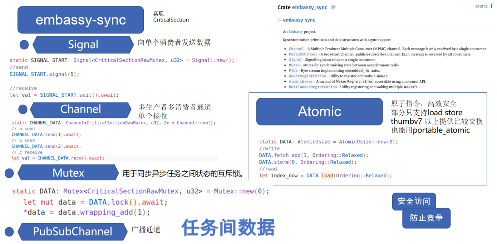

# Embedded Async Programming: A New Embedded Programming Paradigm

Traditional embedded development is mainly based on bare-metal polling and RTOS task models, but both models have their respective limitations.

## Bare-Metal Polling Model

Bare-metal polling is the simplest programming model in embedded systems, based on an infinite loop (commonly called the "main loop"), where various states and events are checked sequentially in the loop and corresponding processing is performed. This approach is simple and straightforward, doesn't depend on any operating system, and is suitable for simple tasks.

A typical bare-metal application often combines polling with interrupts:

```c
// Global variables for interrupt and main loop communication
volatile uint32_t tick_counter = 0;
volatile bool button_pressed = false;

// Timer interrupt service function
void TIM2_IRQHandler(void) {
    if (TIM2->SR & TIM_SR_UIF) {  // Check update interrupt flag
        tick_counter++;           // Increment counter
        TIM2->SR &= ~TIM_SR_UIF;  // Clear interrupt flag
    }
}

// External interrupt service function
void EXTI0_IRQHandler(void) {
    if (EXTI->PR & EXTI_PR_PR0) {
        button_pressed = true;    // Set button pressed flag
        EXTI->PR = EXTI_PR_PR0;   // Clear interrupt flag
    }
}

int main(void) {
    // System initialization
    SystemInit();
    // Configure timer interrupt and callback
    ......
    uint32_t last_tick = 0;
    // Main loop 
    while (1) {
        // Check for button press events
        if (button_pressed) {
            // Handle button event
            LED_Toggle();
            button_pressed = false;  // Clear flag
        }
        // Timer-based periodic tasks
        if (tick_counter - last_tick >= 1000) {  // About every second
            last_tick = tick_counter;
            // Execute periodic tasks
            UpdateSensors();
            UpdateDisplay();
        }
        // Can add more tasks...
    }
}
```

Although simple and understandable, the bare-metal polling model is often difficult to handle when dealing with complex tasks, has low scalability, and is difficult to handle complex task scheduling. Communication between interrupts and main loop relies on global variables, which easily leads to race conditions and data consistency problems. Rust implementation of bare-metal loops has similar effects but can add more safety features like `Atomic`.

## RTOS Task Model

The RTOS task model is a commonly used programming model in embedded systems that divides system tasks into multiple independent tasks, each running in its own context and scheduled through a task scheduler.

Here we use FreeRTOS as an example. FreeRTOS is an open-source real-time operating system widely used in embedded systems. It provides a task scheduler that manages multiple tasks, each running in its own context and scheduled through the task scheduler.

```c
// FreeRTOS task definition
void vSensorTask(void *pvParameters) {
    while(1) {
        // Wait for sensor data
        if(xSemaphoreTake(sensorDataSemaphore, portMAX_DELAY) == pdTRUE) {
            readAndProcessSensorData();
        }
    }
}

void vUartTask(void *pvParameters) {
    while(1) {
        // Wait for UART data
        if(xSemaphoreTake(uartDataSemaphore, portMAX_DELAY) == pdTRUE) {
            handleUartData();
        }
    }
}

// Task creation
void main() {
    // Create semaphores
    sensorDataSemaphore = xSemaphoreCreateBinary();
    uartDataSemaphore = xSemaphoreCreateBinary();
    // Create tasks
    xTaskCreate(vSensorTask, "Sensor", STACK_SIZE, NULL, PRIORITY_NORMAL, NULL);
    xTaskCreate(vUartTask, "UART", STACK_SIZE, NULL, PRIORITY_HIGH, NULL);
    // Start scheduler
    vTaskStartScheduler();
}
```

This task model allows us to perform task scheduling more conveniently, and many projects and products are built based on this model.
However, RTOS task switching requires saving and restoring context, which affects performance if task switching is frequent. Each task also needs separate stack space, which occupies considerable memory if there are many tasks.

## Embedded Async Programming
### What is Async Programming

Async programming is a concurrency model that **allows tasks to yield execution rights while waiting for I/O or other operations to complete** rather than blocking threads or creating new threads. The core idea is:

- **Non-blocking execution**: Operations return immediately after starting, without waiting for completion
- **Callback or await mechanism**: Notify or resume execution when operations complete
- **Efficient resource utilization**: Schedule tasks through state machines rather than thread switching

**Synchronous (blocking) operation**:
```c
// Synchronous read
result = read_sensor();  // Thread blocks until sensor returns data
process(result);         // Process after read completion
```

**Asynchronous (non-blocking) operation**:
```c
// Asynchronous read (pseudo code)
read_sensor_async(callback);  // Start read, return immediately
// Can do other work
// ...
// Callback is called when data is ready
function callback(result) {
    process(result);
}
```

In embedded systems, this can be understood as RTOS being preemptive scheduling, while async programming is cooperative scheduling.

| Scheduling Type | Characteristics |
| --- | --- |
| Preemptive Scheduling (RTOS) | Scheduler can interrupt task execution at any time<br>Task switching is triggered by timer or high-priority tasks<br>Tasks cannot choose "appropriate timing" to yield CPU |
| Cooperative Scheduling (Async) | Tasks actively yield execution rights (at await points)<br>System switches to other ready tasks at await points<br>Task switching points are explicit and predictable |

However, cooperative scheduling cannot achieve absolute real-time performance, so for example, `esp-idf-hal` in esp32 uses FreeRTOS combined with Rust's async programming model.

### Future Working Principle and async/await

Rust's async programming model is based on `Future` and `Async`, providing powerful async programming capabilities.
[Future](https://huangjj27.github.io/async-book/02_execution/02_future.html) is the foundation of Rust async programming, representing a computation that may not yet be complete. Here we directly cite content from the async-book:

```rust
trait SimpleFuture {
    type Output;
    fn poll(&mut self, wake: fn()) -> Poll<Self::Output>;
}

enum Poll<T> {
    Ready(T),
    Pending,
}
```

Future can be advanced by calling poll, which advances the future toward completion as much as possible. If the future completes, it returns Poll::Ready(result). If the future is not yet complete, it returns Poll::Pending and arranges for the wake() function to be called when the Future is ready for further progress. When wake() is called, the executor driving the Future will poll again, allowing the Future to make progress.

Without the wake() function, the executor would have no way of knowing whether a future is ready to make progress and would have to continuously poll all futures. But with the wake() function, the executor knows which futures are ready to be polled.

The key to understanding Future lies in its state machine model:

```rust
// Basic working mode of Future
let mut future = some_async_operation();

loop {
    match future.poll(&mut context) {
        Poll::Ready(value) => break value,   // Complete, return result
        Poll::Pending => {
            // Not complete, wait to be woken up then poll again
            wait_for_wakeup();
        }
    }
}
```

This implements the foundation of async programming, but this pattern has several problems: verbose code, complex state tracking, difficult nested callbacks. To solve these problems, Rust introduced `async/await` syntax sugar.

**async/await Syntax Sugar**

`async/await` is Rust's high-level syntax for handling async programming. It converts async code into state machines while maintaining synchronous code writing style:

```rust
// Concise writing with async/await
async fn read_sensor() -> Result<u16, Error> {
    let i2c = I2C::new().await?;
    let value = i2c.read_register(SENSOR_ADDR, TEMP_REG).await?;
    Ok(value)
}

// Calling async function
async fn process_data() {
    match read_sensor().await {
        Ok(data) => println!("Temperature: {}", data),
        Err(e) => println!("Read error: {:?}", e),
    }
}
```

**Working Principle of async/await**

When you write an `async` function, the Rust compiler will:

1. **Generate state machine**: Convert the function into a state machine that implements the `Future` trait
2. **Identify `.await` points**: Each `.await` is a point where execution might pause
3. **Save context**: Save necessary state at each pause point for resuming execution
4. **Auto-implement `poll`**: Generate complex state transition logic

**Zero-Cost Abstractions**

Rust's async/await is a "zero-cost abstraction" - the compiler translates high-level syntax into efficient state machine code:

- **No runtime overhead**: Generated code is as efficient as hand-written state machines
- **No GC dependency**: Doesn't need garbage collection, suitable for resource-constrained environments
- **Small memory footprint**: Single async task requires less memory than RTOS threads
- **Predictable execution**: Task switching points are explicit (at `.await`), reducing race conditions

For example, a simple `async fn` code:

```rust
async fn example() {
    let a = step_one().await;
    let b = step_two(a).await;
    step_three(b).await;
}
```

Will be converted by the compiler into a roughly equivalent state machine:

```rust
enum ExampleStateMachine {
    Start,
    WaitingOnStepOne(StepOneFuture),
    WaitingOnStepTwo(StepTwoFuture, StepOneOutput),
    WaitingOnStepThree(StepThreeFuture),
}

impl Future for ExampleStateMachine {
    type Output = ();
    
    fn poll(self: Pin<&mut Self>, cx: &mut Context<'_>) -> Poll<()> {
        // Complex state transition logic, automatically generated by compiler
        // ...
    }
}
```

## Async Runtime and Executors in Microcontrollers

To run async code, an executor is needed to manage Future polling and wakeup. There are several popular async runtimes in embedded Rust, with two typical ones being:

[Embassy](https://embassy.dev/book/): Lightweight async runtime designed specifically for embedded systems, supporting various MCUs
[RTIC](https://rtic.rs/2/book/en/): Real-time interrupt-driven concurrency framework

These runtimes are all optimized for resource-constrained environments, providing minimal memory footprint and efficient scheduling.

We mainly introduce Embassy here, which is also a popular async runtime in Rust embedded systems, providing HAL that supports cross-platform development for various MCUs.

**Embassy Features**

- **Static memory allocation**: No need for dynamic heap allocation, memory requirements determined at compile time
- **Lower memory overhead**: Single async task requires much less RAM than RTOS tasks
- **Low context switching cost**: Task switching doesn't require complete context save/restore
- **Type-safe task communication**: Provides typed channels and signals for inter-task communication
- **Simple programming model**: Async programming model is well-suited for embedded development

**Embassy Programming Model**

Embassy's programming model is very simple, just add the `#[embassy_executor::task]` attribute to functions:

```rust
// Multiple concurrent tasks under Embassy framework
#[embassy_executor::task]
async fn sensor_task(i2c: I2c<'static>) {
    let mut sensor = Bme280::new(i2c);
    loop {
        let reading = sensor.read().await.unwrap();
        // Process sensor data
        Timer::after_secs(1).await;
    }
}

#[embassy_executor::task]
async fn display_task(spi: Spi<'static>, mut display_data: Signal<DisplayData>) {
    let mut display = Display::new(spi);
    loop {
        // Wait for new display data
        let data = display_data.wait().await;
        display.update(&data).await;
    }
}

#[embassy_executor::main]
async fn main(_spawner: embassy_executor::Spawner) {
    ...
    ...
    _spawner.spawn(sensor_task(i2c)).ok();
    _spawner.spawn(display_task(spi, display_data)).ok();
}
```

## Async and DMA

In embedded systems, [DMA](https://embassy.dev/book/#_what_is_dma) (Direct Memory Access) is an efficient data transfer method, especially when processing large amounts of data. DMA can bypass the CPU and transfer data directly between memory and peripherals, thus improving data transfer efficiency.

The async programming model and DMA can be said to be very compatible, because the async programming model can avoid CPU blocking while waiting for data transfer, thus utilizing DMA for data transfer, reducing CPU burden for handling I/O.

In Embassy's HAL implementation, most async drivers use DMA transfer as the default implementation, such as I2C, SPI, UART, etc.

## Multi-Priority Task Scheduling

Although Embassy's async model is based on cooperative scheduling, it **supports preemptive-like multi-priority scheduling**. This hybrid model combines the memory efficiency of cooperative scheduling with the real-time responsiveness of preemptive scheduling.

Embassy allows creating multiple executors with different priorities. The official also provides an [example](https://github.com/embassy-rs/embassy/blob/fb5ce05b26ae0c90a872a8e0787c9419178d475a/examples/stm32f4/src/bin/multiprio.rs#L110):

```rust
#[embassy_executor::task]
async fn run_high() {
    loop {
        info!("        [high] tick!");
        Timer::after_ticks(27374).await;
    }
}

#[embassy_executor::task]
async fn run_med() {
    loop {
        let start = Instant::now();
        info!("    [med] Starting long computation");
        // Spin-wait to simulate a long CPU computation
        embassy_time::block_for(embassy_time::Duration::from_secs(1)); // ~1 second
        let end = Instant::now();
        let ms = end.duration_since(start).as_ticks() / 33;
        info!("    [med] done in {} ms", ms);
        Timer::after_ticks(23421).await;
    }
}

#[embassy_executor::task]
async fn run_low() {
    loop {
        let start = Instant::now();
        info!("[low] Starting long computation");
        // Spin-wait to simulate a long CPU computation
        embassy_time::block_for(embassy_time::Duration::from_secs(2)); // ~2 seconds
        let end = Instant::now();
        let ms = end.duration_since(start).as_ticks() / 33;
        info!("[low] done in {} ms", ms);
        Timer::after_ticks(32983).await;
    }
}

static EXECUTOR_HIGH: InterruptExecutor = InterruptExecutor::new();
static EXECUTOR_MED: InterruptExecutor = InterruptExecutor::new();
static EXECUTOR_LOW: StaticCell<Executor> = StaticCell::new();

#[interrupt]
unsafe fn UART4() {EXECUTOR_HIGH.on_interrupt()}

#[interrupt]
unsafe fn UART5() {EXECUTOR_MED.on_interrupt()}

#[entry]
fn main() -> ! {
    info!("Hello World!");
    let _p = embassy_stm32::init(Default::default());
    interrupt::UART4.set_priority(Priority::P6);
    let spawner = EXECUTOR_HIGH.start(interrupt::UART4);
    unwrap!(spawner.spawn(run_high()));
    // Medium-priority executor: UART5, priority level 7
    interrupt::UART5.set_priority(Priority::P7);
    let spawner = EXECUTOR_MED.start(interrupt::UART5);
    unwrap!(spawner.spawn(run_med()));
    // Low priority executor: runs in thread mode, using WFE/SEV
    let executor = EXECUTOR_LOW.init(Executor::new());
    executor.run(|spawner| {
        unwrap!(spawner.spawn(run_low()));
    });
}

//!Output result
//! ```
//!     [med] Starting long computation
//!     [med] done in 992 ms
//!         [high] tick!
//! [low] Starting long computation
//!     [med] Starting long computation
//!         [high] tick!
//!         [high] tick!
//!     [med] done in 993 ms
//!     [med] Starting long computation
//!         [high] tick!
//!         [high] tick!
//!     [med] done in 993 ms
//! [low] done in 3972 ms
//!     [med] Starting long computation
//!         [high] tick!
//!         [high] tick!
//!     [med] done in 993 ms
//! ```
```

From the output results, you can see high-priority tasks interrupting medium and low-priority tasks.

The priority principle in Embassy is to configure idle interrupts with different priorities, utilizing high-priority interrupts in microcontrollers to interrupt low-priority interrupts, thus achieving multi-priority task scheduling.

This multi-priority approach can improve real-time performance of critical tasks.

## Inter-Task Communication

Embassy provides many safe ways for inter-task communication. You can also use Atomic types for inter-task communication.


Note that Atomic types depend on underlying hardware support. Operations like load and store are relatively common atomic operations, but on certain architectures or for more complex operations (like atomic add/subtract, compare-and-swap), hardware support varies. The [portable-atomic](https://github.com/taiki-e/portable-atomic) crate provides a unified API that utilizes hardware instructions when available or provides software implementations based on critical sections when hardware doesn't support it, ensuring cross-platform availability.

## Sharing Peripherals Between Tasks

For multiple tasks using the same peripheral like GPIO, you can use the Mutex mentioned above.


## Summary

Embassy and Rust async programming have many more features. I also recommend checking out the [Embassy official documentation](https://embassy.dev/book/) and [async-book](https://rust-lang.github.io/async-book/).
This article also provides some comparisons between Embassy and RTOS: [Async Rust vs RTOS showdown!](https://tweedegolf.nl/en/blog/65/async-rust-vs-rtos-showdown)

Embedded async programming also has some limitations to consider:

1. **Binary size**: Compiler-generated state machines may lead to increased code size
2. **Debugging complexity**: Debugging async code is more complex than synchronous code
3. **Real-time performance**: Pure cooperative scheduling is difficult to guarantee hard real-time performance requirements

You need to evaluate solutions based on specific scenarios. RTIC, esp-idf-hal, and many other frameworks also provide solutions combining RTOS thread models with async models.

Embassy porting is also very convenient. Besides officially supported ones, there are now Embassy support for domestic MCUs like [py32](https://github.com/hysonglet/py32f030-hal) and [ch32](https://github.com/ch32-rs/ch32-hal).