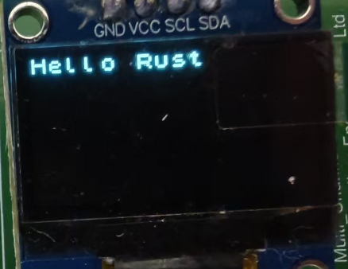

# Basic Example: SSD1306 OLED Display

Here we use a very simple SSD1306 OLED display example to give everyone a feel for creating and writing Embassy projects.

## Creating a Project with cargo-embassy

Embassy provides [cargo-embassy](https://github.com/adinack/cargo-embassy), we just need to select the corresponding MCU.

```bash
cargo install cargo-embassy
cargo embassy init ssd_demo --chip stm32g031g8
cd ssd_demo
```

You can see that the project is generated directly:

```
├──.cargo
│  └──config.toml
├──src
│  ├──fmt.rs
│  └──main.rs
├──build.rs
├──Cargo.lock
├──Cargo.toml
├──Embed.toml
└──rust-toolchain.toml
```

The core of the main file is printing Hello, World! and then LED blinking:

```rust
#[embassy_executor::main]
async fn main(_spawner: Spawner) {
    let p = embassy_stm32::init(Default::default());
    let mut led = Output::new(p.PB7, Level::High, Speed::Low);

    loop {
        info!("Hello, World!");
        led.set_high();
        Timer::after(Duration::from_millis(500)).await;
        led.set_low();
        Timer::after(Duration::from_millis(500)).await;
    }
}
```

Execute in the directory:

```bash
cargo run
```

This will automatically compile and run the example. You can see the corresponding example output printed in the command line:

```
    Finished `dev` profile [optimized + debuginfo] target(s) in 23.37s
     Running `probe-rs run --chip STM32G031G8Ux target\thumbv6m-none-eabi\debug\ssd_demo`
      Erasing ✔ [00:00:00] [###############################################################################################################################################] 14.00 KiB/14.00 KiB @ 54.25 KiB/s (eta 0s )  Programming ✔ [00:00:00] [###############################################################################################################################################] 14.00 KiB/14.00 KiB @ 36.94 KiB/s (eta 0s )    Finished in 0.662s
TRACE BDCR configured: 00008200
└─ embassy_stm32::rcc::bd::{impl#3}::init::{closure#4} @ C:\Users\User\.cargo\registry\src\index.crates.io-6f17d22bba15001f\embassy-stm32-0.2.0\src\rcc\bd.rs:280
DEBUG rcc: Clocks { hclk1: MaybeHertz(16000000), hsi: MaybeHertz(16000000), lse: MaybeHertz(0), lsi: MaybeHertz(0), pclk1: MaybeHertz(16000000), pclk1_tim: MaybeHertz(16000000), pll1_p: MaybeHertz(0), pll1_q: MaybeHertz(0), rtc: MaybeHertz(32000), sys: MaybeHertz(16000000) }
└─ embassy_stm32::rcc::set_freqs @ C:\Users\User\.cargo\registry\src\index.crates.io-6f17d22bba15001f\embassy-stm32-0.2.0\src\rcc\mod.rs:71
INFO  Hello, World!
└─ ssd_demo::____embassy_main_task::{async_fn#0} @ src\fmt.rs:131
INFO  Hello, World!
└─ ssd_demo::____embassy_main_task::{async_fn#0} @ src\fmt.rs:131
INFO  Hello, World!
└─ ssd_demo::____embassy_main_task::{async_fn#0} @ src\fmt.rs:131
```

## Creating a Project from Scratch

According to the guidance in [embassy-book](https://embassy.dev/book/#_starting_a_new_project), we can also start our example step by step.
First, we create a Rust project:

```bash
cargo new ssd1306_demo
cd ssd1306_demo
```

We generated an empty project:

```
├──src
│  └──main.rs
└──Cargo.toml
```

We're using the stm32g031 processor. Opening the corresponding [example](https://github.com/embassy-rs/embassy/tree/main/examples/stm32g0) in Embassy, we can see there's a .cargo/config.toml file. Let's copy the configuration file over.
The example uses:

```
[target.'cfg(all(target_arch = "arm", target_os = "none"))']
# replace STM32G0B1RETx with your chip as listed in `probe-rs chip list`
runner = "probe-rs run --chip STM32G0B1RETx"
[build]
target = "thumbv6m-none-eabi"
[env]
DEFMT_LOG = "trace"
```

`STM32G0B1RETx` is not our current model.
To check supported models, use:

```bash
probe-rs chip list
```

We're using `STM32G031G8Ux`, so replace `STM32G0B1RETx` in the runner above.
Now the compiler and debugger know our instruction set and specific chip type.

Next, add dependencies for Embassy and its support libraries:

```toml
[dependencies]
embassy-executor = { version = "0.7.0", features = ["arch-cortex-m", "executor-thread"] }
embassy-futures = "0.1.1"
embassy-stm32 = { version = "0.2.0", features = ["memory-x", "stm32g031g8", "time-driver-any", "exti", "unstable-pac"] }
embassy-sync = "0.6.2"
embassy-time = { version = "0.4.0", features = ["tick-hz-32_768"] }
```

And other build dependencies:

```toml
defmt = "0.3.5"
defmt-rtt = "0.4.0"
cortex-m = {version = "0.7.7", features = ["critical-section-single-core"]}
cortex-m-rt = "0.7.3"
panic-probe = "0.3.1"
```

Finally, copy the [profile.release] section from the example to our Cargo.toml:

```toml
[profile.release]
debug = 2
```

Embassy is constantly being updated, so it's recommended to try installing from the git repository. Here we find the latest version with the command:

```bash
git ls-remote https://github.com/embassy-rs/embassy.git HEAD
fb5ce05b26ae0c90a872a8e0787c9419178d475a        HEAD
```

Add to Cargo.toml:

```toml
[patch.crates-io]
embassy-time = { git = "https://github.com/embassy-rs/embassy", rev = "fb5ce05b26ae0c90a872a8e0787c9419178d475a" }
embassy-executor = { git = "https://github.com/embassy-rs/embassy", rev = "fb5ce05b26ae0c90a872a8e0787c9419178d475a" }
embassy-stm32 = { git = "https://github.com/embassy-rs/embassy", rev = "fb5ce05b26ae0c90a872a8e0787c9419178d475a" }
```

Finally, copy the build script build.rs from the example to the project:

```rust
fn main() {
    println!("cargo:rustc-link-arg-bins=--nmagic");
    println!("cargo:rustc-link-arg-bins=-Tlink.x");
    println!("cargo:rustc-link-arg-bins=-Tdefmt.x");
}
```

This build script configures linker parameters for embedded Rust projects, which is one of the standard configurations for embedded Rust projects.

Directory structure:

```
├──.cargo
│  └──config.toml
├──src
│  └──main.rs
├──build.rs
└──Cargo.toml
```

Copy an example from the examples to main.rs and execute:

```bash
cargo run
```

Complete build, programming, and debugging.

## Adding Screen Display

[SSD1306](https://cdn-shop.adafruit.com/datasheets/SSD1306.pdf) is an OLED screen commonly used in embedded systems to display information.
Rust provides a package manager, and combined with embedded-hal's cross-platform functionality, we can find the [SSD1306 Rust driver](https://crates.io/crates/ssd1306) and add it to Cargo.toml:

```toml
[dependencies]
ssd1306 = "0.10.0"
```

Since we're using async in Embassy, we need to add features:

```toml
[dependencies]
ssd1306 = { version = "0.10.0", features = ["async"] }
```

Next, add I2C initialization in main.rs:

Embassy generates specific hardware abstraction layer code for each specific MCU model. In this process, only the pins and functions that the MCU actually has are included in the `Peripherals` struct. Due to Rust's strong type system, when you try to access non-existent peripherals or pins, the compiler can immediately detect the problem and report an error. Here, if we initialize the wrong pin, it will report an error:

```rust
let p = embassy_stm32::init(Default::default());
let mut i2c = I2c::new(p.I2C1, p.PB9, p.PB7, Irqs, p.DMA1_CH1, p.DMA1_CH2, Hertz(100_000), Default::default());
```

The error is as follows:

```
error[E0609]: no field `PB9` on type `Peripherals`
  --> src\main.rs:28:11
   |
28 |         p.PB9,
   |           ^^^ unknown field
   |
```

This design of directly reflecting hardware function constraints in the type system has great advantages over traditional C language peripheral libraries.

Correct I2C initialization:

```rust
    let i2c = embassy_stm32::i2c::I2c::new(
        p.I2C1,
        p.PB6,
        p.PB7,
        Irqs,
        p.DMA1_CH1,
        p.DMA1_CH2,
        Hertz::khz(400),
        Default::default(),
    );
```

Create SSD1306 display I2C interface:

```rust
    let interface = I2CDisplayInterface::new(i2c);
```

Create SSD1306 display instance:
Specify display size as 128x64 pixels
Set display orientation to no rotation (Rotate0)
Convert to terminal mode for easier text display:

```rust
    let mut display = Ssd1306Async::new(interface, DisplaySize128x64, DisplayRotation::Rotate0)
        .into_terminal_mode();
```

Initialize display:

```rust
display.init().await.unwrap();
let _ = display.clear().await;
```

This completes the initialization. Add display:

```rust
let _ = display.write_str("Hello Rust!").await;
```

Now you can see `Hello Rust!` on the screen.



The final code is very simple to implement screen display. Overall code:

```rust
//src/main.rs
#![no_std]
#![no_main]
use defmt_rtt as _;
use embassy_executor::Spawner;
use embassy_stm32::{bind_interrupts, i2c, peripherals, time::Hertz};
use panic_probe as _;
use ssd1306::{prelude::*, I2CDisplayInterface, Ssd1306Async};

bind_interrupts!(struct Irqs {
    I2C1 => i2c::EventInterruptHandler<peripherals::I2C1>, i2c::ErrorInterruptHandler<peripherals::I2C1>;
});

#[embassy_executor::main]
async fn main(_spawner: Spawner) {
    let p = embassy_stm32::init(Default::default());
    let i2c = embassy_stm32::i2c::I2c::new(p.I2C1,p.PB6,p.PB7,Irqs,p.DMA1_CH1,p.DMA1_CH2,Hertz::khz(400),Default::default(),);
    let interface = I2CDisplayInterface::new(i2c);
    let mut display = Ssd1306Async::new(interface, DisplaySize128x64, DisplayRotation::Rotate0)
        .into_terminal_mode();
    display.init().await.unwrap();
    let _ = display.clear().await;
    //Display Hello Rust
    let _ = display.write_str("Hello Rust!").await;
    loop {

    }
}
```

The Irqs struct connects hardware interrupts with handlers through the bind_interrupts! macro.    
During I2C initialization, these interrupt handlers are registered with the system.    
When I2C communication events occur (such as data transfer completion or errors), corresponding interrupts are triggered.    
Interrupt handlers serve as waker implementations, responsible for waking async tasks waiting for these events.

This design allows code to use async/await style programming without needing blocking waits or manual polling. When I2C operations (like read/write) are in progress, the CPU can execute other tasks, and only when operations complete (triggering interrupts) will execution return to continue the unfinished parts of async functions.    

This is one of the core advantages of the Embassy framework: seamlessly integrating hardware interrupt mechanisms with Rust's async programming model.

## Summary

Through this basic example, we learned about Embassy's project creation, initialization, display, and other basic operations.
Embassy provides numerous examples for different platforms that can be found directly in [Embassy examples](https://github.com/embassy-rs/embassy/tree/main/examples).