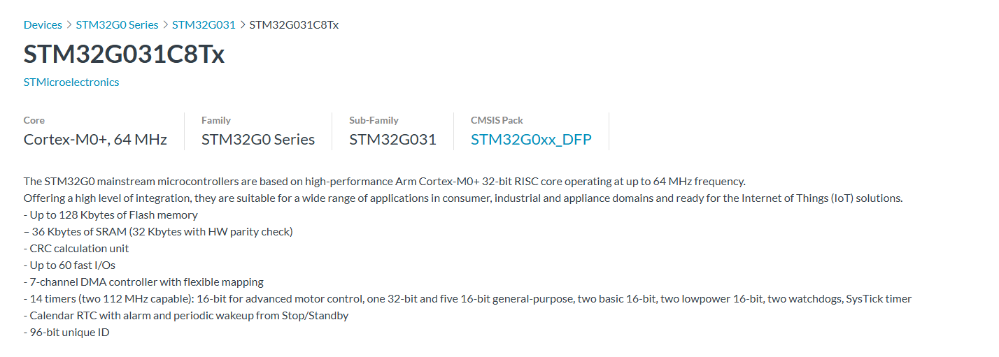

# Environment Setup: Advantages of Modern Toolchains

Embedded C toolchains require different toolchains for different target platforms, which is the first challenge most microcontroller developers encounter. ARM platforms require ARM-GCC or ARMCC installation, 8051 needs Keil C51 or SDCC, ESP32 uses xtensa-esp32-gcc/riscv-32... and many other RISC-V architecture microcontrollers. Toolchains for different platforms are incompatible with each other. Every time developers switch to a different chip platform, they often need to reconfigure the entire environment. Even for the same CPU architecture, different manufacturers and series of microcontrollers may require different SDK and toolchain configurations.

## C Language Development Approach

In principle, we can develop directly using GCC combined with programming and debugging tools. However, C language requires writing makefiles or cmake files, and debugging can also be quite cumbersome.

In C language ARM microcontroller development, many developers use IDEs like Keil5 or IAR:

For example, Keil requires first [downloading](https://www.keil.com/download/product/) from the official website and activating it, then configuring the corresponding SoC [toolkit](https://www.keil.arm.com/devices/)




Many manufacturers also provide their own integrated development environments. For example, TI's [CCS](https://www.ti.com/tool/CCSTUDIO) can be used to compile and debug TI's microcontrollers, DSPs, Bluetooth SoCs, and other processor chips.


ST company provides [CubeIDE](https://www.st.com/en/development-tools/stm32cubeide.html) for their own SoCs.


NXP company provides NXP MCUXpresso


There are also many manufacturers that customize their own SoC development environments through Eclipse or VSCode.

Each chip manufacturer often has their own IDE and toolchain, such as STM32CubeIDE, NXP MCUXpresso, ESP-IDF, etc. This causes developers to need to relearn a set of tools when switching platforms, making project porting difficult and learning costs high.

In comparison, the Rust embedded development ecosystem provides a more modern and unified toolchain experience.

## Rust Environment Configuration

First, let's install the [Rust toolchain](https://www.rust-lang.org/tools/install)

For Windows users, just one line:
```bash
curl --proto '=https' --tlsv1.2 -sSf https://sh.rustup.rs | sh
```

The [Rust ecosystem](https://google.github.io/comprehensive-rust/cargo/rust-ecosystem.html) consists of many tools, mainly including:

* rustc: The Rust compiler that converts .rs files to binary files and other intermediate formats.

* cargo: Rust dependency manager and build tool. Cargo knows how to download dependencies hosted at https://crates.io and pass them to rustc when building projects. Cargo also comes with a built-in test runner for executing unit tests.

* rustup: Rust toolchain installation and update tool. When Rust releases new versions, this tool is used to install and update rustc and cargo. Additionally, rustup can download standard library documentation. Multiple versions of Rust can be installed simultaneously, and rustup allows you to switch between these versions as needed.

Using the rustup tool, you can quickly configure support for different embedded platforms:
   ```bash
   rustup target add thumbv6m-none-eabi  # Add ARM Cortex-M0 support
   rustup target add thumbv7m-none-eabi  # Add ARM Cortex-M3 support
   rustup target add riscv32imac-unknown-none-elf  # Add RISC-V32imac support
   ```

After this, the basic configuration environment for compiling Rust is complete. Then comes programming and debugging for the embedded environment.

## Programming and Debugging

Besides using traditional openocd and debuggers through command line or IDE, you can also use the powerful tool [probe-rs](https://probe.rs/) in the Rust ecosystem.

probe-rs implements adaptation for different SoC manufacturers and different debugging protocols.


Using probe-rs, you can quickly implement programming and debugging of compiled code.
In ```.cargo/config.toml```, add the corresponding compilation target platform, for example stm32g031:
```
[target.'cfg(all(target_arch = "arm", target_os = "none"))']
# replace STM32G031G8Ux with your chip as listed in `probe-rs chip list`
runner = "probe-rs run --chip STM32G031G8Ux"
```

You can then program and run code on the target platform with the ```cargo run``` command:
```
 cargo run --release --target thumbv6m-none-eabi
```

probe-rs also supports integration with IDEs like VSCode/CLion for breakpoint debugging. For details, refer to [probe-rs-vscode](https://probe.rs/docs/tools/debugger/#building-and-testing-the-debug-extension-in-vs-code)


"Printf debugging" is also common in microcontroller programming. probe-rs uses the debugger's [RTT](https://github.com/probe-rs/rtt-target) and [defmt](https://github.com/knurling-rs/defmt) to implement very low latency and non-blocking log printing to the computer. In code, you can use defmt macros like ```debug!```, ```error!```, ```info!``` etc. to directly implement different log printing.

```rust
defmt::info!("This is an info message: {}", 42);
defmt::warn!("This is a warning message: {}", true);
defmt::debug!("This is a debug message: {}", "hello");
defmt::error!("This is an error message: {}", 3.14);
defmt::println!("This is a println message: {}", 42);
defmt::assert!(1 + 1 == 2, "Assertion failed: 1 + 1 != 2");
```

Complete code example:

```rust
#![no_main]
#![no_std]

use defmt::info;
use defmt_rtt as _; // Use RTT as transport layer
use panic_probe as _; // Use probe as panic handler

#[cortex_m_rt::entry]
fn main() -> ! {
    info!("This is an info message: {}", 42);
    defmt::debug!("This is a debug message: {}", "hello");
    defmt::warn!("This is a warning message: {}", true);
    defmt::error!("This is an error message: {}", 3.14);
    defmt::trace!("This is a trace message: {}", [1, 2, 3]);

    defmt::assert!(1 + 1 == 2, "Assertion failed: 1 + 1 != 2");
    defmt::assert_eq!(1 + 1, 2, "Assertion failed: 1 + 1 != 2");
    defmt::assert_ne!(1 + 1, 3, "Assertion failed: 1 + 1 == 3");

    let mut buffer = [0u8; 32];
    defmt::write!(&mut buffer, "Hello, {}!", "world");

    let args = defmt::format_args!("Hello, {}!", "world");
    defmt::println!("This is a println message: {}", 42);

    defmt::log!(defmt::Level::Info, "This is a log message: {}", 42);

    loop {}
}
```

For specific implementation and principles, refer to [defmt-book](https://defmt.ferrous-systems.com/).

The usage here is seamless. After the microcontroller project executes cargo run, it calls probe-rs.
probe-rs has [SEGGER's RTT](https://www.segger.com/products/debug-probes/j-link/technology/about-real-time-transfer/) built-in, sending logs to the computer via RTT.

Thus, through Rust tooling ecosystem, basic configuration can be completed very simply, and compilation and debugging can be easily achieved without needing specific IDEs.