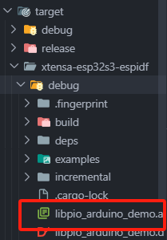

# Rust Development on ESP32

Espressif is one of the few chip manufacturers that officially supports Rust, providing two development approaches: [esp-idf-hal](https://github.com/esp-rs/esp-idf-hal) and [esp-hal](https://github.com/esp-rs/esp-hal).

esp-idf-hal is a Rust wrapper based on the esp-idf C language SDK. Many WiFi and Bluetooth functions are well-adapted and compatible. Since esp-idf provides a newlib environment, the Rust standard library can be built on top of it, so the development environment using esp-idf-hal can use std methods, which greatly improves development efficiency.

esp-hal is a bare-metal hardware abstraction layer for ESP32 (no-std).

For more information, refer to [Rust on ESP](https://docs.esp-rs.org/book/).

Note: The following requires readers to have experience with ESP32 C language development to understand more easily.

## ESP32 Rust Environment Configuration

ESP32 is divided into xtensa architecture and riscv architecture.
ESP32 officially provides [espup](https://github.com/esp-rs/espup) for installing and maintaining toolchains needed for ESP32 series chips.

Two commands complete the installation:

```bash
cargo install espup
espup install
```

## Project Generation

Use esp-generate to generate Rust projects for ESP32:

```bash
cargo install esp-generate
esp-generate --chip=esp32c6 your-project
```

Build and run projects directly using cargo commands:

```bash
cargo build
cargo run
```

You can use [templates](https://docs.esp-rs.org/book/writing-your-own-application/generate-project/esp-idf-template.html) to generate projects:

```bash
cargo generate esp-rs/esp-idf-template cargo
```

## Development

ESP32 development can directly refer to examples in esp-idf-hal and esp-hal repositories. There are also many related resources online, so we'll skip over this here.
It's worth noting that development under the esp-hal environment can use the Embassy framework, and Bluetooth functionality can use Embassy's newly provided [trouble](https://github.com/embassy-rs/trouble).

## Mixed Rust and C

Many times people struggle with "Rust or C". Here's a choice: "or" - mixing Rust and C in a unified project compilation, but not quite like STM32 above where you need to compile first, then embed, then compile C again. ESP provides some mixed programming compilation scripts and project templates that can be seen in the [Readme](https://github.com/esp-rs/esp-idf-template):


### Rust as Component ESP-IDF Method

The method using Cmake construction can be referenced [here](https://github.com/esp-rs/esp-idf-template/blob/master/README-cmake-details.md):

```bash
cargo generate --vcs none --git https://github.com/esp-rs/esp-idf-template cmake --name test
```

Then select the needed toolchain (only RISC-V can use nightly):


This will create an ESP-IDF project using Rust as a component, then build with Cmake.

```
test/
|-- CMakeLists.txt
|-- main/
|   |-- CMakeLists.txt
|   |-- main.c
|-- sdkconfig
|-- components/
|   |-- rust-test/
|       |-- CMakeLists.txt
|       |-- placeholder.c
|       |-- build.rs
|       |-- Cargo.toml
|       |-- rust-toolchain.toml
|       |-- src/
|           |-- lib.rs
```

Code writing and building around Rust mainly happens in rust-test under components.
The template will generate a sample function in lib.rs:

```rust
#[no_mangle]
extern "C" fn rust_main() -> i32 {
    // It is necessary to call this function once. Otherwise some patches to the runtime
    // implemented by esp-idf-sys might not link properly. See https://github.com/esp-rs/esp-idf-template/issues/71
    esp_idf_svc::sys::link_patches();

    // Bind the log crate to the ESP Logging facilities
    esp_idf_svc::log::EspLogger::initialize_default();

    log::info!("Hello, world!");

    42
}
```

And call it in C:

```c
extern int rust_main(void);

void app_main(void) {
    printf("Hello world from C!\n");

    int result = rust_main();

    printf("Rust returned code: %d\n", result);
}
```

Build and run completely using esp-idf csdk methods.
Will compile the Rust project in component and link with C project:

```bash
idf.py set-target [esp32|esp32s2|esp32s3|esp32c2|esp32c3|esp32c6|esp32h2]
idf.py build
idf.py -p /dev/ttyUSB0 flash
idf.py -p /dev/ttyUSB0 monitor
```

This allows real-time adjustment of Rust code implementation while maintaining esp-idf's original usage methods, such as adding other component libraries in components, like adding cam or arduino as components to the project.

### Building with PlatformIO

Many people use [platformio](https://platformio.org/) (abbreviated as pio) to build ESP32 projects. Here's an introduction to that as well.

The official [example](https://github.com/esp-rs/esp-idf-template/blob/master/README-pio.md) provides a template for creating pio projects based on esp-idf construction:

```bash
cargo install cargo-pio # Install pio

# cargo pio new <your-project-name> --platform espressif32 --frameworks espidf [--board <your-board-name>]

cargo pio new pio_espidf_demo --platform espressif32 --frameworks espidf --board lilygo-t-display-s3 -- --edition 2021    
```

The board name doesn't matter and can be modified later in platformio.ini. Other boards like adafruit_feather_esp32s3 can also run.

Here we use Lilygo's T-display-s3. Everyone can use any ESP32 they have at hand.


Then use:

```bash
pio run
```

If in VSCode, you can directly select build and run graphically.

You can also create Arduino-based projects:

```bash
cargo pio new pio_arduino_demo --platform espressif32 --frameworks arduino --board lilygo-t-display-s3 -- --edition 2021 
```

Project structure:

```
├──.cargo
│  └──config.toml
├──src
│  ├──dummy.c
│  ├──lib.rs
│  └──main.cpp
├──.gitignore
├──Cargo.toml
├──platformio.cargo.py
├──platformio.git.py
├──platformio.ini
└──platformio.patch.py
```

Provides simple examples. In lib.rs:

```rust
// Remove if STD is supported for your platform and you plan to use it
#![no_std]

// Remove if STD is supported for your platform and you plan to use it
#[panic_handler]
fn panic(_info: &core::panic::PanicInfo) -> ! {
    loop {}
}

//
// Entry points
//

#[no_mangle]
extern "C" fn arduino_setup() {
}

#[no_mangle]
extern "C" fn arduino_loop() {
}
```

In main.cpp:

```c
#include <Arduino.h>

extern "C" void arduino_setup();
extern "C" void arduino_loop();

void setup() {
    arduino_setup();
}

void loop() {
    arduino_loop();
}
```

Defaults to using no-std. Since ESP32 supports using std libraries like Vec, as mentioned earlier that ESP32 can use std environment, here we'll modify it to use std environment as an example.

First comment out no-std related dependencies in lib.rs:

```rust
// Remove if STD is supported for your platform and you plan to use it
// #![no_std]

// // Remove if STD is supported for your platform and you plan to use it
// #[panic_handler]
// fn panic(_info: &core::panic::PanicInfo) -> ! {
//     loop {}
// }
```

Currently ESP32S3 needs to use espup construction. We add a rust-toolchain.toml file in the root directory:

```toml
[toolchain]
channel = "esp"
```

Then add any print:

```rust
#[no_mangle]
extern "C" fn arduino_loop() {
    use std::string::String;
    // Print a string
    let s = String::from("Hello, Rust!");
    println!("{}", s);
    
}
```

Build, compile, flash and then get an error:


Didn't we say std is supported? Why the error?
Actually, std support needs to be added in .cargo/config.toml. Originally it was:

```toml
[unstable]
build-std = ["core", "panic_abort"]
build-std-features = ["panic_immediate_abort"]
```

Modify build-std to add std support:

```toml
build-std = ["std","core", "panic_abort"]
```

Command line compile and run or select build and run graphically in VSCode:


You can see that Rust is also built during construction:


Get serial output:


This mixed programming is especially suitable for adding Rust safety support without refactoring existing projects.

For example, you can modify demos provided in the [official repository](https://github.com/Xinyuan-LilyGO/T-Display-S3/tree/main).

Imitating the official pio configuration, add to platformio.ini:

```ini
build_flags = 
    -DLV_LVGL_H_INCLUDE_SIMPLE
    -DARDUINO_USB_CDC_ON_BOOT=1
    ; -UARDUINO_USB_CDC_ON_BOOT
    -DDISABLE_ALL_LIBRARY_WARNINGS
    -DARDUINO_USB_MODE=1
    ; Choose different options according to different driver chips
    ; Early use of CST328
    -DTOUCH_MODULES_CST_MUTUAL
    ; Use CST816 by default
    ; -DTOUCH_MODULES_CST_SELF  
```

Copy several files from the example factory folder to the current project.

Src directory structure:
```
├──dummy.c        
├──factory.ino    
├──factory.ino.cpp
├──factory_gui.cpp
├──factory_gui.h  
├──font_Alibaba.c 
├──lib.rs
├──lilygo1_gif.c  
├──lilygo2_gif.c  
├──pin_config.h   
└──zones.h    
```

We add several test functions:

```rust
#[no_mangle]
pub extern "C" fn rust_add_test(a: i32, b: i32) -> i32 {
    a + b
}

#[no_mangle]
pub extern "C" fn rust_multiply(a: i32, b: i32) -> i32 {
    a * b
}

#[no_mangle]
pub extern "C" fn rust_fibonacci(n: i32) -> i32 {
    if n <= 0 {
        return 0;
    } else if n == 1 {
        return 1;
    }
    let mut a = 0;
    let mut b = 1;
    let mut temp;
    for _ in 2..=n {
        temp = a + b;
        a = b;
        b = temp;
    }
    b
}

#[no_mangle]
pub extern "C" fn rust_find_max(arr: *const i32, len: usize) -> i32 {
    if arr.is_null() || len == 0 {
        return 0;
    }
    let slice = unsafe { std::slice::from_raw_parts(arr, len) };
    match slice.iter().max() {
        Some(&max) => max,
        None => 0,
    }
}

#[no_mangle]
pub extern "C" fn rust_string_length(s: *const u8) -> usize {
    if s.is_null() {
        return 0;
    }
    
    let mut len = 0;
    unsafe {
        while *s.add(len) != 0 {
            len += 1;
        }
    }
    len
}
```

Add tests in factory.ino:

```c
extern "C" {
  int rust_add_test(int a, int b);
  int rust_multiply(int a, int b);
  int rust_fibonacci(int n);
  int rust_find_max(const int* arr, size_t len);
  size_t rust_string_length(const char* s);
}

void run_rust_tests(void)
{
    // Clear previous UI elements
    lv_obj_clean(lv_scr_act());
    // Create title
    lv_obj_t *title_label = lv_label_create(lv_scr_act());
    lv_obj_align(title_label, LV_ALIGN_TOP_MID, 0, 10);
    lv_obj_set_style_text_font(title_label, &lv_font_montserrat_14, 0);
    lv_label_set_text(title_label, "Rust Function Tests");
    // Prepare test results
    String result = "";
    // Test addition function
    int add_result = rust_add_test(10, 25);
    result += "Add: 10 + 25 = ";
    result += String(add_result);
    result += "\n";
    // Test multiplication function
    int mul_result = rust_multiply(12, 5);
    result += "Multiply: 12 * 5 = ";
    result += String(mul_result);
    result += "\n";
    // Test fibonacci function
    int fib_result = rust_fibonacci(10);
    result += "Fibonacci(10) = ";
    result += String(fib_result);
    result += "\n";
    // Test find max function
    int arr[] = {3, 7, 1, 9, 4, 6};
    int max_result = rust_find_max(arr, 6);
    result += "Array Max: ";
    result += String(max_result);
    result += "\n";
    // Test string length function
    const char* test_str = "Hello, Rust!";
    size_t len_result = rust_string_length(test_str);
    result += "String Length: ";
    result += String(len_result);
    result += "\n";
    // Create result display area
    lv_obj_t *results_label = lv_label_create(lv_scr_act());
    lv_obj_align(results_label, LV_ALIGN_CENTER, 0, 0);
    lv_obj_set_width(results_label, LV_PCT(90));
    lv_obj_set_style_text_font(results_label, &lv_font_montserrat_14, 0);
    lv_label_set_long_mode(results_label, LV_LABEL_LONG_SCROLL);
    lv_label_set_text(results_label, result.c_str());
    // Output to serial
    Serial.println("=== Rust Test Results ===");
    Serial.println(result);
    // Create back button
    lv_obj_t *back_btn = lv_btn_create(lv_scr_act());
    lv_obj_align(back_btn, LV_ALIGN_BOTTOM_MID, 0, -10);
    lv_obj_set_width(back_btn, 120);
    lv_obj_set_height(back_btn, 40);
    lv_obj_t *back_label = lv_label_create(back_btn);
    lv_label_set_text(back_label, "Back");
    lv_obj_center(back_label);
    lv_obj_add_event_cb(back_btn, [](lv_event_t *e) {
        lv_obj_clean(lv_scr_act());
        lv_obj_t *log_label = lv_label_create(lv_scr_act());
        lv_obj_align(log_label, LV_ALIGN_TOP_LEFT, 0, 0);
        lv_obj_set_width(log_label, LV_PCT(100));
        lv_label_set_long_mode(log_label, LV_LABEL_LONG_SCROLL);
        lv_label_set_recolor(log_label, true);
        lv_label_set_text(log_label, "Scan WiFi");
        wifi_test();
    }, LV_EVENT_CLICKED, NULL);
    // Send test result message
    lv_msg_send(MSG_RUST_TEST_RESULT, result.c_str());
}

void rust_tests(void)
{
    // Clear current screen
    lv_obj_clean(lv_scr_act());
    // Show loading indicator
    lv_obj_t *spinner = lv_spinner_create(lv_scr_act(), 1000, 60);
    lv_obj_set_size(spinner, 100, 100);
    lv_obj_center(spinner);
    lv_obj_t *load_label = lv_label_create(lv_scr_act());
    lv_label_set_text(load_label, "Running Rust Tests...");
    lv_obj_align(load_label, LV_ALIGN_BOTTOM_MID, 0, -40);
    // Brief delay to show loading effect
    LV_DELAY(1000);
    // Delete loading indicator
    lv_obj_del(spinner);
    lv_obj_del(load_label);
    // Run detailed Rust tests
    run_rust_tests();
}
```

You can see the development board screen will display test results:


This completes the basics of mixed Rust and C programming for ESP32. You can now start your own projects.

You can also use similar methods as STM32 to find .a files in target and copy them to other projects for use:



Copy to other project directories and add dependencies in build_flags.

Using this method, you can add a RustTest button to projects like [T-Display-S3-Pro](https://github.com/Xinyuan-LilyGO/T-Display-S3-Pro) Cellphone project.

Put the .a file in the root directory and add to platformio.ini:

```ini
    -L"${PROJECT_DIR}"  
    -lpio_arduino_demo
```

Then similarly add buttons and functions to get:


Click the button to see running examples:


And serial output:


This concludes the entire guide.
Now begin your embedded Rust journey!