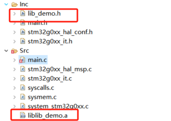

# Embedding Rust in STM32 C Projects

Rust has excellent C language interoperability. [A little Rust with your C](https://docs.rust-embedded.org/book/interoperability/rust-with-c.html) introduces how to embed Rust code into C projects.


Simply put, you need to convert Rust types to C types, then generate libraries and header files to include and use in C projects.

But in microcontrollers, static compilation is needed, so you need:

```
crate-type = ["staticlib"]
```

Here we use the cargo command to create a simple lib:

```bash
cargo new lib_demo --lib
cd lib_demo
```

Then add to Cargo.toml:

```toml
[lib]
name = "lib_demo"
crate-type = ["staticlib"]
```

Add simple arithmetic operations (addition, subtraction, multiplication, division):

```rust
#![no_std]
/// Addition operation
/// Provide panic handler function for no_std environment
#[panic_handler]
fn panic(_info: &core::panic::PanicInfo) -> ! {
    loop {}
}

#[no_mangle]
pub extern "C" fn add(a: i32, b: i32) -> i32 {
    a + b
}

/// Subtraction operation
#[no_mangle]
pub extern "C" fn subtract(a: i32, b: i32) -> i32 {
    a - b
}

/// Multiplication operation
#[no_mangle]
pub extern "C" fn multiply(a: i32, b: i32) -> i32 {
    a * b
}

/// Division operation (returns safe result, returns preset safe result 0 when dividing by zero)
#[no_mangle]
pub extern "C" fn divide(a: i32, b: i32) -> i32 {
    if b == 0 {
        0 // Prevent divide by zero error
    } else {
        a / b
    }
}

/// Floating point division
#[no_mangle]
pub extern "C" fn divide_float(a: f64, b: f64) -> f64 {
    if b == 0.0 {
        0.0 // Prevent divide by zero error
    } else {
        a / b
    }
}
```

Then write a calling header file:

```c
#ifndef LIB_DEMO_H
#define LIB_DEMO_H

#ifdef __cplusplus
extern "C" {
#endif

// Integer operations
int add(int a, int b);
int subtract(int a, int b);
int multiply(int a, int b);
int divide(int a, int b);

// Floating point operations
double divide_float(double a, double b);

#ifdef __cplusplus
}
#endif

#endif // LIB_DEMO_H 
```

Now you can call the written library from C language. Recommend supplementary reading [ffi](https://doc.rust-lang.org/nomicon/ffi.html).

## Embedding in STM32CubeIDE

STM32CubeIDE is the official development environment provided by ST. Here we use a CubeIDE project as an example.
For STM32CubeIDE introduction, refer to [STM32CubeIDE Quick Start Guide](https://www.st.com/resource/zh/user_manual/um2553-stm32cubeide-quick-start-guide-stmicroelectronics.pdf).

First, we open CubeIDE and select to create a new project:


Enter our chip stm32g8u6 and select:


Enter project name and click finish to complete creation:


For this simple example, we use USART output, so only initialize USART2.
Select USART2 on the left and configure mode to Asynchronous mode, which will automatically configure pins:


Then CTRL+S to save, CubeIDE will automatically generate code:


Add the following code to main.c to support printf:
```c
#ifdef __GNUC__
#define PUTCHAR_PROTOTYPE int __io_putchar(int ch)
#else
#define PUTCHAR_PROTOTYPE int fputc(int ch, FILE *f)
#endif

PUTCHAR_PROTOTYPE
{
  HAL_UART_Transmit(&huart2, (uint8_t *)&ch, 1,HAL_MAX_DELAY);
  return ch;

}
```

Add floating point printf support in Project/Properties/C/C++ Build/Settings/Tool Settings:


Now an STM32 C template is complete. Add the lib_demo library.
First compile lib_demo:
```bash
cargo build --release --target thumbv6m-none-eabi
```

Find the lib_demo.a file and add it along with lib_demo.h file to the Src and Inc directories of the STM32CubeIDE project:


Right-click refresh in CUBEIDE to see the added files:



Finally, you need to add this library to the project:

In Project/Properties, select and add the library:


Add to main.c:

```c
#include "lib_demo.h"
...
int main(void)
{
...

  /* USER CODE BEGIN 2 */
  int a = 10, b = 5;
  printf("Integer operations:\n");
  printf("%d + %d = %d\n", a, b, add(a, b));
  printf("%d - %d = %d\n", a, b, subtract(a, b));
  printf("%d * %d = %d\n", a, b, multiply(a, b));
  printf("%d / %d = %d\n", a, b, divide(a, b));
  // Test divide by zero
  printf("%d / %d = %d (divide by zero protection)\n", a, 0, divide(a, 0));
  // Test floating point division
  double x = 10.5, y = 2.5;
  printf("\nFloating point operations:\n");
  printf("%.2f / %.2f = %.2f\n", x, y, divide_float(x, y));
  printf("%.2f / %.2f = %.2f (divide by zero protection)\n", x, 0.0, divide_float(x, 0.0));
  /* USER CODE END 2 */
...
}
```

Click debug and run to see the output in the serial terminal:


This completes embedding a Rust library into an STM32 C language project.

## Summary

This is just using the simplest example for illustration. In actual applications, you can implement complex logic that requires safety guarantees in Rust, then embed it into C projects.
For example, protocol encoding/decoding, calculations, etc.