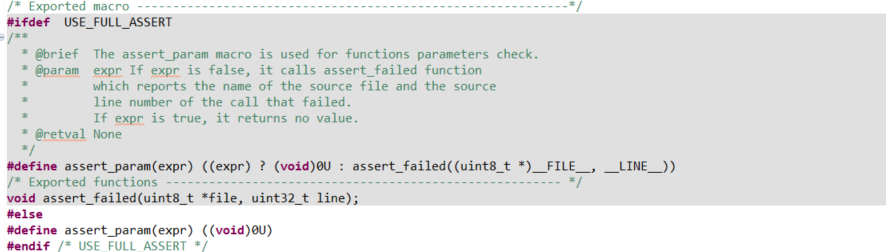

# Type System: Compile-Time Safety and Zero-Cost Abstractions

Rust's type system provides powerful compile-time safety guarantees for embedded development while maintaining zero runtime overhead characteristics, which is particularly important for resource-constrained microcontroller development.

## Type Safety Issues in C Language

Directly manipulating low-level registers in embedded systems can easily cause hardware damage, system instability, or security vulnerabilities if used improperly. Traditional C language relies on runtime checks, technical documentation, and project management standards to avoid these problems. For example, incorrect pin configuration, pin configuration conflicts, etc.

Here's an example of STM32 GPIO configuration:

```c
void HAL_GPIO_WritePin(GPIO_TypeDef *GPIOx, uint16_t GPIO_Pin, GPIO_PinState PinState)
{
  /* Check parameters */
  assert_param(IS_GPIO_PIN(GPIO_Pin));
  assert_param(IS_GPIO_PIN_ACTION(PinState));

  if (PinState != GPIO_PIN_RESET)
  {
    GPIOx->BSRR = GPIO_Pin;
  }
  else
  {
    GPIOx->BSRR = (uint32_t)GPIO_Pin << 16u;
  }
}
```

In the C language code above, we can see several typical safety hazards:

1. **Runtime Parameter Checking**: The function uses `assert_param` to check parameter validity at runtime, which increases program size and execution time, and completely fails when optimization compilation is enabled or assertions are disabled. Moreover, assert_param is disabled by default and needs to be manually enabled via macros.



2. **Lack of Type Safety**: The function accepts any `GPIO_TypeDef` pointer, and the compiler cannot check whether the passed GPIO peripheral has been correctly initialized or is valid.

3. **Unclear State**: There is no type system guarantee that the GPIO pin has been correctly configured as output mode. Even if the pin is configured as input, analog, or other functions, this function can still compile and execute, potentially causing abnormal hardware behavior.

For example, setting a GPIO initialized as input to low level:

```c
  GPIO_InitStruct.Pin = KEY_Pin;
  GPIO_InitStruct.Mode = GPIO_MODE_INPUT;
  GPIO_InitStruct.Pull = GPIO_NOPULL;
  HAL_GPIO_Init(KEY_GPIO_Port, &GPIO_InitStruct);//Configure as input mode
  HAL_GPIO_WritePin(KEY_GPIO_Port, KEY_Pin, GPIO_PIN_RESET);//Set to low level
```

This code will not report errors during compilation or runtime, but this operation is logically unreasonable and may lead to undefined behavior or hardware issues.
C code must rely on runtime checks and developer carefulness rather than utilizing the compiler for static guarantees.

## Rust's Type State Pattern

Rust allows us to encode state at the type system level, making state transition errors become compile errors rather than runtime crashes. Here we look at pseudo-code for a GPIO implementation in Rust:

```rust

pub struct Input<MODE> { _mode: PhantomData<MODE> }
pub struct Output<MODE> { _mode: PhantomData<MODE> }
pub struct Floating; pub struct PullUp; pub struct PullDown; pub struct PushPull; pub struct OpenDrain;

pub struct Pin<const P: char, const N: u8, MODE> { _mode: PhantomData<MODE> }

impl<const P: char, const N: u8, MODE> Pin<P, N, Input<MODE>> {
    pub fn is_high(&self) -> bool { !self.is_low() }
    pub fn is_low(&self) -> bool { ...implementation... }
    pub fn into_push_pull_output(self) -> Pin<P, N, Output<PushPull>> { ...implementation... Pin { _mode: PhantomData } }
    pub fn into_open_drain_output(self) -> Pin<P, N, Output<OpenDrain>> { ...implementation... Pin { _mode: PhantomData } }
}

impl<const P: char, const N: u8, MODE> Pin<P, N, Output<MODE>> {
    pub fn set_high(&mut self) { ...implementation... }
    pub fn set_low(&mut self) { ...implementation... }
    pub fn toggle(&mut self) { ...implementation... }
    pub fn into_floating_input(self) -> Pin<P, N, Input<Floating>> { ...implementation... }
}

// Usage example
fn gpio_example() {
    ...initial configuration...
    let mut output_pin = input_pin.into_push_pull_output();
    // Set output state
    output_pin.set_high();
    output_pin.set_low();
    output_pin.toggle();
    
    // Compile error examples:
    output_pin.is_high();  // ❌ Compile error: Output pins don't have is_high method
    input_pin.set_high();  // ❌ Compile error: input_pin has been consumed (moved)
    // Convert pin back to input mode
    let input_pin = output_pin.into_floating_input();
    let state = input_pin.is_high(); // ✓ Correct: Input pins can read state
}
```

Compared to the C language implementation shown earlier, this actual Rust library implementation demonstrates several key advantages:

1. **Type State Encoding**: The pin's state (input/output) is directly encoded in type parameters, allowing the compiler to statically verify operation validity. For example, output pins don't have an `is_high()` method, and input pins don't have a `set_high()` method.

2. **Safe State Transitions**: Pin state transitions are implemented through methods that consume the old state and return a new state (like `into_push_pull_output()`), ensuring completeness and irreversibility of state transitions, preventing use of old state references.

3. **Ownership System Guarantees**: Rust's ownership system ensures that only one piece of code can operate a specific pin at any time, avoiding concurrent access and configuration conflicts.

4. **Zero Runtime Overhead**: Despite providing rich safety guarantees, these safety checks are performed at compile time, and runtime code is equivalent to hand-optimized C code. `PhantomData` is a zero-sized type that occupies no memory.

## PhantomData and Zero-Cost Abstractions

Above we used ```PhantomData<T>```, which is a special type in the Rust standard library used to mark the existence of a certain type or lifetime at compile time, but does not actually occupy memory space.

In the above example, it represents various pin states and configuration types:

```rust
// PhantomData is used to mark MODE in the type system, but occupies no actual memory
pub struct Pin<const P: char, const N: u8, MODE> {
    _mode: PhantomData<MODE>, // Zero-sized type, occupies no memory after compilation
}

// Different mode types are also zero-sized types
pub struct Input<MODE> { _mode: PhantomData<MODE> }
pub struct Output<MODE> { _mode: PhantomData<MODE> }
pub struct Floating;
pub struct PushPull;
```

### Role of PhantomData

1. **Type Marking**: `PhantomData<MODE>` tells the compiler that the Pin struct is related to the MODE type, even though it doesn't store actual values of the MODE type.

2. **Zero-Sized Type**: `PhantomData<T>` is a zero-sized type (ZST), meaning it typically occupies no memory space after compilation. This ensures our abstractions don't introduce runtime overhead.

3. **Type Safety**: Through PhantomData, the compiler can enforce type rules at compile time, such as preventing calls to `is_high()` method on output pins.

### Compile-Time State Encoding Implementation

In the STM32 GPIO example, we use generic parameters to represent pin states:

```rust
// Input pin with pull-up resistor
let pin: Pin<'A', 5, Input<PullUp>> = ...;

// Output pin in push-pull output mode
let pin: Pin<'A', 5, Output<PushPull>> = ...;
```

When pin state changes, instead of modifying internal fields (which would typically involve modifying a state flag in C), we **return a completely new type of object**:

```rust
// Input to output, consumes input pin, returns output pin
pub fn into_push_pull_output(
    self
) -> Pin<P, N, Output<PushPull>> {
    // Hardware configuration...
    Pin { _mode: PhantomData }
}
```

We can examine the compiled assembly code, comparing versions with and without type safety checks:

```rust
// Rust version (with type state checking)
fn toggle_led(led: &mut Pin<'A', 5, Output<PushPull>>) {
    led.toggle();
}

// Compiles to roughly the same assembly instructions:
// ldr r0, [r0]       // Load pin register address
// ldr r1, [r0, #16]  // Read ODR register
// eor r1, r1, #32    // Flip corresponding bit
// str r1, [r0, #16]  // Write back to ODR register
// bx lr              // Return
```

While the safe C language version requires runtime checks:

```c
// Safe C language version
void toggle_led_safe(GPIO_TypeDef* gpio, uint16_t pin) {
    if (gpio == NULL) return;
    if (pin > 15) return;
    // ...other runtime checks
    gpio->ODR ^= (1 << pin);
}

// Compiles to more instructions:
// cmp r0, #0         // Check NULL
// beq .return
// cmp r1, #15        // Check pin range
// bhi .return
// ...other runtime checks
// ldr r2, [r0, #16]  // Actual operation
// ...
```

For GPIO with relatively few states, some complex peripherals may have more states, such as I2C, SPI, UART, etc. In this case, C language needs to implement through complex macros or state machines, while Rust can implement through the type system.

## PhantomData Lifetime Marking

Rust's lifetime system is one of the cores of its memory safety guarantees, especially important when handling hardware resources in embedded systems. Lifetimes are a mechanism used by the compiler to track reference validity, ensuring that references don't outlive the data they point to.

In C language, we need to manually track pointer validity, which easily leads to problems like dangling pointers or using freed memory. Rust enforces reference safety through compile-time checks.

The lifetime concept is briefly mentioned here only for partial applications in embedded scenarios. Recommend reading [The Rust Programming Language](https://course.rs/advance/lifetime/advance.html) or [Official Rust Documentation](https://doc.rust-lang.org/book/ch10-00-generics.html) for deeper understanding.

### Lifetimes and Embedded Systems

In embedded development, lifetimes are particularly useful in DMA (Direct Memory Access) operation scenarios. DMA allows peripherals to directly access memory, bypassing the CPU, to improve data transfer efficiency. But this also brings a challenge: we must ensure that during DMA operations, the related memory regions remain valid and unmodified.

Let's compare how C and Rust handle this problem:

```c
// DMA transfer in C language - safety depends on developer carefulness
void start_dma_transfer(uint8_t* buffer, size_t size) {
    // Configure DMA and start transfer
    DMA_Config(DMA1, buffer, size);
    DMA_Start(DMA1);
    // Dangerous: C compiler doesn't prevent modifying or freeing buffer during DMA transfer
    // This entirely depends on the developer remembering and avoiding it
}

// Usage example
void example_function(void) {
    uint8_t local_buffer[64];
    // Fill buffer
    for (int i = 0; i < 64; i++) {
        local_buffer[i] = i;
    }
    // Start DMA transfer
    start_dma_transfer(local_buffer, 64);
    // Dangerous: DMA might still be ongoing, but buffer is about to go out of scope
    // C compiler won't warn about this problem
    
    // Possible solution: wait for DMA completion, but this depends on developer remembering to do so
    while(DMA_GetStatus(DMA1) != DMA_COMPLETE) { }
}
```

C language has no built-in mechanism to track pointer *validity range* or *lifetime*, relying entirely on developers. Even if developers are careful themselves, it's still easy to make mistakes.

Now let's see how Rust uses PhantomData and lifetimes to solve this problem:

```rust
// DMA transfer in Rust - compile-time safety guarantee
struct DmaTransfer<'buffer> {
    dma: &'static mut DMA_TypeDef,
    _buffer: PhantomData<&'buffer mut [u8]>, // Mark buffer lifetime
}

impl<'buffer> DmaTransfer<'buffer> {
    // Start DMA transfer
    pub fn new(dma: &'static mut DMA_TypeDef, buffer: &'buffer mut [u8]) -> Self {
        // Configure DMA
        unsafe {
            (*dma).source_addr = buffer.as_ptr() as u32;
            (*dma).byte_count = buffer.len() as u32;
            (*dma).control = DMA_ENABLE;
        }
        
        DmaTransfer {
            dma,
            _buffer: PhantomData, // Track buffer lifetime but don't store it
        }
    }
    
    // Wait for transfer completion
    pub fn wait(self) -> Result<(), Error> {
        unsafe {
            while (*self.dma).status & DMA_COMPLETE == 0 {}
            (*self.dma).control = 0; // Disable DMA
        }
        Ok(())
    }
}

// Drop implementation ensures DMA is stopped when DmaTransfer is dropped
impl<'buffer> Drop for DmaTransfer<'buffer> {
    fn drop(&mut self) {
        unsafe {
            // Ensure DMA is stopped
            (*self.dma).control = 0;
        }
    }
}

// Usage example
fn example_function() {
    let mut buffer = [0u8; 64];
    // Fill buffer
    for i in 0..64 {
        buffer[i] = i as u8;
    }
    // Get DMA peripheral
    let dma = unsafe { &mut *(DMA1 as *mut DMA_TypeDef) };
    // Start DMA transfer
    let transfer = DmaTransfer::new(dma, &mut buffer);
    // Compile error examples:
    buffer[0] = 99; // ❌ Error: buffer is borrowed, cannot modify
    drop(buffer);   // ❌ Error: buffer is borrowed, cannot be dropped early
    // Correct usage: wait for transfer completion
    transfer.wait().unwrap();
    // Now can safely use buffer
    println!("Transfer completed, first byte: {}", buffer[0]);
    // If we don't call wait(), at function end:
    // 1. transfer's Drop implementation will ensure DMA is stopped
    // 2. Then buffer will be freed
}
```

Rust implementation achieves the following:

1. **Lifetime Tracking**: `PhantomData<&'buffer mut [u8]>` tells the compiler that DmaTransfer holds a reference to buffer, and its lifetime is bound to 'buffer.

2. **Borrow Checking**: The compiler ensures buffer is not modified or freed while DMA is using it. Any attempt to modify an already borrowed buffer will cause a compile error.

3. **Resource Management**: Through Drop implementation, even in exceptional situations (such as early return or panic), DMA will be properly stopped.

4. **Zero Runtime Overhead**: `PhantomData` occupies no memory space, and all safety checks are completed at compile time.

In C language, we might use comments and naming conventions to remind developers, or add runtime checks and complex state tracking mechanisms, but this increases overhead and is still not as reliable as compile-time checks.

Through Rust's lifetime system and PhantomData, we can build APIs that are both safe and efficient, letting the compiler help us catch potential resource usage errors, which is particularly important in embedded systems because such errors often lead to hard-to-debug problems.