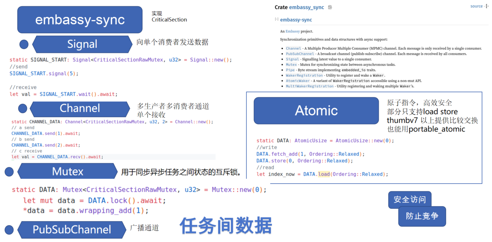
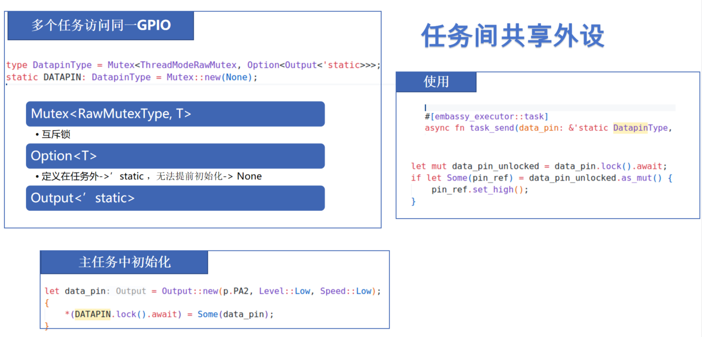

# 嵌入式异步编程：全新嵌入式编程范式


传统嵌入式主要是以裸机轮询和RTOS任务模型为主，但这两种模型都有各自的局限性。

## 裸机轮询模型

裸机轮询（Bare-metal Polling）是嵌入式系统中最简单的编程模型，它基于一个无限循环（通常称为"主循环"），在循环中依次检查各种状态和事件，并执行相应的处理。这种方式简单直接，不依赖任何操作系统，适合简单的任务。

一个典型的裸机应用常常结合轮询和中断：

```c
// 全局变量用于中断和主循环通信
volatile uint32_t tick_counter = 0;
volatile bool button_pressed = false;

// 定时器中断服务函数
void TIM2_IRQHandler(void) {
    if (TIM2->SR & TIM_SR_UIF) {  // 检查更新中断标志
        tick_counter++;           // 递增计数器
        TIM2->SR &= ~TIM_SR_UIF;  // 清除中断标志
    }
}

// 外部中断服务函数
void EXTI0_IRQHandler(void) {
    if (EXTI->PR & EXTI_PR_PR0) {
        button_pressed = true;    // 设置按钮按下标志
        EXTI->PR = EXTI_PR_PR0;   // 清除中断标志
    }
}

int main(void) {
    // 系统初始化
    SystemInit();
    // 配置定时器中断和回调
    ......
    uint32_t last_tick = 0;
    // 主循环 
    while (1) {
        // 检查是否有按钮按下事件
        if (button_pressed) {
            // 处理按钮事件
            LED_Toggle();
            button_pressed = false;  // 清除标志
        }
        // 基于定时器的周期性任务
        if (tick_counter - last_tick >= 1000) {  // 大约每秒
            last_tick = tick_counter;
            // 执行周期性任务
            UpdateSensors();
            UpdateDisplay();
        }
        // 可以添加更多任务...
    }
}
```

虽然简单易懂，但裸机轮询模型在应对复杂任务时候往往难以处理，扩展性较低，难以处理复杂任务调度，同时中断与主循环通信依赖全局变量，容易出现竞态条件和数据一致性问题。Rust中实现裸机循环效果类似，但是可以增加如`Atomic`等更多安全特性。

## RTOS任务模型

RTOS任务模型是嵌入式系统中常用的编程模型，它将系统任务划分为多个独立的任务，每个任务在独立的上下文中运行，通过任务调度器进行调度。

我们这里用FreeRTOS为例，FreeRTOS是一个开源的实时操作系统，广泛应用于嵌入式系统中。它提供了一个任务调度器，可以管理多个任务，每个任务在独立的上下文中运行，通过任务调度器进行调度。

```c
// FreeRTOS任务定义
void vSensorTask(void *pvParameters) {
    while(1) {
        // 等待传感器数据
        if(xSemaphoreTake(sensorDataSemaphore, portMAX_DELAY) == pdTRUE) {
            readAndProcessSensorData();
        }
    }
}
void vUartTask(void *pvParameters) {
    while(1) {
        // 等待串口数据
        if(xSemaphoreTake(uartDataSemaphore, portMAX_DELAY) == pdTRUE) {
            handleUartData();
        }
    }
}

// 任务创建
void main() {
    // 创建信号量
    sensorDataSemaphore = xSemaphoreCreateBinary();
    uartDataSemaphore = xSemaphoreCreateBinary();
    // 创建任务
    xTaskCreate(vSensorTask, "Sensor", STACK_SIZE, NULL, PRIORITY_NORMAL, NULL);
    xTaskCreate(vUartTask, "UART", STACK_SIZE, NULL, PRIORITY_HIGH, NULL);
    // 启动调度器
    vTaskStartScheduler();
}
```

这样的任务模型让我们能更方便的进行任务调度，大量的项目产品都是依据这种模型构建。
但是RTOS任务切换中需要保存和恢复上下文，如果任务切换频繁，会影响性能。每个任务也需要单独的栈空间，如果任务较多，会占用较大内存。


## 嵌入式异步编程
### 什么是异步编程

异步编程是一种**允许任务在等待I/O或其他操作完成时让出执行权**的并发模型，而不是阻塞线程或创建新线程。核心思想是：

- **非阻塞执行**：操作启动后立即返回，不等待完成
- **回调或等待机制**：操作完成时通知或恢复执行
- **高效资源利用**：通过状态机调度任务，而非线程切换


**同步（阻塞）操作**：
```c
// 同步读取
result = read_sensor();  // 线程阻塞直到传感器返回数据
process(result);         // 读取完成后处理
```

**异步（非阻塞）操作**：
```c
// 异步读取（伪代码）
read_sensor_async(callback);  // 启动读取，立即返回
// 可以做其他工作
// ...
// 数据准备好时回调会被调用
function callback(result) {
    process(result);
}
```

在嵌入式中可以理解为RTOS为抢占式调度，而异步编程为协作式调度。

| 调度类型 | 特点 |
| --- | --- |
| 抢占式调度（RTOS） | 调度器可随时中断任务执行<br>任务切换由定时器或高优先级任务触发<br>任务无法选择"合适的时机"让出CPU |
| 协作式调度（异步） | 任务主动让出执行权（在等待点）<br>系统在等待点切换到其他准备执行的任务<br>任务间切换点明确、可预测 |

但是协作式调度无法实现绝对的实时性，所以比如esp32的`esp-idf-hal`中是使用Freertos配合Rust的异步编程模型实现。

### Future工作原理与async/await

Rust的异步编程模型基于`Future`和`Async`，提供了强大的异步编程能力。
[Future](https://huangjj27.github.io/async-book/02_execution/02_future.html)是Rust异步编程的基础，代表一个可能尚未完成的计算这里直接引用async-book中的内容

```rust

trait SimpleFuture {
    type Output;
    fn poll(&mut self, wake: fn()) -> Poll<Self::Output>;
}

enum Poll<T> {
    Ready(T),
    Pending,
}

```

Future 能通过调用 poll 的方式推进，这会尽可能地推进 future 到完成状态。如果 future 完成了， 那就会返回 poll::Ready(result)。如果 future 尚未完成，则返回 poll::Pending，并且安排 wake() 函数在 Future 准备好进一步执行时调用（译者注：注册回调函数）。当 wake() 调用 时，驱动 Future 的执行器会再次 poll 使得 Future 有所进展。

没有 wake() 函数的话，执行器将无从获知一个 future 是否能有所进展，只能持续轮询（polling） 所有 future。但有了 wake() 函数，执行器就能知道哪些 future 已经准备好轮询了。

理解Future的关键在于它的状态机模型：

```rust
// Future的基本工作模式
let mut future = some_async_operation();

loop {
    match future.poll(&mut context) {
        Poll::Ready(value) => break value,   // 完成，返回结果
        Poll::Pending => {
            // 未完成，等待被唤醒后再次poll
            wait_for_wakeup();
        }
    }
}
```
这样就实现了异步编程的基础，但是这种模式存在几个问题：代码冗长，状态跟踪复杂，嵌套回调困难。为解决这些问题，Rust引入了`async/await`语法糖。

**async/await语法糖**

`async/await`是Rust处理异步编程的高级语法，它将异步代码转换成状态机，但保持同步代码的写法：

```rust
// 使用async/await的简洁写法
async fn read_sensor() -> Result<u16, Error> {
    let i2c = I2C::new().await?;
    let value = i2c.read_register(SENSOR_ADDR, TEMP_REG).await?;
    Ok(value)
}

// 调用异步函数
async fn process_data() {
    match read_sensor().await {
        Ok(data) => println!("温度: {}", data),
        Err(e) => println!("读取错误: {:?}", e),
    }
}
```

**async/await的工作原理**

当你写下一个`async`函数时，Rust编译器会：

1. **生成状态机**：将函数转换为实现了`Future` trait的状态机
2. **识别`.await`点**：每个`.await`就是一个可能暂停执行的点
3. **保存上下文**：在每个暂停点保存必要的状态，以便恢复执行
4. **自动实现`poll`**：生成复杂的状态转换逻辑


**零成本抽象**

Rust的async/await是一种"零成本抽象"——编译器将高级语法翻译成高效的状态机代码：

- **没有运行时开销**：生成的代码与手写状态机一样高效
- **无GC依赖**：不需要垃圾回收，适合资源受限环境
- **内存占用小**：单个异步任务比RTOS线程需要更少内存
- **可预测的执行**：任务切换点明确（`.await`处），减少竞态条件

例如，一个简单的`async fn`代码：

```rust
async fn example() {
    let a = step_one().await;
    let b = step_two(a).await;
    step_three(b).await;
}
```

会被编译器转换为一个大致等效的状态机：

```rust
enum ExampleStateMachine {
    Start,
    WaitingOnStepOne(StepOneFuture),
    WaitingOnStepTwo(StepTwoFuture, StepOneOutput),
    WaitingOnStepThree(StepThreeFuture),
}

impl Future for ExampleStateMachine {
    type Output = ();
    
    fn poll(self: Pin<&mut Self>, cx: &mut Context<'_>) -> Poll<()> {
        // 复杂的状态转换逻辑，由编译器自动生成
        // ...
    }
}
```


## 单片机中异步运行时与执行器

要运行异步代码，需要一个执行器(executor)来管理Future的轮询和唤醒。嵌入式Rust中有几个流行的异步运行时，其中两个比较典型的是：

[Embassy](https://embassy.dev/book/)：专为嵌入式设计的轻量级异步运行时，支持多种MCU
[RTIC](https://rtic.rs/2/book/en/)：实时中断驱动的并发框架

这些运行时都针对资源受限的环境优化，提供了最小的内存占用和高效的调度。

我们这里主要介绍embassy，这也是Rust嵌入式中比较流行的异步运行时，并且提供了HAL可以支持多种MCU跨平台开发。

**Embassy的特点**

- **静态内存分配**：无需动态堆栈分配，编译时确定内存需求
- **更低的内存开销**：单个异步任务比RTOS任务需要少得多的RAM
- **上下文切换成本低**：任务切换不需要完整的上下文保存/恢复
- **类型安全的任务通信**：提供了类型化的通道和信号等方式用于任务间通信
- **编程模型简单**：异步的编程模型很适合嵌入式开发

**Embassy的编程模型**

Embassy的编程模型非常简单，只需要在函数上添加`#[embassy_executor::task]`属性即可：

```rust
// Embassy框架下的多个并发任务
#[embassy_executor::task]
async fn sensor_task(i2c: I2c<'static>) {
    let mut sensor = Bme280::new(i2c);
    loop {
        let reading = sensor.read().await.unwrap();
        // 处理传感器数据
        Timer::after_secs(1).await;
    }
}

#[embassy_executor::task]
async fn display_task(spi: Spi<'static>, mut display_data: Signal<DisplayData>) {
    let mut display = Display::new(spi);
    loop {
        // 等待新的显示数据
        let data = display_data.wait().await;
        display.update(&data).await;
    }
}

#[embassy_executor::main]
async fn main(_spawner: embassy_executor::Spawner) {
    ...
    ...
    _spawner.spawn(sensor_task(i2c)).ok();
    _spawner.spawn(display_task(spi, display_data)).ok();
}

```

## 异步与DMA

在嵌入式系统中，[DMA](https://embassy.dev/book/#_what_is_dma)（Direct Memory Access）是一种高效的数据传输方式，特别是在处理大量数据时。DMA可以绕过CPU，直接在内存和外设之间传输数据，从而提高数据传输效率。

异步编程模型和DMA可以说是非常契合，因为异步编程模型可以避免CPU在等待数据传输时被阻塞，从而可以利用DMA来传输数据，从而降低CPU处理IO的负担。

在embassy的hal实现中也是将大多的异步驱动都将DMA传输作为默认实现，比如I2C, SPI, UART等。


## 多优先级任务调度

虽然Embassy的异步模型是基于协作式调度，但它**支持类似抢占式的多优先级调度**。这种混合模型结合了协作式调度的内存效率和抢占式调度的实时响应能力。

Embassy允许创建多个不同优先级的执行器，官方也给出了[示例](https://github.com/embassy-rs/embassy/blob/fb5ce05b26ae0c90a872a8e0787c9419178d475a/examples/stm32f4/src/bin/multiprio.rs#L110)：

```rust
#[embassy_executor::task]
async fn run_high() {
    loop {
        info!("        [high] tick!");
        Timer::after_ticks(27374).await;
    }
}
#[embassy_executor::task]
async fn run_med() {
    loop {
        let start = Instant::now();
        info!("    [med] Starting long computation");
        // Spin-wait to simulate a long CPU computation
        embassy_time::block_for(embassy_time::Duration::from_secs(1)); // ~1 second
        let end = Instant::now();
        let ms = end.duration_since(start).as_ticks() / 33;
        info!("    [med] done in {} ms", ms);
        Timer::after_ticks(23421).await;
    }
}
#[embassy_executor::task]
async fn run_low() {
    loop {
        let start = Instant::now();
        info!("[low] Starting long computation");
        // Spin-wait to simulate a long CPU computation
        embassy_time::block_for(embassy_time::Duration::from_secs(2)); // ~2 seconds
        let end = Instant::now();
        let ms = end.duration_since(start).as_ticks() / 33;
        info!("[low] done in {} ms", ms);
        Timer::after_ticks(32983).await;
    }
}
static EXECUTOR_HIGH: InterruptExecutor = InterruptExecutor::new();
static EXECUTOR_MED: InterruptExecutor = InterruptExecutor::new();
static EXECUTOR_LOW: StaticCell<Executor> = StaticCell::new();
#[interrupt]
unsafe fn UART4() {EXECUTOR_HIGH.on_interrupt()}
#[interrupt]
unsafe fn UART5() {EXECUTOR_MED.on_interrupt()}
#[entry]
fn main() -> ! {
    info!("Hello World!");
    let _p = embassy_stm32::init(Default::default());
    interrupt::UART4.set_priority(Priority::P6);
    let spawner = EXECUTOR_HIGH.start(interrupt::UART4);
    unwrap!(spawner.spawn(run_high()));
    // Medium-priority executor: UART5, priority level 7
    interrupt::UART5.set_priority(Priority::P7);
    let spawner = EXECUTOR_MED.start(interrupt::UART5);
    unwrap!(spawner.spawn(run_med()));
    // Low priority executor: runs in thread mode, using WFE/SEV
    let executor = EXECUTOR_LOW.init(Executor::new());
    executor.run(|spawner| {
        unwrap!(spawner.spawn(run_low()));
    });
}
//!输出结果
//! ```
//!     [med] Starting long computation
//!     [med] done in 992 ms
//!         [high] tick!
//! [low] Starting long computation
//!     [med] Starting long computation
//!         [high] tick!
//!         [high] tick!
//!     [med] done in 993 ms
//!     [med] Starting long computation
//!         [high] tick!
//!         [high] tick!
//!     [med] done in 993 ms
//! [low] done in 3972 ms
//!     [med] Starting long computation
//!         [high] tick!
//!         [high] tick!
//!     [med] done in 993 ms
//! ```
```

从输出结果中可以看到高优先级任务打断中低优先级任务

Embassy中优先级原理就是将空闲的中断配置不同优先级，利用单片机中高优先级中断打断低优先级中断，从而实现多优先级任务调度。

这种多优先级能提高关键任务的实时性。

## 任务间通信

embassy中提供了不少安全的任务间通信的方式。也可以使用Atomic类型来实现任务间通信。



注意 Atomic 类型依赖于底层硬件支持。像 load 和 store 是比较普遍的原子操作，但在某些架构或更复杂的操作（如原子加减、比较交换）上，硬件支持程度不同。[portable-atomic](https://github.com/taiki-e/portable-atomic) crate 提供了一个统一的 API，它会在需要时利用硬件指令，或者在硬件不支持时提供软件实现如基于 critical section 来模拟，从而确保跨平台的可用性

## 任务间共享外设

对于多个任务用同一个外设比如GPIO的时候可以使用上面提到的Mutex




## 小结

Embassy和Rust异步编程还有很多特性，也推荐大家去[Embassy官方文档](https://embassy.dev/book/)
和[async-book](https://rust-lang.github.io/async-book/)。
这篇文章中也给出了一些embassy与RTOS的对比[Async Rust vs RTOS showdown!](https://tweedegolf.nl/en/blog/65/async-rust-vs-rtos-showdown)

嵌入式异步编程也有一些限制需要考虑：

1. **二进制大小**：编译器生成的状态机可能导致代码体积增加
2. **调试复杂性**：异步代码的调试比同步代码更复杂
3. **实时性**：纯协作式调度难以保证硬实时性能需求

就需要根据具体场景评估方案，RTIC ，esp-idf-hal等不少框架中也提供了RTOS线程模型与异步模型结合的方案。

embassy移植也非常方便，不止embassy官方支持的，现在还有[py32](https://github.com/hysonglet/py32f030-hal) 、[ch32](https://github.com/ch32-rs/ch32-hal)等国产MCU的embassy支持
