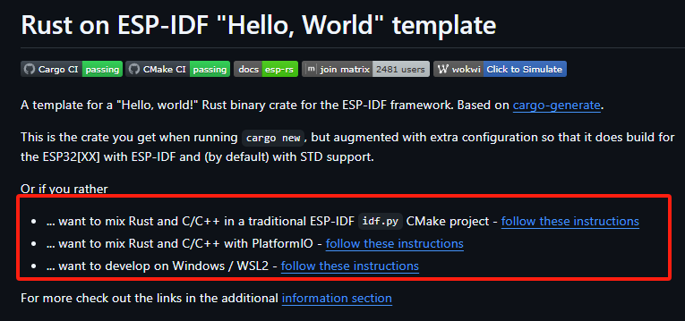
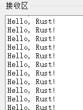
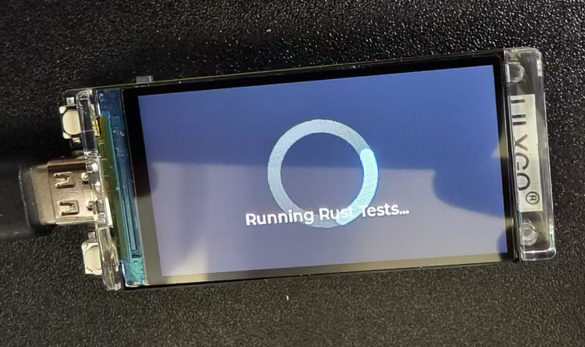

# ESP32中的Rust开发

乐鑫是少有的官方支持Rust的芯片厂商，提供了[esp-idf-hal](https://github.com/esp-rs/esp-idf-hal)和[esp-hal](https://github.com/esp-rs/esp-hal)两种开发方式，

esp-idf-hal是基于esp-idf的c语言sdk做的rust封装，很多Wifi 蓝牙功能很好适配兼容，由于esp-idf 提供了newlib环境，可以在上面构建Rust标准库，所以使用esp-idf-hal的开发环境可以使用到std的方法，这样开发效率会大大提升。

esp-hal是esp32裸机的硬件抽象层(no-std)。

更多的可以参考 [Rust on ESP](https://docs.esp-rs.org/book/)

注意，下面的需要读者有使用过esp32C语言开发的经验才能更方便的理解

## ESP32Rust环境配置

esp32分为xtensa架构和riscv架构
esp32官方提供了[espup](https://github.com/esp-rs/espup)用来安装和维护esp32系列芯片所需工具链。

两行命令即可完成安装

```bash
cargo install espup
espup install
```

## 生成项目
使用esp-generate可以生成用于esp32的Rust项目

```bash
cargo install esp-generate
esp-generate --chip=esp32c6 your-project
```

构建和运行项目直接使用cargo命令即可

```bash
cargo build
cargo run
```
可以使用[模板](https://docs.esp-rs.org/book/writing-your-own-application/generate-project/esp-idf-template.html)生成项目

```bash
cargo generate esp-rs/esp-idf-template cargo
```

## 开发

esp32的开发直接参考esp-idf-hal 和esp-hal的储存库示例即可，网上也有很多相关资料，在这里暂时掠过。
值得注意的是esp-hal环境下开发可以使用embassy框架，且蓝牙功能可以使用embassy新提供的[trouble](https://github.com/embassy-rs/trouble)。

## 混合Rust与C

很多时候大家会在“Rust or C”中纠结，这里给出一个选择:“or”,Rust和C混合编写统一在一个项目中编译，但又不完全像上面STM32需要先编译后嵌入再编译c一样，ESP提供了一些混合编程的编译脚本、工程模板在[Readme](https://github.com/esp-rs/esp-idf-template)中可以看到


### Rust作为component ESP-IDF 方法

使用Cmake构建的方法可以参考[这里](https://github.com/esp-rs/esp-idf-template/blob/master/README-cmake-details.md)


```bash
cargo generate --vcs none --git https://github.com/esp-rs/esp-idf-template cmake --name test
```
然后选择需要的工具链(RISC-V的才可以用nightly)


这将创建一个ESP-IDF项目，并使用Rust作为component，然后使用Cmake构建。

```
test/
|-- CMakeLists.txt
|-- main/
|   |-- CMakeLists.txt
|   |-- main.c
|-- sdkconfig
|-- components/
|   |-- rust-test/
|       |-- CMakeLists.txt
|       |-- placeholder.c
|       |-- build.rs
|       |-- Cargo.toml
|       |-- rust-toolchain.toml
|       |-- src/
|           |-- lib.rs
```

围绕Rust的代码编写和构建主要在components下的rust-test中，
模板会在lib.rs生成一个示例函数

```rust
#[no_mangle]
extern "C" fn rust_main() -> i32 {
    // It is necessary to call this function once. Otherwise some patches to the runtime
    // implemented by esp-idf-sys might not link properly. See https://github.com/esp-rs/esp-idf-template/issues/71
    esp_idf_svc::sys::link_patches();

    // Bind the log crate to the ESP Logging facilities
    esp_idf_svc::log::EspLogger::initialize_default();

    log::info!("Hello, world!");

    42
}
```

并在c中调用

```c
extern int rust_main(void);

void app_main(void) {
    printf("Hello world from C!\n");

    int result = rust_main();

    printf("Rust returned code: %d\n", result);
}

```

构建和运行完全使用esp-idf csdk的方法
会编译component中的rust工程并和c工程链接

```bash
idf.py set-target [esp32|esp32s2|esp32s3|esp32c2|esp32c3|esp32c6|esp32h2]
idf.py build
idf.py -p /dev/ttyUSB0 flash
idf.py -p /dev/ttyUSB0 monitor
```

这样可以实时调整Rust代码的实现。同样保持了esp-idf 原来的使用方法比如components中添加其他组件库，比如把cam或者把arduino作为components添加到工程中。

### 利用platformio构建

很多人会使用[platformio](https://platformio.org/)（后简称pio）去构建esp32的工程，这里也介绍一下
官方[示例](https://github.com/esp-rs/esp-idf-template/blob/master/README-pio.md)中给出了新建基于esp-idf构建的pio工程模板


```bash
cargo install cargo-pio #安装 pio

#cargo pio new <your-project-name> --platform espressif32 --frameworks espidf [--board <your-board-name>]

cargo pio new pio_espidf_demo --platform espressif32 --frameworks espidf --board lilygo-t-display-s3 -- --edition 2021    

```

板子的名字无所谓可以后续在platformio.ini中修改，adafruit_feather_esp32s3等其他板子也可以运行


在这里我们用到的是Lilygo的T-display-s3 ，大家可以用自己手边任意的esp32


而后使用

```bash
pio run
```
如果在vscode中可以直接图形化的选择构建和运行

也可以创建基于arduino的工程

```bash
cargo pio new pio_arduino_demo --platform espressif32 --frameworks arduino --board lilygo-t-display-s3 -- --edition 2021 
```

工程结构如下

```
├──.cargo
│  └──config.toml
├──src
│  ├──dummy.c
│  ├──lib.rs
│  └──main.cpp
├──.gitignore
├──Cargo.toml
├──platformio.cargo.py
├──platformio.git.py
├──platformio.ini
└──platformio.patch.py
```

提供了简单示例,lib.rs中：

```rust
// Remove if STD is supported for your platform and you plan to use it
#![no_std]

// Remove if STD is supported for your platform and you plan to use it
#[panic_handler]
fn panic(_info: &core::panic::PanicInfo) -> ! {
    loop {}
}

//
// Entry points
//

#[no_mangle]
extern "C" fn arduino_setup() {
}

#[no_mangle]
extern "C" fn arduino_loop() {
}

```

main.cpp中：

```c
#include <Arduino.h>

extern "C" void arduino_setup();
extern "C" void arduino_loop();

void setup() {
    arduino_setup();
}

void loop() {
    arduino_loop();
}
```

默认使用no-std,由于esp32支持使用std中的Vec等库，前面提到了esp32中可以使用std环境，这里也以此为例稍作修改使用std环境
首先在lib.rs中将no-std相关依赖注释

```rust
// Remove if STD is supported for your platform and you plan to use it
// #![no_std]

// // Remove if STD is supported for your platform and you plan to use it
// #[panic_handler]
// fn panic(_info: &core::panic::PanicInfo) -> ! {
//     loop {}
// }
```


当前esp32s3需要使用espup构建我们在根目录添加一个rust-toolchain.toml文件

```toml
[toolchain]
channel = "esp"
```

这里然后任意添加一个打印

```rust
#[no_mangle]
extern "C" fn arduino_loop() {
    use std::string::String;
    //打印一个字符串
    let s = String::from("Hello, Rust!");
    println!("{}", s);
    
}
```

构建编译烧录然后报错


之前不是说支持std吗为什么会报错呢。
其实这里还需要再.cargo/config.toml中添加std支持，原先是

```toml
[unstable]
build-std = ["core", "panic_abort"]
build-std-features = ["panic_immediate_abort"]
```

修改build-std添加std支持

```toml
build-std = ["std","core", "panic_abort"]
```
命令行编译运行或者在vscode中图形化选择构建和运行


可以看到构建时会一并构建rust


得到串口输出



这种混合编程尤其适合在不重构现有工程的情况下添加Rust安全支持。

比如可以在[官方储存库](https://github.com/Xinyuan-LilyGO/T-Display-S3/tree/main)
中提供的demo上修改


仿造官方给出的pio配置在platformio.ini中添加

```ini
build_flags = 
    -DLV_LVGL_H_INCLUDE_SIMPLE
    -DARDUINO_USB_CDC_ON_BOOT=1
    ; -UARDUINO_USB_CDC_ON_BOOT
    -DDISABLE_ALL_LIBRARY_WARNINGS
    -DARDUINO_USB_MODE=1
    ; Choose different options according to different driver chips
    ; Early use of CST328
    -DTOUCH_MODULES_CST_MUTUAL
    ; Use CST816 by default
    ; -DTOUCH_MODULES_CST_SELF  
```

将示例factory文件夹下的几个文件复制到当前工程

src目录下结构为
```
├──dummy.c        
├──factory.ino    
├──factory.ino.cpp
├──factory_gui.cpp
├──factory_gui.h  
├──font_Alibaba.c 
├──lib.rs
├──lilygo1_gif.c  
├──lilygo2_gif.c  
├──pin_config.h   
└──zones.h    
```

我们添加几个测试函数


```rust
#[no_mangle]
pub extern "C" fn rust_add_test(a: i32, b: i32) -> i32 {
    a + b
}

#[no_mangle]
pub extern "C" fn rust_multiply(a: i32, b: i32) -> i32 {
    a * b
}

#[no_mangle]
pub extern "C" fn rust_fibonacci(n: i32) -> i32 {
    if n <= 0 {
        return 0;
    } else if n == 1 {
        return 1;
    }
    let mut a = 0;
    let mut b = 1;
    let mut temp;
    for _ in 2..=n {
        temp = a + b;
        a = b;
        b = temp;
    }
    b
}
#[no_mangle]
pub extern "C" fn rust_find_max(arr: *const i32, len: usize) -> i32 {
    if arr.is_null() || len == 0 {
        return 0;
    }
    let slice = unsafe { std::slice::from_raw_parts(arr, len) };
    match slice.iter().max() {
        Some(&max) => max,
        None => 0,
    }
}
#[no_mangle]
pub extern "C" fn rust_string_length(s: *const u8) -> usize {
    if s.is_null() {
        return 0;
    }
    
    let mut len = 0;
    unsafe {
        while *s.add(len) != 0 {
            len += 1;
        }
    }
    len
}
```

在factory.ino中添加测试

```c
extern "C" {
  int rust_add_test(int a, int b);
  int rust_multiply(int a, int b);
  int rust_fibonacci(int n);
  int rust_find_max(const int* arr, size_t len);
  size_t rust_string_length(const char* s);
}

void run_rust_tests(void)
{
    // 清除之前的UI元素
    lv_obj_clean(lv_scr_act());
    // 创建标题
    lv_obj_t *title_label = lv_label_create(lv_scr_act());
    lv_obj_align(title_label, LV_ALIGN_TOP_MID, 0, 10);
    lv_obj_set_style_text_font(title_label, &lv_font_montserrat_14, 0);
    lv_label_set_text(title_label, "Rust Function Tests");
    // 准备测试结果
    String result = "";
    // 测试加法函数
    int add_result = rust_add_test(10, 25);
    result += "Add: 10 + 25 = ";
    result += String(add_result);
    result += "\n";
    // 测试乘法函数
    int mul_result = rust_multiply(12, 5);
    result += "Multiply: 12 * 5 = ";
    result += String(mul_result);
    result += "\n";
    // 测试斐波那契函数
    int fib_result = rust_fibonacci(10);
    result += "Fibonacci(10) = ";
    result += String(fib_result);
    result += "\n";
    // 测试查找最大值函数
    int arr[] = {3, 7, 1, 9, 4, 6};
    int max_result = rust_find_max(arr, 6);
    result += "Array Max: ";
    result += String(max_result);
    result += "\n";
    // 测试字符串长度函数
    const char* test_str = "Hello, Rust!";
    size_t len_result = rust_string_length(test_str);
    result += "String Length: ";
    result += String(len_result);
    result += "\n";
    // 创建结果显示区域
    lv_obj_t *results_label = lv_label_create(lv_scr_act());
    lv_obj_align(results_label, LV_ALIGN_CENTER, 0, 0);
    lv_obj_set_width(results_label, LV_PCT(90));
    lv_obj_set_style_text_font(results_label, &lv_font_montserrat_14, 0);
    lv_label_set_long_mode(results_label, LV_LABEL_LONG_SCROLL);
    lv_label_set_text(results_label, result.c_str());
    // 输出到串口
    Serial.println("=== Rust Test Results ===");
    Serial.println(result);
    // 创建返回按钮
    lv_obj_t *back_btn = lv_btn_create(lv_scr_act());
    lv_obj_align(back_btn, LV_ALIGN_BOTTOM_MID, 0, -10);
    lv_obj_set_width(back_btn, 120);
    lv_obj_set_height(back_btn, 40);
    lv_obj_t *back_label = lv_label_create(back_btn);
    lv_label_set_text(back_label, "Back");
    lv_obj_center(back_label);
    lv_obj_add_event_cb(back_btn, [](lv_event_t *e) {
        lv_obj_clean(lv_scr_act());
        lv_obj_t *log_label = lv_label_create(lv_scr_act());
        lv_obj_align(log_label, LV_ALIGN_TOP_LEFT, 0, 0);
        lv_obj_set_width(log_label, LV_PCT(100));
        lv_label_set_long_mode(log_label, LV_LABEL_LONG_SCROLL);
        lv_label_set_recolor(log_label, true);
        lv_label_set_text(log_label, "Scan WiFi");
        wifi_test();
    }, LV_EVENT_CLICKED, NULL);
    // 发送测试结果消息
    lv_msg_send(MSG_RUST_TEST_RESULT, result.c_str());
}

void rust_tests(void)
{
    // 清除当前屏幕
    lv_obj_clean(lv_scr_act());
    // 显示加载指示器
    lv_obj_t *spinner = lv_spinner_create(lv_scr_act(), 1000, 60);
    lv_obj_set_size(spinner, 100, 100);
    lv_obj_center(spinner);
    lv_obj_t *load_label = lv_label_create(lv_scr_act());
    lv_label_set_text(load_label, "Running Rust Tests...");
    lv_obj_align(load_label, LV_ALIGN_BOTTOM_MID, 0, -40);
    // 短暂延迟以显示加载效果
    LV_DELAY(1000);
    // 删除加载指示器
    lv_obj_del(spinner);
    lv_obj_del(load_label);
    // 运行详细的Rust测试
    run_rust_tests();
}

```

可以看到开发板屏幕将显示测试的结果




至此对于ESP32的Rust和C混合编程基础就完成了，可以开始进行自己的项目了。


也可以使用类似stm32中的方法找到target中的.a文件复制到其他项目中使用


复制到其他项目目录中，并在build_flags中添加依赖


利用这个方法可以在比如[T-Display-S3-Pro](https://github.com/Xinyuan-LilyGO/T-Display-S3-Pro)的Cellphone项目中添加RustTest按钮

把.a文件放在根目录，在platformio.ini中添加

```ini
    -L"${PROJECT_DIR}"  
    -lpio_arduino_demo
```
然后类似添加按钮和函数即可得到


点击按钮可以看到运行示例


和串口输出


至此整个指南便结束
下面开启你的嵌入式Rust之旅吧！

