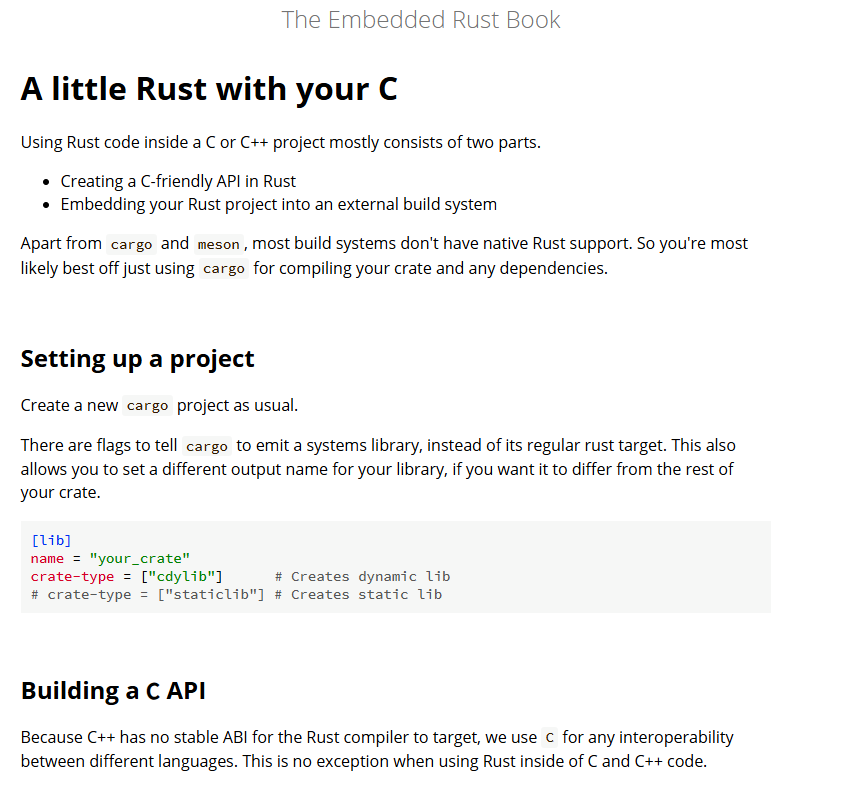
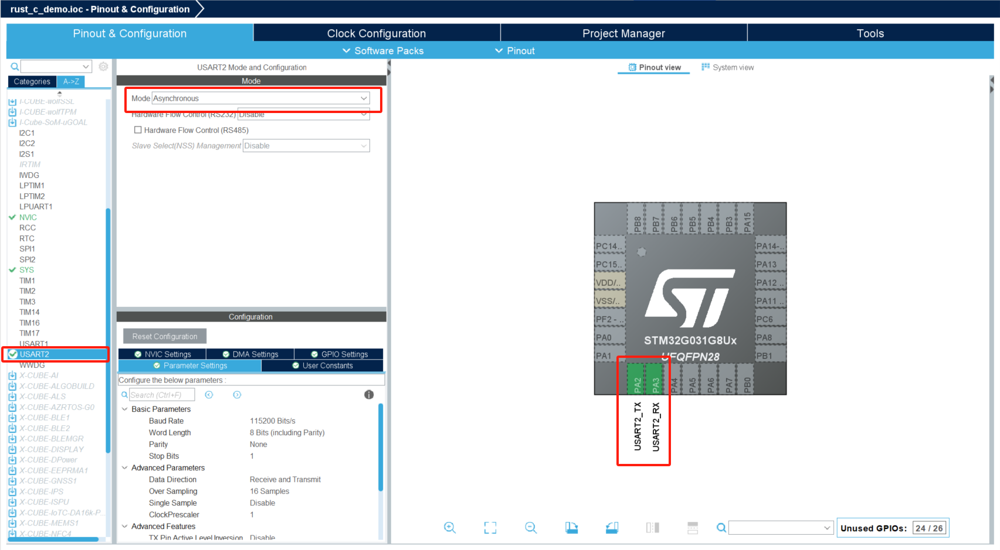

# Rust嵌入stm32的C工程


Rust具有良好的C语言互操作性，[A little Rust with your C](https://docs.rust-embedded.org/book/interoperability/rust-with-c.html)中介绍了如何将Rust代码嵌入C工程中。


简言之你需要将Rust的类型转为C的类型，然后生成库和头文件，在C工程中引入使用。

但是在单片机中需要静态编译于是需要

```
crate-type = ["staticlib"]
```

这里使用cargo命令创建一个简单的lib

```bash
cargo new lib_demo --lib
cd lib_demo
```

然后在Cargo.toml中添加

```toml
[lib]
name = "lib_demo"
crate-type = ["staticlib"]
```

添加一个简单的加减乘除运算 

```rust
#![no_std]
/// 加法运算
/// 提供panic处理函数，在no_std环境下
#[panic_handler]
fn panic(_info: &core::panic::PanicInfo) -> ! {
    loop {}
}
#[no_mangle]
pub extern "C" fn add(a: i32, b: i32) -> i32 {
    a + b
}
/// 减法运算
#[no_mangle]
pub extern "C" fn subtract(a: i32, b: i32) -> i32 {
    a - b
}
/// 乘法运算
#[no_mangle]
pub extern "C" fn multiply(a: i32, b: i32) -> i32 {
    a * b
}
/// 除法运算（返回安全的结果，除以零时返回预设的安全结果0）
#[no_mangle]
pub extern "C" fn divide(a: i32, b: i32) -> i32 {
    if b == 0 {
        0 // 防止除以零错误
    } else {
        a / b
    }
}
/// 浮点数除法
#[no_mangle]
pub extern "C" fn divide_float(a: f64, b: f64) -> f64 {
    if b == 0.0 {
        0.0 // 防止除以零错误
    } else {
        a / b
    }
}

```

然后编写一个调用的头文件

```c
#ifndef LIB_DEMO_H
#define LIB_DEMO_H

#ifdef __cplusplus
extern "C" {
#endif

// 整数运算
int add(int a, int b);
int subtract(int a, int b);
int multiply(int a, int b);
int divide(int a, int b);

// 浮点运算
double divide_float(double a, double b);

#ifdef __cplusplus
}
#endif

#endif // LIB_DEMO_H 
```
至此就可以用c语言调用写的库了，推荐补充阅读[ffi](https://doc.rust-lang.org/nomicon/ffi.html)

## STM32CubeIDE中嵌入
stm32CubeIDE是st官方提供的开发环境，这里以cubeide的工程为例来介绍
STM32CubeIDE的入门可以参考[STM32CubeIDE快速入门指南](https://www.st.com/resource/zh/user_manual/um2553-stm32cubeide-quick-start-guide-stmicroelectronics.pdf)

我们首先打开cubeide，选择新建一个工程

输入我们使用的芯片stm32g8u6并选择

输入工程名称并点击finish即可完成创建

这个简单示例我们用USART输出结果所以只用初始化USART2
左侧选择USART2将mode配置为Asynchronous模式，即可自动配置引脚

然后CTRL+S保存，CubeIDE会自动生成代码


main.c中添加以下代码用以支持printf
```c
#ifdef __GNUC__
#define PUTCHAR_PROTOTYPE int __io_putchar(int ch)
#else
#define PUTCHAR_PROTOTYPE int fputc(int ch, FILE *f)
#endif

PUTCHAR_PROTOTYPE
{
  HAL_UART_Transmit(&huart2, (uint8_t *)&ch, 1,HAL_MAX_DELAY);
  return ch;

}
```

Project/Properties/C/C++ Build/Settings/Tool Settings中添加浮点数printf支持


至此一个stm32C的模板完成，添加lib_demo库
首先编译lib_demo
```bash
cargo build --release --target thumbv6m-none-eabi
```
找到lib_demo.a文件，将他和lib_demo.h文件添加到STM32CubeIDE工程的Src和Inc目录下


在CUBEIDE中右键刷新即可看到添加的文件


最后需要在工程中添加这个库


在Project/Properties中选择并添加库


在main.c中添加

```c
#include "lib_demo.h"
...
int main(void)
{
...

  /* USER CODE BEGIN 2 */
  int a = 10, b = 5;
  printf("整数运算:\n");
  printf("%d + %d = %d\n", a, b, add(a, b));
  printf("%d - %d = %d\n", a, b, subtract(a, b));
  printf("%d * %d = %d\n", a, b, multiply(a, b));
  printf("%d / %d = %d\n", a, b, divide(a, b));
  // 测试除以零
  printf("%d / %d = %d (除以零保护)\n", a, 0, divide(a, 0));
  // 测试浮点除法
  double x = 10.5, y = 2.5;
  printf("\n浮点运算:\n");
  printf("%.2f / %.2f = %.2f\n", x, y, divide_float(x, y));
  printf("%.2f / %.2f = %.2f (除以零保护)\n", x, 0.0, divide_float(x, 0.0));
  /* USER CODE END 2 */
...
}
```

点击调试并运行即可在串口助手中看到输出


至此完成了在stm32C语言工程中嵌入Rust库

## 小结

这里只是用一个最简单的例子举例，实际应用中可以将复杂且需要安全性保证的逻辑用Rust实现，然后嵌入到C工程中。
比如一些协议编解码，计算等等
