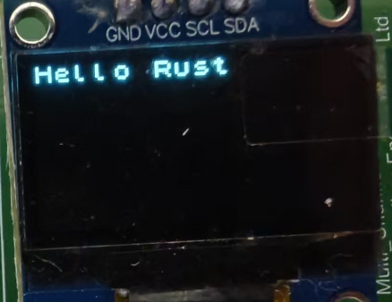

# 基础示例：SSD1306 OLED显示

这里用一个很简单的SSD1306 OLED显示例子带大家感受一下Embassy工程的创建和编写。

## 使用cargo-embassy创建工程

embassy提供了[cargo-embassy](https://github.com/adinack/cargo-embassy)，我们只需要选择对应的MCU即可。

```bash
cargo install cargo-embassy
cargo embassy init ssd_demo --chip stm32g031g8
cd ssd_demo
```

可以看到直接生成了工程

```
├──.cargo
│  └──config.toml
├──src
│  ├──fmt.rs
│  └──main.rs
├──build.rs
├──Cargo.lock
├──Cargo.toml
├──Embed.toml
└──rust-toolchain.toml
```

对于main文件中核心就是打印Hello, World!，然后led闪烁

```rust
#[embassy_executor::main]
async fn main(_spawner: Spawner) {
    let p = embassy_stm32::init(Default::default());
    let mut led = Output::new(p.PB7, Level::High, Speed::Low);

    loop {
        info!("Hello, World!");
        led.set_high();
        Timer::after(Duration::from_millis(500)).await;
        led.set_low();
        Timer::after(Duration::from_millis(500)).await;
    }
}
```

在目录中执行

```bash
cargo run
```

就能自动编译并运行示例，可以看到命令行中打印对应示例的输出

```
    Finished `dev` profile [optimized + debuginfo] target(s) in 23.37s
     Running `probe-rs run --chip STM32G031G8Ux target\thumbv6m-none-eabi\debug\ssd_demo`
      Erasing ✔ [00:00:00] [###############################################################################################################################################] 14.00 KiB/14.00 KiB @ 54.25 KiB/s (eta 0s )  Programming ✔ [00:00:00] [###############################################################################################################################################] 14.00 KiB/14.00 KiB @ 36.94 KiB/s (eta 0s )    Finished in 0.662s
TRACE BDCR configured: 00008200
└─ embassy_stm32::rcc::bd::{impl#3}::init::{closure#4} @ C:\Users\User\.cargo\registry\src\index.crates.io-6f17d22bba15001f\embassy-stm32-0.2.0\src\rcc\bd.rs:280
DEBUG rcc: Clocks { hclk1: MaybeHertz(16000000), hsi: MaybeHertz(16000000), lse: MaybeHertz(0), lsi: MaybeHertz(0), pclk1: MaybeHertz(16000000), pclk1_tim: MaybeHertz(16000000), pll1_p: MaybeHertz(0), pll1_q: MaybeHertz(0), rtc: MaybeHertz(32000), sys: MaybeHertz(16000000) }
└─ embassy_stm32::rcc::set_freqs @ C:\Users\User\.cargo\registry\src\index.crates.io-6f17d22bba15001f\embassy-stm32-0.2.0\src\rcc\mod.rs:71
INFO  Hello, World!
└─ ssd_demo::____embassy_main_task::{async_fn#0} @ src\fmt.rs:131
INFO  Hello, World!
└─ ssd_demo::____embassy_main_task::{async_fn#0} @ src\fmt.rs:131
INFO  Hello, World!
└─ ssd_demo::____embassy_main_task::{async_fn#0} @ src\fmt.rs:131
```


## 从头开始创建工程
根据[embassy-book](https://embassy.dev/book/#_starting_a_new_project)中的指导我们也能一步一步开始我们的示例
首先我们创建一个Rust工程

```bash
cargo new ssd1306_demo
cd ssd1306_demo
```

我们生成了一个空的工程

```
├──src
│  └──main.rs
└──Cargo.toml
```

我们使用的处理器为stm32g031，打开Embassy中对应[示例](https://github.com/embassy-rs/embassy/tree/main/examples/stm32g0) 可以看到有个.cargo/config.toml文件，我们将配置文件复制过来
示例中使用的是

```
[target.'cfg(all(target_arch = "arm", target_os = "none"))']
# replace STM32G0B1RETx with your chip as listed in `probe-rs chip list`
runner = "probe-rs run --chip STM32G0B1RETx"
[build]
target = "thumbv6m-none-eabi"
[env]
DEFMT_LOG = "trace"
```

`STM32G0B1RETx`这个不是我们当前的型号。
查看支持的型号可以使用

```bash
probe-rs chip list
```

使用的是`STM32G031G8Ux`这里替换上面runner中的`STM32G0B1RETx`
现在编译器和调试器已经知道我们使用的指令集和具体芯片类型。

下面添加embassy及其支持库的依赖

```toml
[dependencies]
embassy-executor = { version = "0.7.0", features = ["arch-cortex-m", "executor-thread"] }
embassy-futures = "0.1.1"
embassy-stm32 = { version = "0.2.0", features = ["memory-x", "stm32g031g8", "time-driver-any", "exti", "unstable-pac"] }
embassy-sync = "0.6.2"
embassy-time = { version = "0.4.0", features = ["tick-hz-32_768"] }
```

以及其他构建依赖

```toml
defmt = "0.3.5"
defmt-rtt = "0.4.0"
cortex-m = {version = "0.7.7", features = ["critical-section-single-core"]}
cortex-m-rt = "0.7.3"
panic-probe = "0.3.1"
```

最后，将[profile.release]示例中的部分复制Cargo.toml到我们的部分中。

```toml
[profile.release]
debug = 2
```

embassy处于不断更新中，推荐尝试从git仓库安装，这里通过命令找到最新的

```bash
git ls-remote https://github.com/embassy-rs/embassy.git HEAD
fb5ce05b26ae0c90a872a8e0787c9419178d475a        HEAD
```

在Cargo.toml中添加

```toml
[patch.crates-io]
embassy-time = { git = "https://github.com/embassy-rs/embassy", rev = "fb5ce05b26ae0c90a872a8e0787c9419178d475a" }
embassy-executor = { git = "https://github.com/embassy-rs/embassy", rev = "fb5ce05b26ae0c90a872a8e0787c9419178d475a" }
embassy-stm32 = { git = "https://github.com/embassy-rs/embassy", rev = "fb5ce05b26ae0c90a872a8e0787c9419178d475a" }
```

最后从示例中复制构建脚本build.rs到项目中

```rust
fn main() {
    println!("cargo:rustc-link-arg-bins=--nmagic");
    println!("cargo:rustc-link-arg-bins=-Tlink.x");
    println!("cargo:rustc-link-arg-bins=-Tdefmt.x");
}

```

这个构建脚本的作用是为嵌入式Rust项目配置链接器参数，这是嵌入式Rust项目的标准配置之一。

目录结构为

```
├──.cargo
│  └──config.toml
├──src
│  └──main.rs
├──build.rs
└──Cargo.toml
```

在example中复制一个我们的示例到main.rs中并执行

```bash
cargo run
```

完成构建烧录和调试

## 添加屏幕显示
[SSD1306](https://cdn-shop.adafruit.com/datasheets/SSD1306.pdf)是一款OLED屏幕，嵌入式中经常使用它来显示信息。
Rust提供了包管理器，配合embedded-hal的跨平台功能我们可以找到[SSD1306 Rust驱动](https://crates.io/crates/ssd1306)并添加到Cargo.toml中

```toml
[dependencies]
ssd1306 = "0.10.0"
```

由于我们在embassy中使用的是async，所以需要添加features

```toml
[dependencies]
ssd1306 = { version = "0.10.0", features = ["async"] }
```

下面在main.rs中添加i2c初始化

Embassy为每个具体MCU型号生成特定的硬件抽象层代码。在这个过程中，只有该MCU实际拥有的引脚和功能才会被包含在`Peripherals`结构体中。由于Rust的强类型系统，当你尝试访问不存在的外设或引脚时，编译器能立即检测到问题并报错。在这里如果我们初始化错误的引脚将会报错

```rust
let p = embassy_stm32::init(Default::default());
let mut i2c = I2c::new(p.I2C1, p.PB9, p.PB7, Irqs, p.DMA1_CH1, p.DMA1_CH2, Hertz(100_000), Default::default());
```

报错如下

```
error[E0609]: no field `PB9` on type `Peripherals`
  --> src\main.rs:28:11
   |
28 |         p.PB9,
   |           ^^^ unknown field
   |
```

这种将硬件功能的约束直接体现在类型系统中的设计对比传统C语言外设库有很大的优势。

正确初始化I2C

```rust
    let i2c = embassy_stm32::i2c::I2c::new(
        p.I2C1,
        p.PB6,
        p.PB7,
        Irqs,
        p.DMA1_CH1,
        p.DMA1_CH2,
        Hertz::khz(400),
        Default::default(),
    );
```

创建SSD1306显示屏的I2C接口

```rust
    let interface = I2CDisplayInterface::new(i2c);
```

创建SSD1306显示屏实例
指定显示屏尺寸为128x64像素
设置显示方向为不旋转(Rotate0)
转换为终端模式，便于文本显示

```rust
    let mut display = Ssd1306Async::new(interface, DisplaySize128x64, DisplayRotation::Rotate0)
        .into_terminal_mode();
```

初始化显示屏

```rust
display.init().await.unwrap();
let _ = display.clear().await;
```

至此完成了初始化，添加显示

```rust
let _ = display.write_str("Hello Rust!").await;
```

下面就能在屏幕中看到`Hello Rust!`



最终用很简单的代码就能实现屏幕显示，总体代码如下

```rust
//src/main.rs
#![no_std]
#![no_main]
use defmt_rtt as _;
use embassy_executor::Spawner;
use embassy_stm32::{bind_interrupts, i2c, peripherals, time::Hertz};
use panic_probe as _;
use ssd1306::{prelude::*, I2CDisplayInterface, Ssd1306Async};
bind_interrupts!(struct Irqs {
    I2C1 => i2c::EventInterruptHandler<peripherals::I2C1>, i2c::ErrorInterruptHandler<peripherals::I2C1>;
});
#[embassy_executor::main]
async fn main(_spawner: Spawner) {
    let p = embassy_stm32::init(Default::default());
    let i2c = embassy_stm32::i2c::I2c::new(p.I2C1,p.PB6,p.PB7,Irqs,p.DMA1_CH1,p.DMA1_CH2,Hertz::khz(400),Default::default(),);
    let interface = I2CDisplayInterface::new(i2c);
    let mut display = Ssd1306Async::new(interface, DisplaySize128x64, DisplayRotation::Rotate0)
        .into_terminal_mode();
    display.init().await.unwrap();
    let _ = display.clear().await;
    //显示Hello Rust
    let _ = display.write_str("Hello Rust!").await;
    loop {

    }
}
```

Irqs 结构体通过 bind_interrupts! 宏将硬件中断与处理程序连接起来。    
在 I2C 初始化过程中，这些中断处理程序被注册到系统中。    
当 I2C 通信事件发生（如数据传输完成或发生错误）时，相应的中断被触发。    
中断处理程序作为 waker 的实现，负责唤醒等待这些事件的异步任务。
这样的设计使得代码可以使用 async/await 风格编程，而不需要阻塞式等待或手动轮询。当 I2C 操作（如读/写）正在进行时，CPU 可以执行其他任务，只有当操作完成（触发中断）时才会返回继续执行异步函数中未完成的部分。    
这正是 Embassy 框架的核心优势之一：将硬件中断机制与 Rust 的异步编程模型无缝集成。


## 小结

通过这个基础示例，我们了解了Embassy的创建工程、初始化、显示等基本操作。
Embassy提供了大量不同平台示例可以直接到[Embassy示例](https://github.com/embassy-rs/embassy/tree/main/examples)中查看。