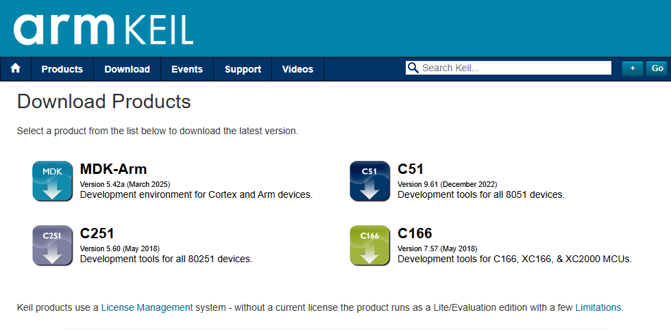
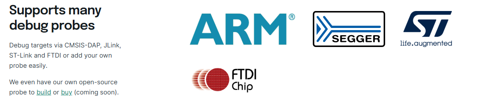
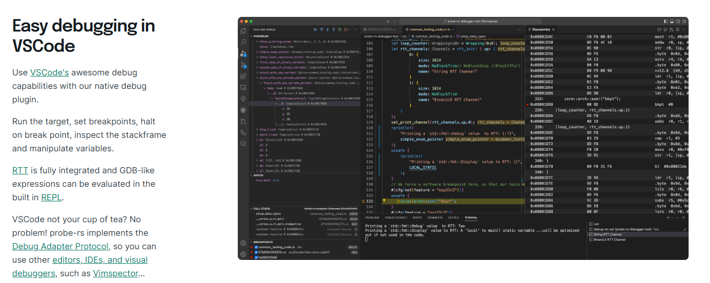

# 环境搭建：现代工具链的优势
嵌入式中C工具链根据不同目标平台需要不同的工具链，这是单片机开发者最常遇到的第一个挑战。ARM平台需要安装ARM-GCC或ARMCC，8051需要Keil C51或者SDCC，ESP32使用xtensa-esp32-gcc/riscv-32... 还有很多Risc-V架构的单片机。不同平台工具链之间互不兼容，每换一个芯片平台，开发者往往需要重新配置整个环境。即使是同一CPU架构，不同厂商和不同系列的单片机，也可能需要不同的SDK和工具链配置。
## C语言开发方式
从原理上来讲我们可以直接通过gcc配合烧录调试工具直接进行开发，但是C语言需要编写makefile或者cmake且调试上也会很麻烦

在C语言ARM单片机开发中，很多开发者使用的是像Keil5或者IAR这样的IDE：
比如Keil需要先在官网[下载](https://www.keil.com/download/product/)并激活后配置对应soc的[工具包](https://www.keil.arm.com/devices/)

 


很多厂商也给出了自己的集成开发环境比如TI的[CCS](https://www.ti.com/tool/CCSTUDIO)，能用于编译调试TI的单片机，DSP，蓝牙SOC等处理器芯片


ST公司为自家SOC提供的[CubeIDE](https://www.st.com/en/development-tools/stm32cubeide.html)

NXP公司提供的NXP MCUXpresso


也有很多厂商通过eclipse或者VScode自定义自家SOC的开发环境。

每个芯片厂商往往有自己的IDE和工具链，例如STM32CubeIDE、NXP MCUXpresso、ESP-IDF等。这导致开发者在切换平台时需要重新学习一套工具，项目移植困难，学习成本高。

相比之下，Rust嵌入式开发生态提供了一套更加现代化、统一的工具链体验

## Rust环境配置

首先我们来安装[Rust工具链](https://www.rust-lang.org/tools/install)

对于windows用户只需一行
```bash
curl --proto '=https' --tlsv1.2 -sSf https://sh.rustup.rs | sh
```

[Rust 生态系统](https://google.github.io/comprehensive-rust/cargo/rust-ecosystem.html)由许多工具组成，主要包括：

* rustc：Rust 编译器，可将 .rs 文件转换为二进制文件和其他中间格式。

* cargo：Rust 依赖项管理器和构建工具。Cargo 知道如何下载托管在 https://crates.io 上的依赖项,并在构建项目时将它们传递给 rustc。Cargo 还附带一个内置的测试运行程序，用于执行单元测试。

* rustup：Rust 工具链安装和更新工具。当 Rust 发布新版本时，此工具用于安装并更新 rustc 和 cargo。 此外，rustup 还可以下载标准库的文档。可以同时安装多个版本的 Rust，rustup 会根据需要让你在这些版本之间切换。

利用rustup工具可以快速配置不同嵌入式平台支持：
   ```bash
   rustup target add thumbv6m-none-eabi  # 添加ARM Cortex-M0支持
   rustup target add thumbv7m-none-eabi  # 添加ARM Cortex-M3支持
   rustup target add riscv32imac-unknown-none-elf  # 添加RISC-V32imac支持
   ```
在这之后就完成编译rust的基础配置环境了。然后就是针对嵌入式环境的烧录和调试。

## 烧录和调试

除了通过命令行或IDE使用传统的openocd ，调试器等。也可以用Rust生态中的强力工具[probe-rs](https://probe.rs/)
probe-rs实现了针对不同SOC厂商和不同调试协议的适配


利用probe-rs可以快速实现编译后代码的烧录和调试。
在```.cargo/config.toml```中添加对应的编译目标平台例如stm32g031
```
[target.'cfg(all(target_arch = "arm", target_os = "none"))']
# replace STM32G031G8Ux with your chip as listed in `probe-rs chip list`
runner = "probe-rs run --chip STM32G031G8Ux"
```
即可通过```cargo run```命令将代码烧录并运行在目标平台
```
 cargo run --release --target thumbv6m-none-eabi
```
probe-rs还支持与VSCode/CLion等IDE的集成，可以实现代码的断点调试。具体可以参考[probe-rs-vscode](https://probe.rs/docs/tools/debugger/#building-and-testing-the-debug-extension-in-vs-code)

在单片机编程中也经常有"printf调试"，probe-rs中利用调试器的[RTT](https://github.com/probe-rs/rtt-target)和[defmt](https://github.com/knurling-rs/defmt) 实现很小的延迟和无阻塞的方式将日志记录打印到电脑，代码中利用defmt中的```debug！``` ```error！``` ``` info！```等宏直接实现不同日志的打印


```rust
defmt::info!("This is an info message: {}", 42);
defmt::warn!("This is a warning message: {}", true);
defmt::debug!("This is a debug message: {}", "hello");
defmt::error!("This is an error message: {}", 3.14);
defmt::println!("This is a println message: {}", 42);
defmt::assert!(1 + 1 == 2, "Assertion failed: 1 + 1 != 2");
```

整体代码示例：

```rust
#![no_main]
#![no_std]

use defmt::info;
use defmt_rtt as _; // 使用 RTT 作为传输层
use panic_probe as _; // 使用探针作为 panic handler

#[cortex_m_rt::entry]
fn main() -> ! {
    info!("This is an info message: {}", 42);
    defmt::debug!("This is a debug message: {}", "hello");
    defmt::warn!("This is a warning message: {}", true);
    defmt::error!("This is an error message: {}", 3.14);
    defmt::trace!("This is a trace message: {}", [1, 2, 3]);

    defmt::assert!(1 + 1 == 2, "Assertion failed: 1 + 1 != 2");
    defmt::assert_eq!(1 + 1, 2, "Assertion failed: 1 + 1 != 2");
    defmt::assert_ne!(1 + 1, 3, "Assertion failed: 1 + 1 == 3");

    let mut buffer = [0u8; 32];
    defmt::write!(&mut buffer, "Hello, {}!", "world");

    let args = defmt::format_args!("Hello, {}!", "world");
    defmt::println!("This is a println message: {}", 42);

    defmt::log!(defmt::Level::Info, "This is a log message: {}", 42);

    loop {}
}
```

具体实现和原理可以参考[defmt-book](https://defmt.ferrous-systems.com/)。

这里使用的时候是无感的，单片机工程执行cargo run 之后调用probe-rs。
probe-rs内置了[SEGGER 的 RTT](https://www.segger.com/products/debug-probes/j-link/technology/about-real-time-transfer/)，通过RTT将日志发送给电脑。

至此通过Rust工具的生态能非常简单的完成基础配置，且无需特定的IDE便能轻松实现编译和调试

